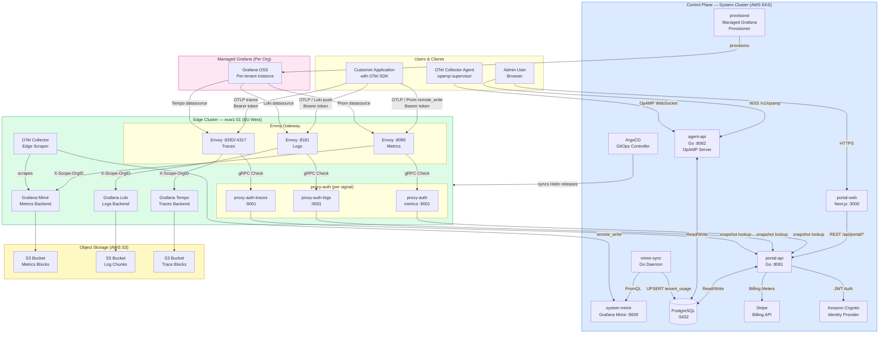
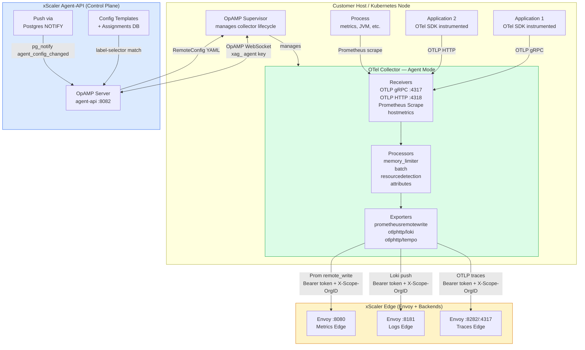
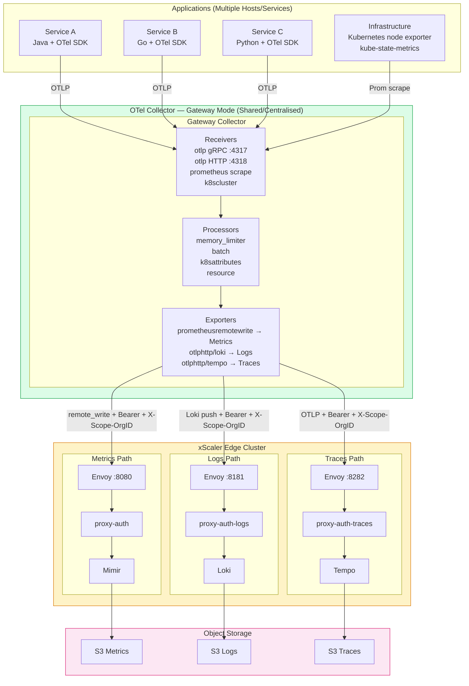
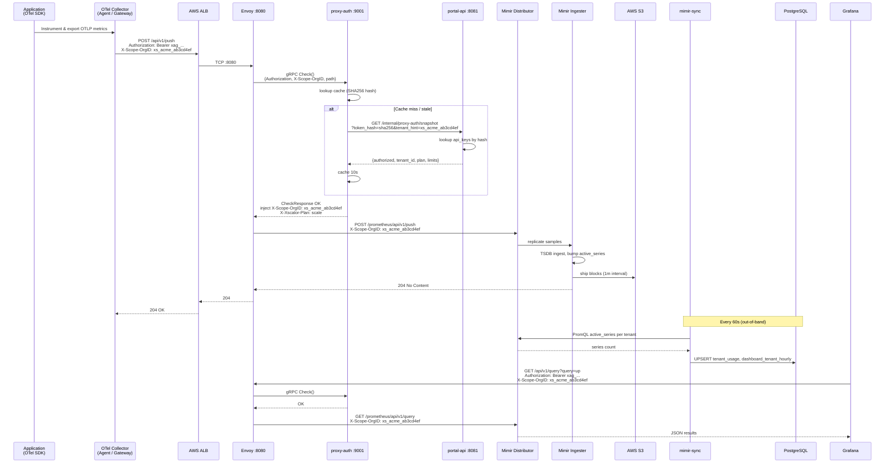
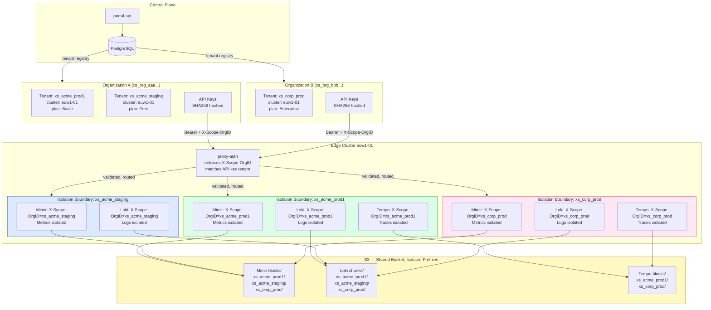
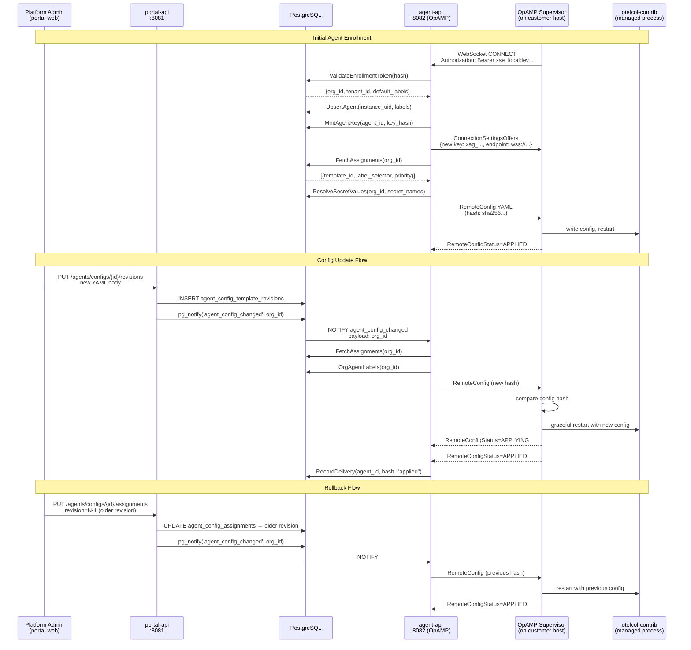
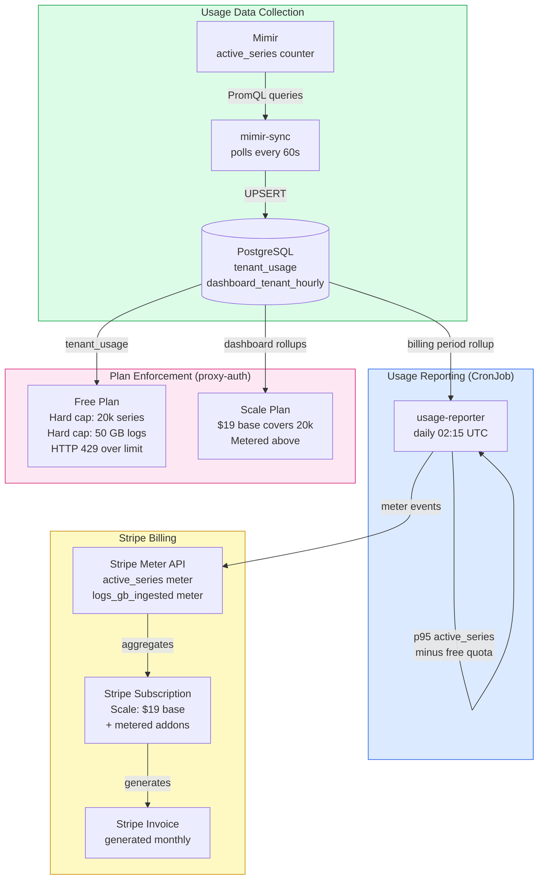
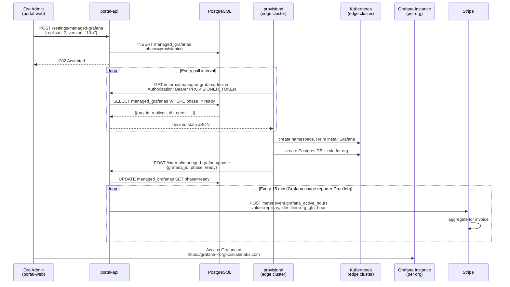
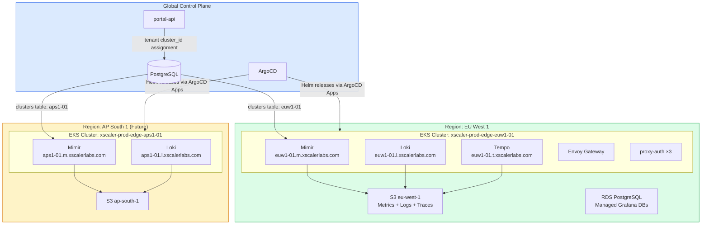

# xScaler Platform — Architecture Diagrams
## Mermaid Diagram Collection
**Based on:** Repository analysis of `/Users/pathum.fernando/Projects/xscaler/xscaler`

---

## Diagram A — High-Level Platform Architecture



---

## Diagram B — OpenTelemetry Agent Mode Architecture



---

## Diagram C — OpenTelemetry Gateway Mode Architecture



---

## Diagram D — End-to-End Telemetry Flow (Metrics)



---

## Diagram E — Multi-Tenant Architecture



---

## Diagram F — Configuration Management Flow (OpAMP)



---

## Diagram G — Authentication & Authorization Flow

```mermaid
flowchart TD
    subgraph ControlPlane["Control Plane Auth"]
        U([User]) -->|1. OIDC login| COG[Amazon Cognito]
        COG -->|2. id_token| PW[portal-web]
        PW -->|3. POST /auth/cognito/exchange<br/>Cognito token| PA[portal-api]
        PA -->|4. Validate Cognito token| COG
        PA -->|5. Generate xScaler JWT<br/>HS256, 30m TTL| PW
        PW -->|6. HttpOnly cookie| BROWSER[Browser Session]
        BROWSER -->|7. All API calls<br/>Authorization: Bearer JWT| PA
    end

    subgraph DataPlane["Data Plane Auth"]
        AGENT([OTel Agent]) -->|1. POST /api/v1/push<br/>Authorization: Bearer API_KEY| ENV[Envoy]
        ENV -->|2. gRPC Check()| PAUTH[proxy-auth]
        PAUTH -->|3. SHA256 hash of token| PAUTH
        PAUTH -->|4. GET /internal/proxy-auth/snapshot<br/>token_hash=sha256| PA2[portal-api]
        PA2 -->|5. lookup api_keys table| PG[(PostgreSQL)]
        PG -->|6. {tenant_id, plan, limits}| PA2
        PA2 -->|7. snapshot response| PAUTH
        PAUTH -->|8. CheckResponse<br/>inject headers| ENV
        ENV -->|9. X-Scope-OrgID: tenant_id<br/>X-Xscalor-Plan: scale| BACKEND[Mimir/Loki/Tempo]
    end

    subgraph AgentMgmt["Agent Management Auth"]
        AG([OTel Supervisor]) -->|1. WebSocket Bearer xse_...| AAPI[agent-api]
        AAPI -->|2. Validate enrollment token| PG2[(PostgreSQL)]
        AAPI -->|3. Mint agent key xag_...| PG2
        AAPI -->|4. Offer xag_ key| AG
        AG -->|5. Reconnect Bearer xag_...| AAPI
        AAPI -->|6. Push RemoteConfig| AG
    end

    style ControlPlane fill:#dbeafe,stroke:#2563eb
    style DataPlane fill:#dcfce7,stroke:#16a34a
    style AgentMgmt fill:#fef3c7,stroke:#d97706
```

---

## Diagram H — Billing & Usage Flow



---

## Diagram I — Managed Grafana Provisioning



---

## Diagram J — Regional Deployment & Scaling


