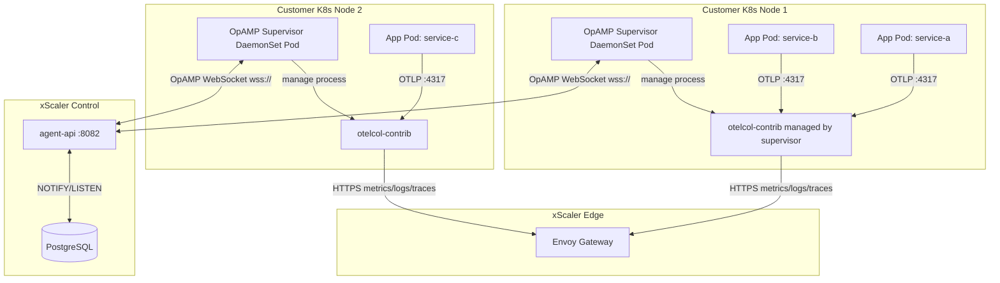

# Agent Mode Architecture

## Overview

In Agent Mode, an OTel Collector is deployed on each host (as a DaemonSet in Kubernetes) and managed remotely via the OpAMP protocol through `agent-api`.



## Supervisor Config (from ``)

```yaml
server:
  endpoint: ws://agent-api:8082/v1/opamp
  headers:
    Authorization: "Bearer xse_<enrollment-token>"

capabilities:
  accepts_remote_config: true
  reports_effective_config: true
  reports_remote_config: true
  reports_health: true

agent:
  executable: /usr/local/bin/otelcol-contrib
  description:
    non_identifying_attributes:
      host.name: "${HOSTNAME}"

storage:
  directory: /var/lib/otelcol-supervisor
```

## Key Properties

| Property | Value | Notes |
|---|---|---|
| Protocol | WebSocket (OpAMP) | Bidirectional, persistent connection |
| Endpoint | `/v1/opamp` on agent-api | Configurable via `cfg.OpAMPPath` |
| Enrollment | `xse_` token → `xag_` key | Two-phase exchange |
| Stale threshold | 90 seconds | Configurable in Helm values |
| Stale sweep interval | 30 seconds | Background goroutine in agent-api |
| Config push trigger | PostgreSQL NOTIFY | Near real-time |

---

*← Previous: [Configuration Management](configuration-management.md)*  
*Next: [Gateway Mode →](gateway-mode.md)*
