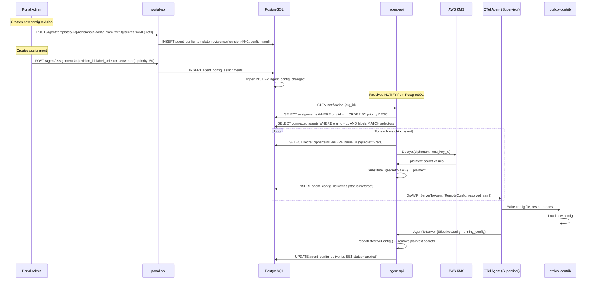

# Configuration Management Flow

## Architecture



## Config Template Versioning

```mermaid
graph LR
    T[Template: Prod K8s Agent]
    R1[Revision 1 Base OTLP config]
    R2[Revision 2 + hostmetrics]
    R3[Revision 3 + attributes processor]

    T --> R1 --> R2 --> R3

    A1[Assignment priority 0 label: {}]
    A2[Assignment priority 50 label: {team:db}]

    R3 --> A1 & A2
    A1 -->|matches all| AGENTS[All Agents]
    A2 -->|matches DB team| DB_AGENTS[DB Team Agents]
```

Revisions are **immutable** — creating a new revision does not modify existing ones. Rollback is achieved by creating a new assignment pointing to a previous revision at higher priority.

---

*← Previous: [Multi-Tenant Architecture](multi-tenant.md)*  
*Next: [Agent Mode →](agent-mode.md)*
