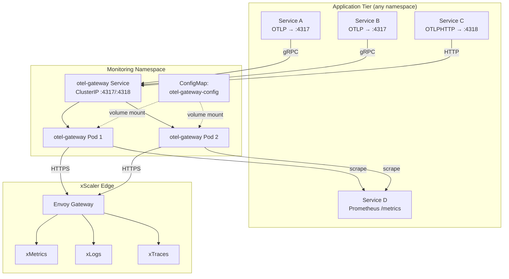

# Gateway Mode Architecture

## Overview

In Gateway Mode, one or more centralised OTel Collector instances receive from all application pods and forward to xScaler. No OpAMP supervision is used — configuration is managed via Kubernetes ConfigMaps or Helm.



## Gateway Config (Production Helm Template)

Based on `charts/edge-xscaler/templates/otel-collector-configmap.yaml`:

```yaml
receivers:
  otlp:
    protocols:
      grpc:
        endpoint: 0.0.0.0:4317
      http:
        endpoint: 0.0.0.0:4318

  prometheus:
    config:
      scrape_configs:
        - job_name: mimir-distributor
          dns_sd_configs:
            - names:
                - "AAAA+mimir-distributor.xscaler-edge.svc.cluster.local"
              type: AAAA
              port: 8080
          metric_relabel_configs:
            - source_labels: [__name__]
              action: keep
              regex: "xscalor_ext_authz_.*|xscalor_proxy_auth_.*"

processors:
  memory_limiter:
    check_interval: 1s
    limit_mib: 512
    spike_limit_mib: 128
  batch:
    timeout: 5s
    send_batch_size: 2048
  attributes/cluster:
    actions:
      - key: xscaler_cluster
        value: "{{ .Release.Namespace }}"
        action: upsert

exporters:
  prometheusremotewrite:
    endpoint: "{{ .Values.otelCollector.remoteWrite.endpoint }}"
    headers:
      X-Scope-OrgID: system-monitoring

service:
  pipelines:
    metrics:
      receivers: [otlp, prometheus]
      processors: [memory_limiter, batch, attributes/cluster]
      exporters: [prometheusremotewrite]
```

## Comparison: Agent Mode vs Gateway Mode

| Feature | Agent Mode | Gateway Mode |
|---|---|---|
| Deployment | DaemonSet (one per node) | Deployment (N replicas) |
| Config mgmt | OpAMP push from portal | ConfigMap + Helm |
| Host metrics | ✅ Native (hostmetrics receiver) | ❌ Requires separate DaemonSet |
| Log files | ✅ Native (filelog receiver) | ❌ |
| Kubernetes scrape | ✅ Per-node k8s SD | ✅ Cluster-wide |
| Central aggregation | ❌ | ✅ |
| Config rollback | Portal revision history | Git revert + kubectl |
| Secret management | KMS via agent-api | Kubernetes Secrets |

---

*← Previous: [Agent Mode](agent-mode.md)*  
*Next: [Lab 01 — Tenant Creation →](../labs/lab-01-tenant-creation.md)*
