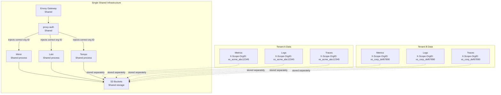

# Multi-Tenant Architecture

## Tenant Isolation Model

xScaler's multi-tenancy is built on a single architectural principle: **every storage write and read is namespaced by the `X-Scope-OrgID` header**.



### Isolation Guarantees

| Layer | Isolation Mechanism |
|---|---|
| **Envoy** | Lua filter rejects multi-tenant header injection |
| **proxy-auth** | Overwrites any client-supplied `X-Scope-OrgID` |
| **Mimir** | `multitenancy_enabled: true` — all queries scoped to org ID |
| **Loki** | `auth_enabled: true` — rejects requests without org ID header |
| **Tempo** | `multitenancy_enabled: true` — trace storage namespaced |
| **S3** | Data stored under `s3://bucket/tenant_id/` prefix paths |

---

## Tenant Identifier Format

```
xs_payment_ab3cd4ef
│  │        │
│  │        └── 8-char lower-case base32 (random, collision-resistant)
│  └── Organisation slug (derived from display_name)
└── xScaler namespace prefix
```

**Organisation ID format:**
```
xs_org_a1b2c3d4e5f6g7h8i9j0k1l2m3n4o5p6
│     │
│     └── 32-char lower hex (UUID-like)
└── xScaler org namespace prefix
```

---

## Multi-Tenant Storage Paths

### Mimir (S3)

```
s3://xscaler-mimir-euw1-01/
├── xs_payment_abc12345/
│   ├── 01J1234567890/         # TSDB block
│   │   ├── chunks/
│   │   ├── index
│   │   └── meta.json
│   └── 01J2345678901/
└── xs_acme_def67890/
    └── 01J3456789012/
```

### Loki (S3)

```
s3://xscaler-loki-euw1-01/
├── xs_payment_abc12345/
│   ├── index/
│   │   └── TSDB v13 index files
│   └── chunks/
│       └── compressed log chunks
└── xs_acme_def67890/
```

### Tempo (S3)

```
s3://xscaler-tempo-euw1-01/
├── xs_payment_abc12345/
│   └── blocks/
│       ├── {block-id}/
│       │   ├── data/
│       │   └── meta.json
└── xs_acme_def67890/
```

---

## Rate Limiting Per Tenant

proxy-auth enforces per-org limits set in the `plans` table:

| Plan | Max Active Series | Max Logs Bytes/sec | Notes |
|---|---|---|---|
| Free | 20,000 | 10 MB/s | Shared platform quota |
| Scale | 20,000 + metered | 20 MB/s | Metered above included |
| Enterprise | Custom | Custom | Negotiated |

When a tenant exceeds their limit:
- proxy-auth returns **429 Too Many Requests** to the collector
- The collector's retry queue holds the data
- The limit appears in `xscalor_ext_authz_requests_total{status="DENIED"}` metric

---

*← Previous: [Telemetry Flow](telemetry-flow.md)*  
*Next: [Configuration Management →](configuration-management.md)*
