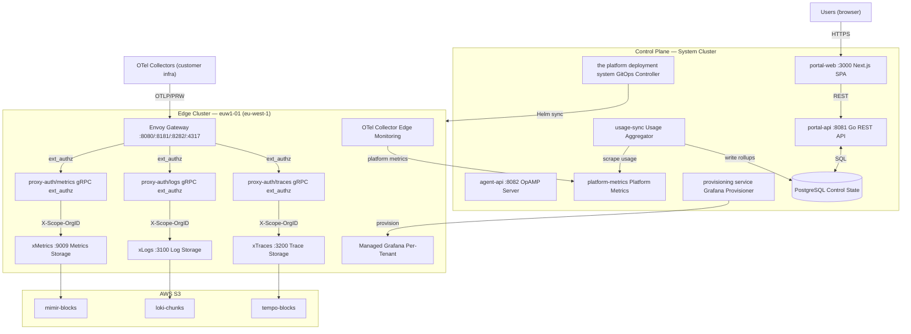

# Platform Architecture

## Overview

xScaler is a multi-tenant SaaS observability platform with a strict two-tier architecture. Understanding this separation is essential for both operators and integrators.



---

## Component Reference

### Control Plane

| Component | Language | Port | Role |
|---|---|---|---|
| `portal-api` | Go | `:8081` | REST API: tenant CRUD, auth, billing, usage |
| `portal-web` | Next.js/TypeScript | `:3000` | SPA web portal |
| `agent-api` | Go | `:8082` | OpAMP server for OTel agent management |
| `usage-sync` | Go | — | Polls xMetrics, writes PostgreSQL usage rollups |
| `platform-metrics` | xMetrics | `:9010` | Platform self-monitoring metrics |
| `provisioning service` | Go | — | Managed Grafana provisioner (Helm operator) |
| `postgres` | PostgreSQL | `:5432` | Single source of truth for all control state |
| `the platform deployment system` | — | — | GitOps controller (syncs from `/gitops/`) |

### Data Plane (Edge)

| Component | Language | Port(s) | Role |
|---|---|---|---|
| `envoy` | C++/Envoy Proxy | `:8080/:8181/:8282/:4317` | Edge gateway + ext_authz |
| `proxy-auth` | Go | `:9001` (gRPC), `:9002` (metrics) | API key validation, rate limiting |
| `xMetrics` | xMetrics | `:9009` | Tenant metrics storage |
| `xLogs` | xLogs | `:3100/:9095` | Tenant log storage |
| `tempo` | xTraces | `:3200/:9095` | Tenant trace storage |
| `otel-collector` | OTel Contrib | `:4317/:4318` | Edge platform monitoring |

---

## Database Schema

### portal-api Owned Tables

```sql
-- Users and Identity
users                    -- user accounts
organizations            -- xs_org_<32-lower-hex>
organization_members     -- user-to-org mapping with role
sessions                 -- JWT session tracking

-- Tenants and Keys
tenants                  -- xs_<slug>_<8-char-base32>
api_keys                 -- SHA-256 hashed, never plaintext
clusters                 -- regional edge cluster registry

-- Billing
plans                    -- Free / Scale ($19) / Enterprise
plan_stripe_prices       -- Stripe price catalog (primary + addons)
subscriptions            -- per-org Stripe subscription mapping
organization_billing     -- billing state (last_posted_logs_bytes_billable)

-- Usage
tenant_usage             -- real-time usage snapshot (usage-sync writes)
dashboard_tenant_hourly  -- hourly rollups for UI graphs
```

### agent-api Owned Tables

```sql
agent_enrollment_tokens  -- xse_ tokens (fleet credentials)
agents                   -- registered agent instances
agent_keys               -- xag_ keys (per-agent, SHA-256 hashed)
agent_config_templates   -- config template definitions
agent_config_template_revisions  -- versioned YAML content
agent_config_assignments  -- label selector → revision mappings
agent_config_deliveries  -- delivery tracking: offered→applied/failed
agent_config_secrets     -- KMS envelope-encrypted secret values
```

---

## Authentication Model

### Human Users

```
Browser → Cognito (IdP) → exchange token → portal-api (/auth/cognito/exchange)
→ xScaler JWT (HS256, 30-min TTL) → stored as HttpOnly cookie
```

### OTel Collectors (API Keys)

```
Collector → Envoy → ext_authz → proxy-auth
→ SHA-256 hash lookup → tenant_id → inject X-Scope-OrgID
→ forward to backend with tenant isolation
```

### OTel Agents (OpAMP)

```
Supervisor → agent-api WebSocket (/v1/opamp)
Phase 1: xse_ enrollment token → receive xag_ per-agent key
Phase 2: xag_ key → receive config YAML (with secrets resolved)
```

---

## Billing Model

| Plan | Price | Included Metrics | Included Logs | Retention |
|---|---|---|---|---|
| Free | $0 | 20k active series | 50 GB/month | 30 days |
| Scale | $19/month | 20k (then metered) | 50 GB (then metered) | 90 days |
| Enterprise | Custom | Custom | Custom | Custom |

**Meter types:** `active_series` (p95 of billing period), `logs_gb_ingested` (delta bytes), `grafana_active_hours` ($0.04/pod-hour)

---

*← Previous: [Wrap-Up](../session-7/wrap-up.md)*  
*Next: [Telemetry Flow →](telemetry-flow.md)*
