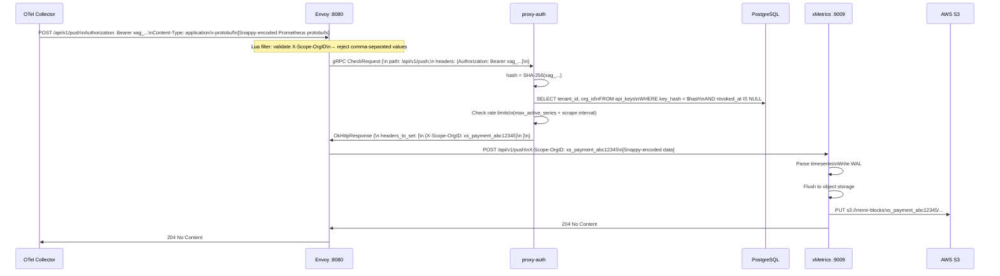
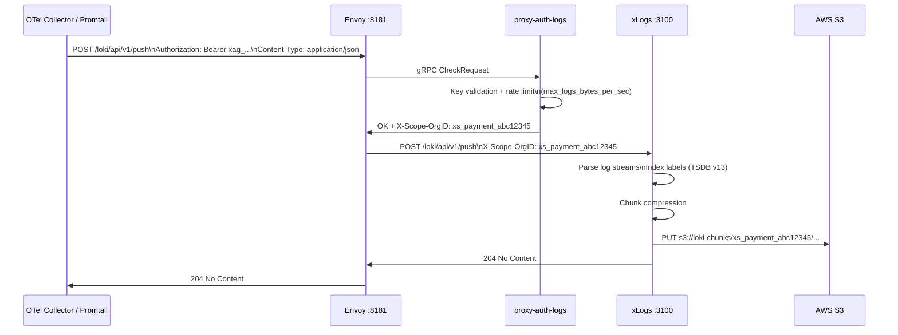
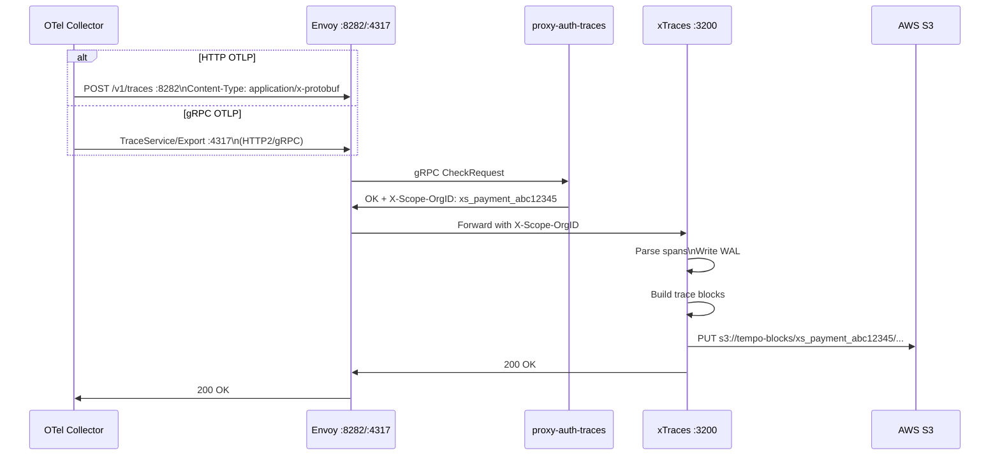
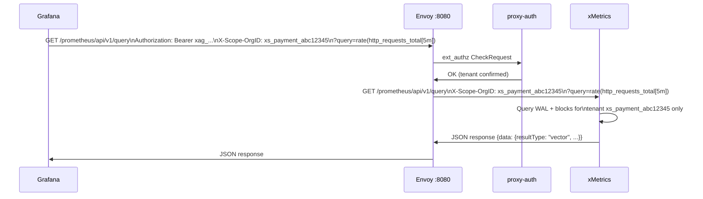

# End-to-End Telemetry Flow

## Metrics Ingestion Flow

## Logs Ingestion Flow

## Traces Ingestion Flow

## Query Flow (Grafana → xMetrics)

---

*← Previous: [Platform Architecture](platform-architecture.md)*  
*Next: [Multi-Tenant Architecture →](multi-tenant.md)*
