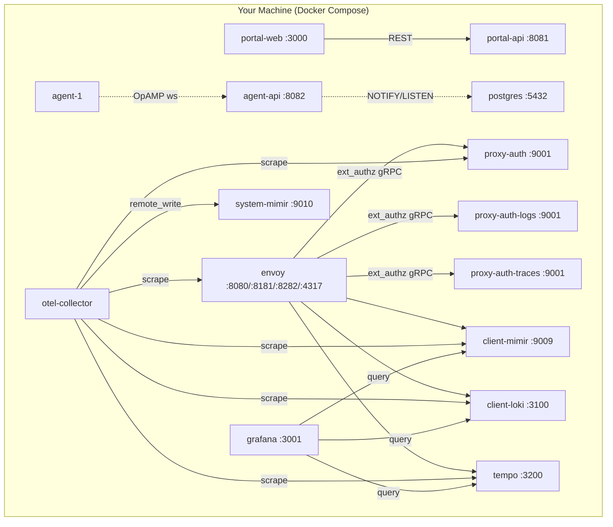

# Getting Started

## Learning Objectives

By the end of this section you will be able to:

- [ ] Clone and start the xScaler local development stack
- [ ] Verify all services are healthy
- [ ] Access the portal UI and API
- [ ] Create your first organisation account
- [ ] Understand the training environment topology

---

## Environment Setup

### Prerequisites

!!! warning "Required Software"
    Install all tools before the training begins. You will not have time to install them during class.

=== "macOS"

    ```bash
    # Install Homebrew (if not already installed)
    /bin/bash -c "$(curl -fsSL https://raw.githubusercontent.com/Homebrew/install/HEAD/install.sh)"

    # Install Docker Desktop
    brew install --cask docker

    # Install CLI tools
    brew install curl jq git

    # Verify Docker is running
    docker info | grep "Server Version"
    ```

=== "Linux (Ubuntu/Debian)"

    ```bash
    # Install Docker Engine
    curl -fsSL https://get.docker.com | sh
    sudo usermod -aG docker $USER
    newgrp docker

    # Install CLI tools
    sudo apt-get install -y curl jq git

    # Verify
    docker info | grep "Server Version"
    ```

---

## Clone the Repository

```bash
git clone https://github.com/xscalerlabs/xscaler.git
cd xscaler
```

---

## Configure the Environment

```bash
# Copy the example environment file
cp .env.example .env
```

For local training, the defaults in `.env.example` are sufficient. The file pre-configures:

| Variable | Value | Purpose |
|---|---|---|
| `JWT_SIGNING_KEY` | `dev-signing-key` | HS256 JWT signing |
| `DATABASE_URL` | `postgres://...` | PostgreSQL connection |
| `LOADGEN_GRAFANA_TENANT` | `xs_loadgen_...` | Load generator tenant |
| `STRIPE_SECRET_KEY` | (sandbox key from instructor) | Billing integration |

!!! info "Stripe Sandbox Keys"
    Your instructor will provide a Stripe sandbox key for the billing exercises.
    Without it, billing features return mock data — all other platform features work normally.

---

## Start the Stack

```bash
# Start all services in the background
docker compose up -d

# Watch startup logs
docker compose logs -f --tail=50
```

The full stack starts approximately 25 services. Expect 60–90 seconds for all health checks to pass.

### Verify All Services Are Up

```bash
docker compose ps --format "table {{.Name}}\t{{.Status}}\t{{.Ports}}"
```

Expected output (all services should show `Up` or `healthy`):

```
NAME                    STATUS                    PORTS
xscaler-portal-api-1    Up (healthy)              0.0.0.0:8081->8081/tcp
xscaler-portal-web-1    Up                        0.0.0.0:3000->3000/tcp
xscaler-agent-api-1     Up (healthy)              0.0.0.0:8082->8082/tcp
xscaler-envoy-1         Up                        0.0.0.0:8080->8080/tcp, ...
xscaler-client-mimir-1  Up (healthy)              0.0.0.0:9009->9009/tcp
xscaler-client-loki-1   Up (healthy)              0.0.0.0:3100->3100/tcp
xscaler-tempo-1         Up (healthy)              0.0.0.0:3200->3200/tcp
xscaler-grafana-1       Up (healthy)              0.0.0.0:3001->3001/tcp
xscaler-postgres-1      Up (healthy)              0.0.0.0:5432->5432/tcp
```

---

## Verify Service Health

Run these health checks to confirm each service is responding:

```bash
# Portal API
curl -s http://localhost:8081/health | jq .
# Expected: {"status":"ok"}

# Agent API
curl -s http://localhost:8082/health | jq .
# Expected: {"status":"ok"}

# Mimir (tenant metrics)
curl -s http://localhost:9009/ready
# Expected: ready

# Loki (logs)
curl -s http://localhost:3100/ready
# Expected: ready

# Tempo (traces)
curl -s http://localhost:3200/ready
# Expected: ready
```

---

## Seed Local Development Data

The local dev stack requires a one-time seed for agent management:

```bash
# Seed enrollment token and default config template
docker compose exec postgres psql -U xscaler -d xscaler \
  -f /scripts/agents/seed-local.sql
```

This seeds:

- Enrollment token: `xse_localdev0000000000000000000000` (hash stored in DB)
- Config template revision 1: minimal OTLP → debug pipeline
- Assignment: empty label selector `{}` → matches all agents in the local org

---

## Access the Training Services

### Portal Web UI

Open your browser and navigate to `http://localhost:3000`.

<div class="screenshot-placeholder">
[Screenshot: xScaler portal login page with email and password fields]
</div>

### Sign Up

```bash
# Or via API
curl -s -X POST http://localhost:8081/auth/signup \
  -H "Content-Type: application/json" \
  -d '{
    "email": "training@example.com",
    "password": "TrainingPass123!",
    "name": "Training User"
  }' | jq .
```

Expected response:
```json
{
  "token": "eyJhbGciOiJIUzI1NiIsInR5cCI6IkpXVCJ9...",
  "user": {
    "id": "xs_org_abc123",
    "email": "training@example.com",
    "name": "Training User"
  }
}
```

Save your JWT token:
```bash
export JWT_TOKEN="eyJhbGciOiJIUzI1NiIsInR5cCI6IkpXVCJ9..."
export PORTAL_BASE="http://localhost:8081"
```

### Grafana

Navigate to `http://localhost:3001` — Grafana is pre-provisioned with local dev datasources.

<div class="screenshot-placeholder">
[Screenshot: Grafana home dashboard showing the pre-provisioned datasources panel]
</div>

---

## Training Environment Architecture



---

## Troubleshooting

??? failure "Services not starting"
    Check Docker resource allocation. The full stack requires at minimum:
    - 4 vCPUs
    - 8 GB RAM
    - 10 GB disk
    
    Increase via Docker Desktop → Settings → Resources

??? failure "`connection refused` on port 8081"
    portal-api is still starting. Wait 30 seconds and retry.
    ```bash
    docker compose logs portal-api --tail=20
    ```

??? failure "Database connection errors"
    ```bash
    docker compose restart postgres
    docker compose restart portal-api
    ```

??? failure "Mimir returns 500"
    Check the block retention config:
    ```bash
    docker compose logs client-mimir --tail=30
    ```

---

## Key Takeaways

!!! success "Checkpoint"
    - The local dev stack runs 25+ services using Docker Compose
    - All services must be `healthy` before beginning lab exercises
    - Environment variables in `.env` configure all service integrations
    - A one-time seed script initialises agent management data
    - JWT tokens expire after **30 minutes** — re-authenticate when they expire

---

*← Previous: [Home](index.md)*  
*Next: [Session 1 — Overview →](session-1/overview.md)*
