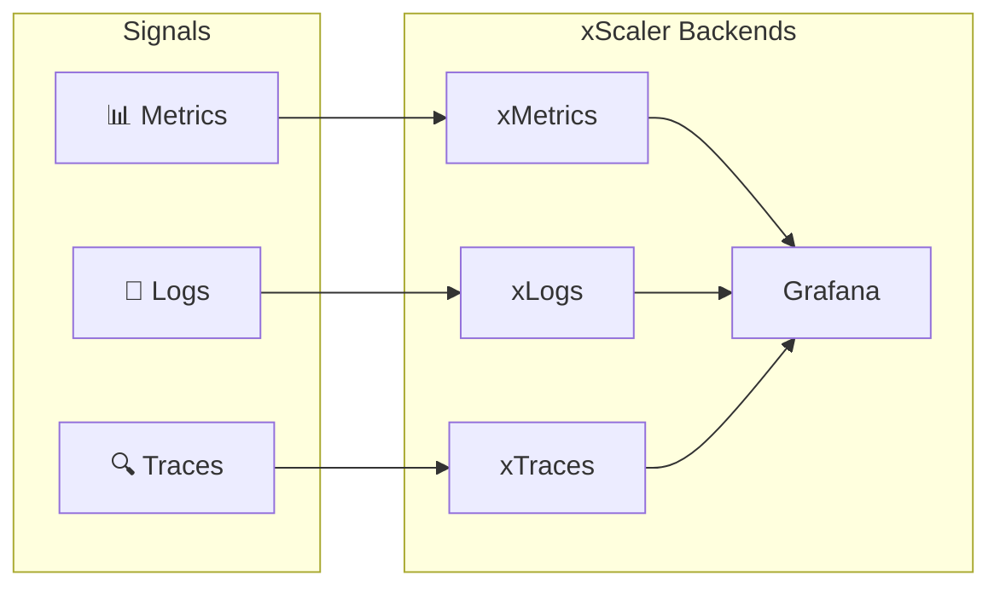

import Tabs from '@theme/Tabs';
import TabItem from '@theme/TabItem';

# xScaler Observability Platform — Training

[Banner: xScaler logo + tagline "Multi-Tenant Observability for Modern Infrastructure"]

Welcome to the **xScaler Observability Platform Training Programme**. This two-day instructor-led course gives platform administrators, DevOps engineers, and SRE teams everything they need to deploy, configure, and operate the xScaler platform in production.

---

## What You Will Learn

<Tabs>
  <TabItem value="day-1" label="Day 1">

| Session | Topic | Duration |
|---|---|---|
| 1 | Platform Introduction and User Management | 2 hours |
| 2 | OpenTelemetry Fundamentals | 2 hours |
| 3 | Data Collection Architecture | 2 hours |

  </TabItem>
</Tabs>

<Tabs>
  <TabItem value="day-2" label="Day 2">

| Session | Topic | Duration |
|---|---|---|
| 4 | Tenant Setup and Agent Deployment | 2 hours |
| 5 | Grafana Integration | 1.5 hours |
| 6 | Dashboards, APM and Alerting | 2 hours |
| 7 | Hands-On Lab and Q&A | 2 hours |

  </TabItem>
</Tabs>

---

## Platform at a Glance

xScaler is a **production-grade, multi-tenant SaaS observability platform** that unifies metrics, logs, and traces in a single tenanted environment:

| Component | Role |
|---|---|
| **xMetrics** | Multi-tenant long-term metrics storage |
| **xLogs** | Multi-tenant log aggregation |
| **xTraces** | Distributed trace storage |
| **Grafana** | Visualisation, dashboards, alerting |
| **Envoy** | Edge gateway — authentication + routing |
| **proxy-auth** | API key validation and rate limiting |
| **agent-api** | OpenTelemetry agent management (OpAMP) |
| **portal-api** | Control plane REST API |
| **portal-web** | Self-service web portal |

---

## Who This Training Is For

- **Platform Administrators** — Deploying and managing the xScaler control plane
- **DevOps Engineers** — Instrumenting services and deploying OTel collectors
- **SRE Engineers** — Operating multi-tenant observability in production
- **Operations Teams** — Day-to-day tenant management and incident response

---

## Prerequisites

:::info[Before You Begin]

- Linux/macOS command line proficiency
- Docker and `docker compose` installed
- Basic understanding of Kubernetes
- Familiarity with YAML configuration files
- Access to the training environment (credentials provided by your instructor)

:::

---

## Training Environment

Your instructor will provide environment credentials. The platform exposes these endpoints:

| Service | URL | Purpose |
|---|---|---|
| Portal | `https://portal.xscalerlabs.com` | Web portal and control plane API |
| Agent API (OpAMP) | `wss://agents.xscalerlabs.com/v1/opamp` | Agent management |
| Metrics ingestion | `https://<edge>.m.xscalerlabs.com/otlp/v1/metrics` | OTLP metrics → xMetrics |
| Logs ingestion | `https://<edge>.l.xscalerlabs.com/otlp/v1/logs` | OTLP logs → xLogs |
| Traces (HTTP) | `https://<edge>.t.xscalerlabs.com/otlp/v1/traces` | OTLP traces → xTraces |
| Traces (gRPC) | `<edge>.t.xscalerlabs.com:4317` | OTLP gRPC → xTraces |
| Grafana | `https://<org-slug>.g.xscalerlabs.com` | Dashboards and alerting |

---

## How to Use This Site

Navigate using the **sidebar** on the left or the **Previous / Next** buttons at the bottom of each page.

Each page follows a consistent structure:

1. **Learning Objectives** — what you will be able to do
2. **Concepts** — the theory behind the feature
3. **Architecture** — how it fits into the platform
4. **Examples** — real configuration and code
5. **Hands-On Exercise** — practise in your environment
6. **Validation** — confirm your work is correct
7. **Troubleshooting** — common issues and fixes
8. **Key Takeaways** — summary for review

---

## Quick Links

- [Architecture Reference](architecture/platform-architecture.md)
- [Lab Guides](labs/lab-01-tenant-creation.md)
- [Troubleshooting](appendix/troubleshooting.md)
- [API Examples](appendix/api-examples.md)
- [Collector Configurations](appendix/collector-configurations.md)

---

*Next: [Getting Started →](getting-started.md)*
