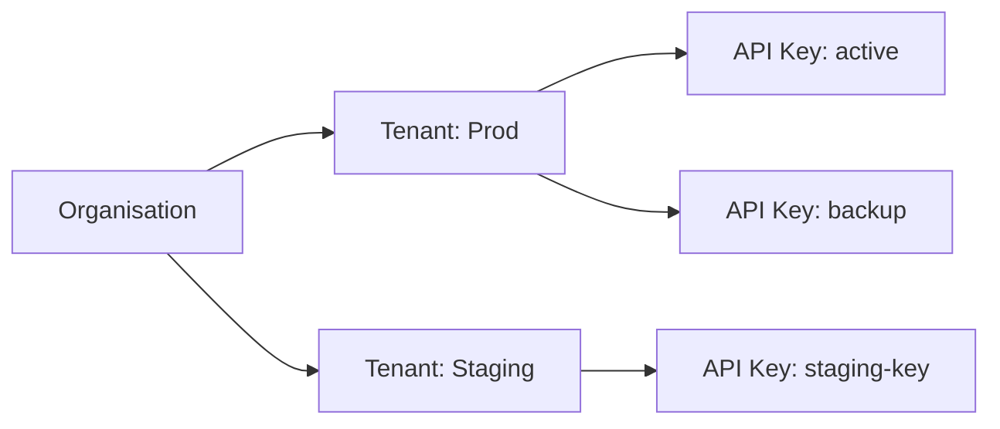

# Lab 01 — Tenant Creation and API Key Management

## Objective

Create a production-ready tenant hierarchy with multiple API keys and verify the setup.

## Prerequisites

- [ ] Local dev stack running (`docker compose ps` all green)
- [ ] JWT token exported: `export JWT_TOKEN=...`
- [ ] Base URL exported: `export PORTAL_BASE="http://localhost:8081"`

## Architecture



## Steps

### Step 1 — Create Tenants

```bash
# Create production tenant
PROD=$(curl -s -X POST $PORTAL_BASE/tenants \
  -H "Authorization: Bearer $JWT_TOKEN" \
  -H "Content-Type: application/json" \
  -d '{"display_name": "Lab Workshop Production", "environment": "prod"}')
export PROD_TENANT=$(echo $PROD | jq -r '.id')
echo "Production tenant: $PROD_TENANT"

# Create staging tenant
STAGING=$(curl -s -X POST $PORTAL_BASE/tenants \
  -H "Authorization: Bearer $JWT_TOKEN" \
  -H "Content-Type: application/json" \
  -d '{"display_name": "Lab Workshop Staging", "environment": "staging"}')
export STAGING_TENANT=$(echo $STAGING | jq -r '.id')
echo "Staging tenant: $STAGING_TENANT"
```

### Step 2 — Create API Keys

```bash
# Production: primary key
PROD_KEY=$(curl -s -X POST $PORTAL_BASE/tenants/$PROD_TENANT/keys \
  -H "Authorization: Bearer $JWT_TOKEN" \
  -H "Content-Type: application/json" \
  -d '{"display_name": "lab-primary"}')
export PROD_API_KEY=$(echo $PROD_KEY | jq -r '.key')
echo "Prod API Key: $PROD_API_KEY"

# Production: backup key
BACKUP=$(curl -s -X POST $PORTAL_BASE/tenants/$PROD_TENANT/keys \
  -H "Authorization: Bearer $JWT_TOKEN" \
  -H "Content-Type: application/json" \
  -d '{"display_name": "lab-backup"}')
export BACKUP_KEY=$(echo $BACKUP | jq -r '.key')
echo "Backup Key: $BACKUP_KEY"
```

### Step 3 — Verify

```bash
# List all tenants
curl -s $PORTAL_BASE/tenants \
  -H "Authorization: Bearer $JWT_TOKEN" | jq '.[].display_name'

# List keys for prod tenant
curl -s $PORTAL_BASE/tenants/$PROD_TENANT/keys \
  -H "Authorization: Bearer $JWT_TOKEN" | jq '.[].display_name'
```

## Validation

- [ ] Two tenants exist (prod + staging)
- [ ] Production tenant has two API keys
- [ ] API key starts with `xag_`
- [ ] Backup key starts with `xag_`

## Expected Output

```
Production tenant: xs_labworkshop_ab3cd4ef
Staging tenant: xs_labworkshop_ij5kl6mn
Prod API Key: xag_a1b2c3d4e5f6g7h8i9j0k1l2m3n4o5p6
Backup Key: xag_z9y8x7w6v5u4t3s2r1q0p9o8n7m6l5k4
```

## Troubleshooting

??? failure "401 on tenant creation"
    Token may have expired (30-min TTL). Re-authenticate:
    ```bash
    export JWT_TOKEN=$(curl -s -X POST $PORTAL_BASE/auth/login \
      -H "Content-Type: application/json" \
      -d '{"email":"admin@example.com","password":"Training123!"}' | jq -r '.token')
    ```

---

*← Previous: [Gateway Mode](../architecture/gateway-mode.md)*  
*Next: [Lab 02 — Agent Deployment →](lab-02-agent-deployment.md)*
