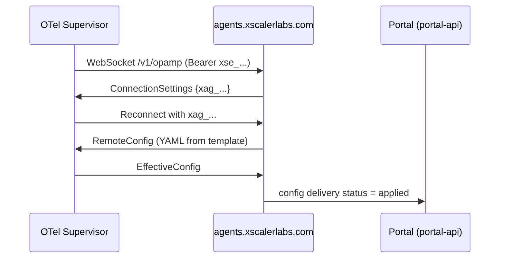

# Lab 02 — Agent Deployment and Enrollment

## Objective

Deploy an OTel Collector agent, enrol it with xScaler via OpAMP, and verify it appears in the portal with a delivered configuration.

## Prerequisites

- [ ] Lab 01 completed (`PROD_TENANT` and `PROD_API_KEY` exported)
- [ ] OTel Collector (`otelcol-contrib`) installed on your lab machine
- [ ] `PORTAL_BASE` and `JWT_TOKEN` exported

## Enrollment Flow



---

## Steps

### Step 1 — Create an Enrollment Token

In the portal, navigate to **Agents → Enrollment Tokens → New Token**.

Or via API:

```bash
ENROLL=$(curl -s -X POST "$PORTAL_BASE/api/portal/orgs/enrollment-tokens" \
  -H "Authorization: Bearer $JWT_TOKEN" \
  -H "Content-Type: application/json" \
  -d '{"display_name": "lab-enrollment"}')
export ENROLLMENT_TOKEN=$(echo $ENROLL | jq -r '.token')
echo "Enrollment token: $ENROLLMENT_TOKEN"
```

The token starts with `xse_` and is single-use by default.

### Step 2 — Configure the OTel Supervisor

Create `supervisor.yaml`:

```yaml
server:
  endpoint: wss://agents.xscalerlabs.com/v1/opamp
  headers:
    Authorization: "Bearer ${ENROLLMENT_TOKEN}"

capabilities:
  accepts_remote_config: true
  reports_effective_config: true
  reports_own_metrics: true

agent:
  executable: /usr/local/bin/otelcol-contrib
  config_apply_timeout: 30s
```

### Step 3 — Start the Agent

```bash
otelcol-contrib --config supervisor.yaml
```

Watch the startup output — you should see:

```
[INFO] Connected to OpAMP server
[INFO] Received remote config (revision 1)
[INFO] Config applied successfully
```

### Step 4 — Verify in the Portal

Navigate to **Agents → Fleet** in the portal. Your agent should appear with:

- **Status:** Online
- **Config status:** Applied
- **Last seen:** within the last minute

<div class="screenshot-placeholder">
[Screenshot: Portal Agents Fleet view showing one agent online with status Applied]
</div>

### Step 5 — Check via API

```bash
# List all agents in the org
curl -s "$PORTAL_BASE/api/portal/orgs/agents" \
  -H "Authorization: Bearer $JWT_TOKEN" | jq '.[].status'
```

Expected: `"online"` for your enrolled agent.

---

## Validation

- [ ] Enrollment token created (starts with `xse_`)
- [ ] Supervisor connects and logs "Config applied"
- [ ] Agent appears in portal with status **Online**
- [ ] Config delivery shows **Applied**

---

## Key Takeaways

- The enrollment token (`xse_`) is used once — the agent receives a permanent per-agent key (`xag_`) after first connection
- `accepts_remote_config: true` is required for OpAMP config push to work
- Config delivery status transitions: `offered` → `applied` (or `failed` on error)

---

*← Previous: [Lab 01](lab-01-tenant-creation.md)*  
*Next: [Lab 03 — Agent Registration →](lab-03-registration.md)*
