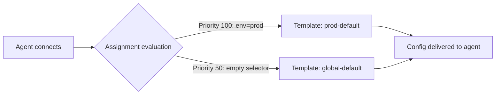

# Lab 03 — Agent Registration and Config Templates

## Objective

Create a config template in the portal, assign it to your enrolled agent, and verify the updated configuration is delivered and applied.

## Prerequisites

- [ ] Lab 02 completed — agent enrolled and showing **Online / Applied** in the portal

---

## Background: Config Template Assignment

When an agent connects, the xScaler agent-api evaluates all active assignments in priority order. The first assignment whose `label_selector` matches the agent's labels wins, and that config revision is delivered.



---

## Steps

### Step 1 — View Existing Templates

In the portal, navigate to **Config → Templates**. You should see the default template created during organisation setup.

Or via API:

```bash
curl -s "$PORTAL_BASE/api/portal/orgs/agent-config-templates" \
  -H "Authorization: Bearer $JWT_TOKEN" | jq '.[].display_name'
```

### Step 2 — Create a New Config Template

In the portal: **Config → Templates → New Template**

Name it `lab-workshop` and paste the following YAML:

```yaml
receivers:
  otlp:
    protocols:
      grpc:
        endpoint: "0.0.0.0:4317"
      http:
        endpoint: "0.0.0.0:4318"

processors:
  batch:
    timeout: 5s
  memory_limiter:
    limit_mib: 256

exporters:
  otlphttp/metrics:
    endpoint: "https://${EDGE}.m.xscalerlabs.com/otlp"
    headers:
      Authorization: "Bearer ${secret:API_KEY}"
  otlphttp/logs:
    endpoint: "https://${EDGE}.l.xscalerlabs.com/otlp"
    headers:
      Authorization: "Bearer ${secret:API_KEY}"
  otlphttp/traces:
    endpoint: "https://${EDGE}.t.xscalerlabs.com/otlp"
    headers:
      Authorization: "Bearer ${secret:API_KEY}"

service:
  pipelines:
    metrics:
      receivers: [otlp]
      processors: [memory_limiter, batch]
      exporters: [otlphttp/metrics]
    logs:
      receivers: [otlp]
      processors: [memory_limiter, batch]
      exporters: [otlphttp/logs]
    traces:
      receivers: [otlp]
      processors: [memory_limiter, batch]
      exporters: [otlphttp/traces]
```

Note the `${secret:API_KEY}` placeholder — this is resolved by the platform using a KMS-encrypted secret at delivery time. No plaintext credentials appear in the template.

Or via API:

```bash
TMPL=$(curl -s -X POST "$PORTAL_BASE/api/portal/orgs/agent-config-templates" \
  -H "Authorization: Bearer $JWT_TOKEN" \
  -H "Content-Type: application/json" \
  -d '{
    "display_name": "lab-workshop",
    "config_yaml": "receivers:\n  otlp:\n    protocols:\n      grpc:\n        endpoint: \"0.0.0.0:4317\"\n"
  }')
export TEMPLATE_ID=$(echo $TMPL | jq -r '.id')
echo "Template ID: $TEMPLATE_ID"
```

### Step 3 — Create an Assignment

In the portal: **Config → Assignments → New Assignment**

Set:
- **Template:** `lab-workshop`
- **Label selector:** `{}` (matches all agents)
- **Priority:** `50`

Or via API:

```bash
curl -s -X POST "$PORTAL_BASE/api/portal/orgs/agent-config-assignments" \
  -H "Authorization: Bearer $JWT_TOKEN" \
  -H "Content-Type: application/json" \
  -d "{
    \"template_id\": \"$TEMPLATE_ID\",
    \"label_selector\": {},
    \"priority\": 50
  }"
```

### Step 4 — Verify Config Delivery

Within 5–10 seconds your agent should receive and apply the new config. In the portal under **Agents → Fleet**, select your agent and check:

- **Config revision:** incremented (e.g., `2`)
- **Config status:** `applied`

In the agent's logs you should see:

```
[INFO] Received remote config (revision 2)
[INFO] Config applied successfully
```

### Step 5 — Add an Agent Label

Label your agent so you can test selector-based routing. In the portal: **Agents → Fleet → [your agent] → Edit Labels**

Add the label `env=lab`.

Then create a second assignment with:
- **Label selector:** `{"env": "lab"}`
- **Priority:** `100`

The higher-priority selector now matches your agent, so it will receive the assignment at priority 100 instead of the empty-selector assignment at priority 50.

---

## Validation

- [ ] At least one config template visible in **Config → Templates**
- [ ] Assignment with `{}` selector exists at priority 50
- [ ] Agent config status shows `applied` after assignment was created
- [ ] Config revision number incremented after assignment change

---

## Key Takeaways

- `${secret:NAME}` placeholders prevent credentials from being stored in plain text in templates
- Label selectors use exact-match JSON objects — `{}` matches every agent
- Higher priority assignments win; a `{}` catch-all at priority 0 is a safe global default
- Config is pushed in real time via the OpAMP WebSocket — no polling needed

---

*← Previous: [Lab 02](lab-02-agent-deployment.md)*  
*Next: [Lab 04 — Grafana Setup →](lab-04-grafana.md)*
