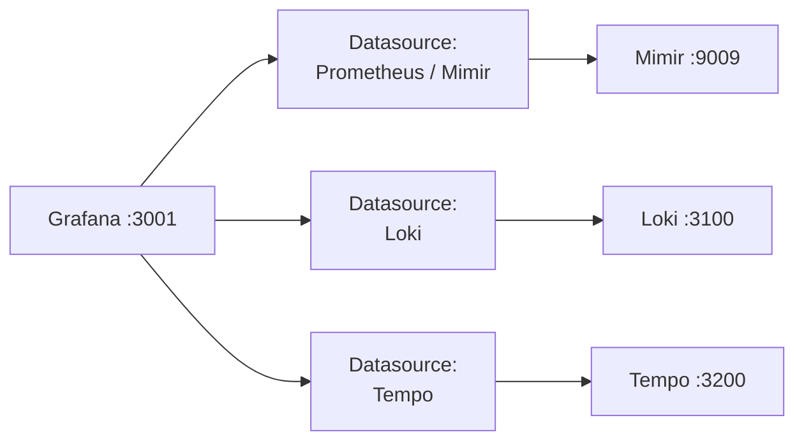

# Lab 04 — Grafana Datasource Configuration

## Objective

Configure and verify all three xScaler datasources in Grafana, including cross-signal correlation.

## Prerequisites

- [ ] Lab 01 completed (`PROD_TENANT` and `PROD_API_KEY` exported)
- [ ] Grafana accessible: `http://localhost:3001`
- [ ] Local stack running

## Architecture



## Steps

### Step 1 — Verify Pre-Provisioned Datasources

1. Open `http://localhost:3001` (admin/admin)
2. Navigate to **Connections → Data Sources**
3. Verify four datasources exist: `system-mimir`, `client-mimir`, `client-loki`, `tempo`
4. Click **Test** on each — all should show green

### Step 2 — Verify Metrics Datasource

```bash
# Direct query to confirm data exists
curl -s "http://localhost:9009/prometheus/api/v1/query" \
  -H "X-Scope-OrgID: system-monitoring" \
  --data-urlencode 'query=up' | jq '.data.result | length'
# Expected: > 0
```

### Step 3 — Verify Logs Datasource

In Grafana Explore → `client-loki` datasource:
```logql
{service=~".+"}
```
Expected: Log streams from the loadgen service.

### Step 4 — Verify Traces Datasource

In Grafana Explore → `tempo` datasource → **Search** → Run Query.
Expected: Recent traces from loadgen.

### Step 5 — Test Cross-Signal Correlation

1. In Tempo Explore, click any trace
2. Click **Logs for this span**
3. Verify Loki log lines appear

<div class="screenshot-placeholder">
[Screenshot: Grafana Tempo trace detail with side panel showing correlated Loki log lines]
</div>

## Validation

- [ ] All four datasources show green status
- [ ] PromQL `up` returns results
- [ ] LogQL `{service=~".+"}` returns log streams
- [ ] Tempo search returns traces
- [ ] Trace-to-logs correlation works

## Troubleshooting

??? failure "Tempo shows 'no traces'"
    ```bash
    docker compose logs loadgen --tail=20
    docker compose ps loadgen
    ```

---

*← Previous: [Lab 03](lab-03-registration.md)*  
*Next: [Lab 05 — Dashboard Creation →](lab-05-dashboard.md)*
