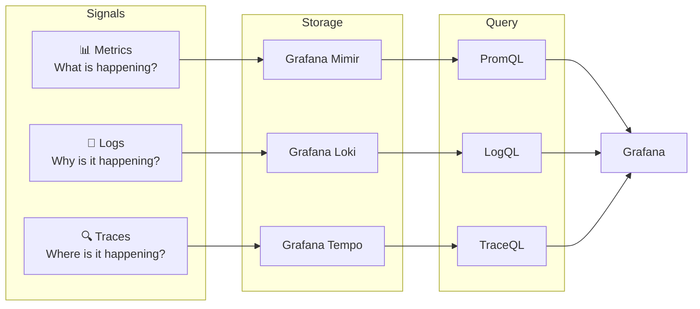
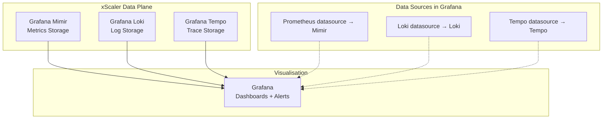

# Observability Fundamentals

## Learning Objectives

- [ ] Define the three pillars of observability: metrics, logs, and traces
- [ ] Explain which xScaler component handles each signal
- [ ] Describe the Grafana LGTM stack and how it maps to each signal
- [ ] Use basic PromQL, LogQL, and TraceQL queries in Grafana

---

## The Three Pillars of Observability

Modern systems are too complex to debug by inspection alone. **Observability** is the ability to understand your system's internal state from its external outputs.



---

## Metrics

**Definition:** Numeric time-series data representing measurements over time.

**Format:** `metric_name{label="value"} numeric_value timestamp`

**Examples:**
```promql
# HTTP request rate
rate(http_requests_total{service="payment-api", status="200"}[5m])

# Memory usage
node_memory_MemAvailable_bytes / node_memory_MemTotal_bytes

# Active database connections
pg_stat_database_numbackends{datname="xscaler"}
```

**xScaler metrics storage:** Grafana Mimir (`multitenancy_enabled: true`, port `:9009`)

**Key characteristics:**
- Aggregatable — you can sum, average, and percentile across thousands of series
- Low storage — just numbers + labels + timestamp
- Not individual events — represents aggregated state

**Prometheus Data Model:**
```
metric_name{label1="value1", label2="value2"} 42.5 1718800000
          ↑                                   ↑    ↑
          Metric family                       Value Unix timestamp
```

---

## Logs

**Definition:** Timestamped text records describing discrete events.

**Examples:**
```
2026-06-18T10:22:31.445Z [ERROR] payment-api: charge failed: card declined (trace_id=abc123)
2026-06-18T10:22:31.446Z [INFO]  payment-api: retry 1/3 scheduled (delay=2s)
2026-06-18T10:22:33.501Z [ERROR] payment-api: charge failed after 3 retries, giving up
```

**xScaler logs storage:** Grafana Loki (`auth_enabled: true`, HTTP `:3100`, gRPC `:9095`)

**LogQL query examples:**
```logql
# All errors from payment-api
{service="payment-api", level="error"}

# Parse JSON logs and filter on status code
{service="api-gateway"} | json | status_code >= 500

# Count errors over time
rate({service="payment-api"} |= "error" [5m])

# Find logs for a specific trace
{service="payment-api"} | json | trace_id = "abc123"
```

**Key characteristics:**
- High cardinality — every event is unique
- High storage cost — full text
- Essential for debugging — "what exactly happened"

---

## Traces

**Definition:** End-to-end records of a request's journey through distributed services.

```mermaid
gantt
    title Distributed Trace: POST /checkout
    dateFormat  X
    axisFormat  %Lms

    section api-gateway
    HTTP handler           : 0, 5

    section payment-api
    ValidateCart           : 5, 15
    ChargeCard             : 15, 145
    UpdateInventory        : 145, 165

    section card-processor
    AuthorizePayment       : 20, 140
```



**xScaler traces storage:** Grafana Tempo (`multitenancy_enabled: true`, HTTP `:3200`, gRPC `:9095`)

**TraceQL query examples:**
```traceql
# All slow database spans
{span.db.system = "postgresql" && duration > 500ms}

# Errors in payment-api
{resource.service.name = "payment-api" && status = error}

# Find trace by ID
{traceID = "abc123def456"}
```

**Key characteristics:**
- Requires instrumentation in application code
- Connects related log events and metrics into a single request flow
- Essential for diagnosing latency in distributed systems

---

## The Grafana LGTM Stack

LGTM is the acronym for the four open-source components that form the xScaler observability backend:

| Letter | Component | Signal | Port(s) |
|---|---|---|---|
| **L** | Grafana Loki | Logs | HTTP :3100, gRPC :9095 |
| **G** | Grafana | Visualisation | :3001 |
| **T** | Grafana Tempo | Traces | HTTP :3200, gRPC :9095 |
| **M** | Grafana Mimir | Metrics | :9009 |



### Why Three Separate Backends?

| Concern | Mimir (Metrics) | Loki (Logs) | Tempo (Traces) |
|---|---|---|---|
| Data model | Float64 time series | Compressed log streams | Span trees |
| Cardinality | Limited (labels only) | Unlimited (full text) | Unlimited (per-request) |
| Query language | PromQL | LogQL | TraceQL |
| Compression | High (numbers) | Medium (text) | Low (complex structures) |
| Retention | Long (years) | Medium (months) | Short (days-weeks) |

---

## The Four Golden Signals

Google SRE popularised the concept of four signals that, together, describe the health of any service:

| Signal | Metric Name | PromQL Example |
|---|---|---|
| **Latency** | p99 request duration | `histogram_quantile(0.99, rate(http_request_duration_seconds_bucket[5m]))` |
| **Traffic** | Request rate | `sum(rate(http_requests_total[5m]))` |
| **Errors** | Error rate | `sum(rate(http_requests_total{status=~"5.."}[5m])) / sum(rate(http_requests_total[5m]))` |
| **Saturation** | CPU/memory utilisation | `1 - avg(rate(node_cpu_seconds_total{mode="idle"}[5m]))` |

---

## Hands-On Exercise

### Exercise 1.5 — Explore Grafana Datasources

1. Open Grafana at `http://localhost:3001`
2. Navigate to **Connections → Data Sources**

<div class="screenshot-placeholder">
[Screenshot: Grafana data sources page showing system-mimir, client-mimir, client-loki, and tempo datasources]
</div>

You should see four pre-provisioned datasources:
- `system-mimir` — platform internal metrics (`X-Scope-OrgID: system-monitoring`)
- `client-mimir` — tenant metrics (`X-Scope-OrgID: ${LOADGEN_GRAFANA_TENANT}`)
- `client-loki` — tenant logs
- `tempo` — tenant traces

### Exercise 1.6 — Run Your First PromQL Query

1. Open Grafana → **Explore**
2. Select the `client-mimir` datasource
3. Enter this query:

```promql
up
```

This returns `1` for every scrape target that is reachable.

<div class="screenshot-placeholder">
[Screenshot: Grafana Explore panel with 'up' query returning 1 for multiple targets]
</div>

### Exercise 1.7 — Run Your First LogQL Query

1. In Grafana → **Explore**
2. Select the `client-loki` datasource
3. Enter:

```logql
{service="loadgen"}
```

<div class="screenshot-placeholder">
[Screenshot: Grafana Explore showing log lines from the loadgen service]
</div>

---

## Validation

- [ ] Grafana is accessible at `http://localhost:3001`
- [ ] All four datasources show green status (✓) in Connections → Data Sources
- [ ] `up` query in Explore returns results from `client-mimir`
- [ ] A LogQL query returns log lines in the Loki Explore view

---

## Troubleshooting

??? failure "Datasource shows 'Data source connected but no labels found'"
    The load generator may not be running. Check:
    ```bash
    docker compose ps loadgen
    docker compose logs loadgen --tail=20
    ```

??? failure "PromQL query returns 'No data'"
    Wait 30 seconds — scrape interval is 15s and there may not be enough data points yet.
    Also verify the correct datasource is selected (`client-mimir` not `system-mimir`).

??? failure "Loki datasource connection error"
    ```bash
    curl -s http://localhost:3100/ready
    docker compose logs client-loki --tail=20
    ```

---

## Key Takeaways

!!! success "Session 1.3 Summary"
    - Three observability signals: **metrics** (what), **logs** (why), **traces** (where)
    - xScaler uses three separate backends: **Mimir** (metrics), **Loki** (logs), **Tempo** (traces)
    - **Grafana** is the single visualisation layer connecting all three backends
    - The **four golden signals** — latency, traffic, errors, saturation — are the foundation of SRE alerting
    - Use **PromQL** for metrics, **LogQL** for logs, **TraceQL** for traces

---

*← Previous: [User Management](user-management.md)*  
*Next: [Session 2 Overview →](../session-2/overview.md)*
