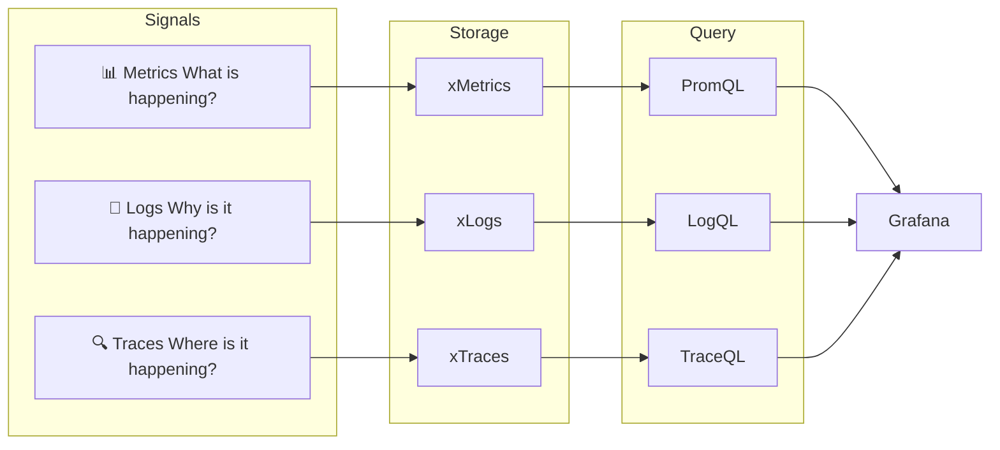
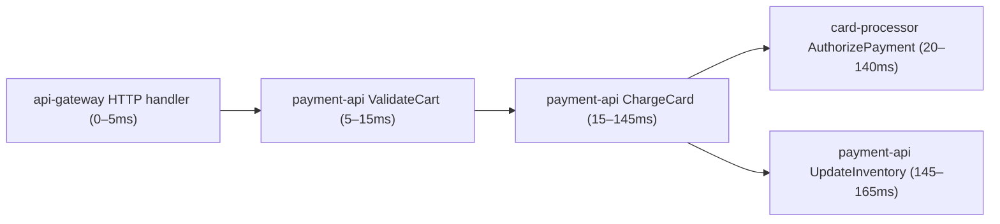
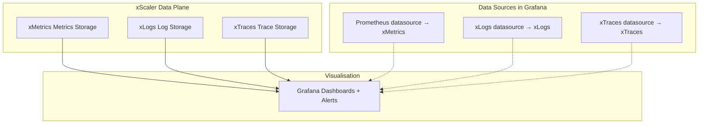

# Observability Fundamentals

## Learning Objectives

- [ ] Define the three pillars of observability: metrics, logs, and traces
- [ ] Explain which xScaler component handles each signal
- [ ] Describe the xScaler backend stack and how it maps to each signal
- [ ] Use basic PromQL, LogQL, and TraceQL queries in Grafana

---

## The Three Pillars of Observability

Modern systems are too complex to debug by inspection alone. **Observability** is the ability to understand your system's internal state from its external outputs.



---

## Metrics

**Definition:** Numeric time-series data representing measurements over time.

**Format:** `metric_name{label="value"} numeric_value timestamp`

**Examples:**
```promql
# HTTP request rate
rate(http_requests_total{service="payment-api", status="200"}[5m])

# Memory usage
node_memory_MemAvailable_bytes / node_memory_MemTotal_bytes

# Active database connections
pg_stat_database_numbackends{datname="xscaler"}
```

**xScaler metrics storage:** xMetrics (`multitenancy_enabled: true`, port `:9009`)

**Key characteristics:**
- Aggregatable — you can sum, average, and percentile across thousands of series
- Low storage — just numbers + labels + timestamp
- Not individual events — represents aggregated state

**Prometheus Data Model:**
```
metric_name{label1="value1", label2="value2"} 42.5 1718800000
          ↑                                   ↑    ↑
          Metric family                       Value Unix timestamp
```

---

## Logs

**Definition:** Timestamped text records describing discrete events.

**Examples:**
```
2026-06-18T10:22:31.445Z [ERROR] payment-api: charge failed: card declined (trace_id=abc123)
2026-06-18T10:22:31.446Z [INFO]  payment-api: retry 1/3 scheduled (delay=2s)
2026-06-18T10:22:33.501Z [ERROR] payment-api: charge failed after 3 retries, giving up
```

**xScaler logs storage:** xLogs (`auth_enabled: true`, HTTP `:3100`, gRPC `:9095`)

**LogQL query examples:**
```logql
# All errors from payment-api
{service="payment-api", level="error"}

# Parse JSON logs and filter on status code
{service="api-gateway"} | json | status_code >= 500

# Count errors over time
rate({service="payment-api"} |= "error" [5m])

# Find logs for a specific trace
{service="payment-api"} | json | trace_id = "abc123"
```

**Key characteristics:**
- High cardinality — every event is unique
- High storage cost — full text
- Essential for debugging — "what exactly happened"

---

## Traces

**Definition:** End-to-end records of a request's journey through distributed services.



**xScaler traces storage:** xTraces (`multitenancy_enabled: true`, HTTP `:3200`, gRPC `:9095`)

**TraceQL query examples:**
```traceql
# All slow database spans
{span.db.system = "postgresql" && duration > 500ms}

# Errors in payment-api
{resource.service.name = "payment-api" && status = error}

# Find trace by ID
{traceID = "abc123def456"}
```

**Key characteristics:**
- Requires instrumentation in application code
- Connects related log events and metrics into a single request flow
- Essential for diagnosing latency in distributed systems

---

## The xScaler Observability Stack

xScaler combines four components to form a complete observability backend:

| Component | Signal | Access |
|---|---|---|
| **xLogs** | Logs | `https://<edge>.l.xscalerlabs.com` |
| **Grafana** | Visualisation | `https://<slug>.g.xscalerlabs.com` |
| **xTraces** | Traces | `https://<edge>.t.xscalerlabs.com` |
| **xMetrics** | Metrics | `https://<edge>.m.xscalerlabs.com` |



### Why Three Separate Backends?

| Concern | xMetrics (Metrics) | xLogs (Logs) | xTraces (Traces) |
|---|---|---|---|
| Data model | Float64 time series | Compressed log streams | Span trees |
| Cardinality | Limited (labels only) | Unlimited (full text) | Unlimited (per-request) |
| Query language | PromQL | LogQL | TraceQL |
| Compression | High (numbers) | Medium (text) | Low (complex structures) |
| Retention | Long (years) | Medium (months) | Short (days-weeks) |

---

## The Four Golden Signals

Google SRE popularised the concept of four signals that, together, describe the health of any service:

| Signal | Metric Name | PromQL Example |
|---|---|---|
| **Latency** | p99 request duration | `histogram_quantile(0.99, rate(http_request_duration_seconds_bucket[5m]))` |
| **Traffic** | Request rate | `sum(rate(http_requests_total[5m]))` |
| **Errors** | Error rate | `sum(rate(http_requests_total{status=~"5.."}[5m])) / sum(rate(http_requests_total[5m]))` |
| **Saturation** | CPU/memory utilisation | `1 - avg(rate(node_cpu_seconds_total{mode="idle"}[5m]))` |

---

## Hands-On Exercise

### Exercise 1.5 — Explore Grafana Datasources

1. Open Grafana at `https://<slug>.g.xscalerlabs.com`
2. Navigate to **Connections → Data Sources**

<div class="screenshot-placeholder">
[Screenshot: Grafana data sources page showing platform-metrics, xMetrics, xLogs, and tempo datasources]
</div>

You should see four pre-provisioned datasources:
- `platform-metrics` — platform internal metrics (`X-Scope-OrgID: <your-tenant-id>`)
- `xMetrics` — tenant metrics (`X-Scope-OrgID: <your-tenant-id>`)
- `xLogs` — tenant logs
- `tempo` — tenant traces

### Exercise 1.6 — Run Your First PromQL Query

1. Open Grafana → **Explore**
2. Select the `xMetrics` datasource
3. Enter this query:

```promql
up
```

This returns `1` for every scrape target that is reachable.

<div class="screenshot-placeholder">
[Screenshot: Grafana Explore panel with 'up' query returning 1 for multiple targets]
</div>

### Exercise 1.7 — Run Your First LogQL Query

1. In Grafana → **Explore**
2. Select the `xLogs` datasource
3. Enter:

```logql
{service="loadgen"}
```

<div class="screenshot-placeholder">
[Screenshot: Grafana Explore showing log lines from the loadgen service]
</div>

---

## Validation

- [ ] Grafana is accessible at `https://<slug>.g.xscalerlabs.com`
- [ ] All four datasources show green status (✓) in Connections → Data Sources
- [ ] `up` query in Explore returns results from `xMetrics`
- [ ] A LogQL query returns log lines in the xLogs Explore view

---

## Troubleshooting

<details>
<summary><strong>Datasource shows 'Data source connected but no labels found'</strong></summary>

The load generator may not be running. Check:
```bash
docker compose ps loadgen
docker compose logs loadgen --tail=20
```

</details>

<details>
<summary><strong>PromQL query returns 'No data'</strong></summary>

Wait 30 seconds — scrape interval is 15s and there may not be enough data points yet.
Also verify the correct datasource is selected (`xMetrics` not `platform-metrics`).

</details>

<details>
<summary><strong>xLogs datasource connection error</strong></summary>

```bash
curl -s https://<edge>.l.xscalerlabs.com/ready
docker compose logs xLogs --tail=20
```

</details>

---

## Key Takeaways

:::tip[Session 1.3 Summary]

- Three observability signals: **metrics** (what), **logs** (why), **traces** (where)
- xScaler uses three separate backends: **xMetrics** (metrics), **xLogs** (logs), **xTraces** (traces)
- **Grafana** is the single visualisation layer connecting all three backends
- The **four golden signals** — latency, traffic, errors, saturation — are the foundation of SRE alerting
- Use **PromQL** for metrics, **LogQL** for logs, **TraceQL** for traces

:::

---

*← Previous: [User Management](user-management.md)*  
*Next: [Session 2 Overview →](../session-2/overview.md)*
