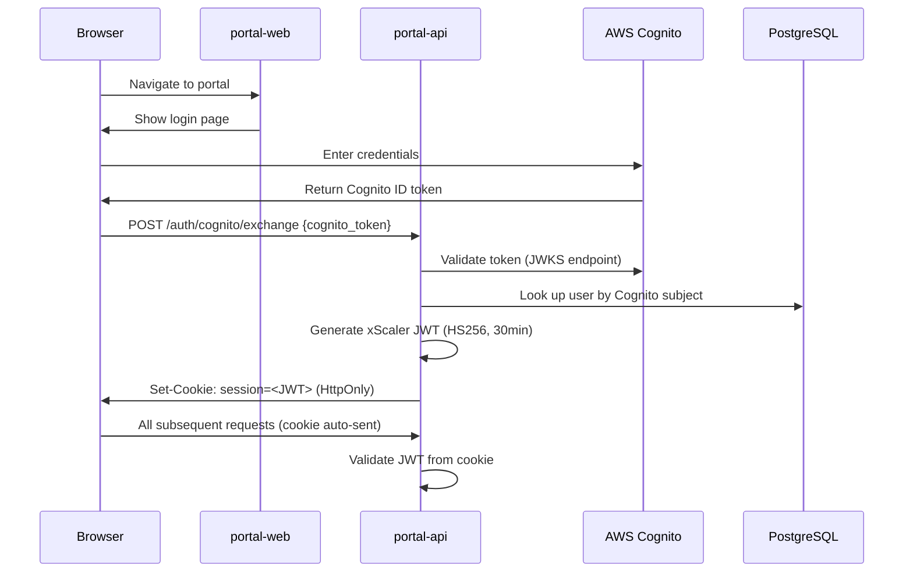
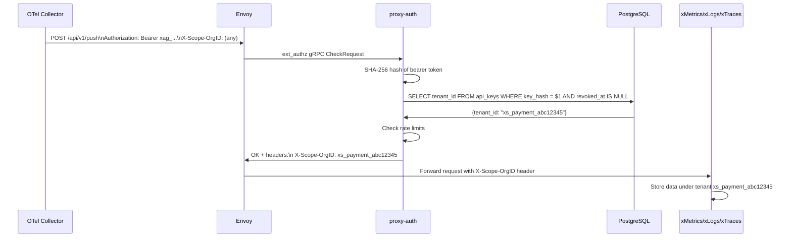
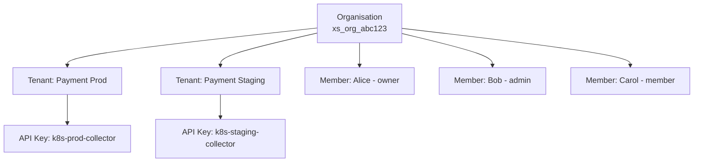

# User Management

## Learning Objectives

- [ ] Describe the xScaler authentication flow end-to-end
- [ ] Explain the difference between Cognito tokens and xScaler JWTs
- [ ] List all user roles and their permissions
- [ ] Create an organisation and invite team members
- [ ] Generate and manage API keys for tenants

---

## Concepts

### Identity Model

xScaler has two distinct identity models:

| Identity Type | Used By | Mechanism | Purpose |
|---|---|---|---|
| Human users | Browser sessions | JWT (HS256, 30-min TTL) | Portal access |
| OTel collectors | Data ingestion | API keys (`xag_` prefix) | Telemetry push |
| OTel agents | OpAMP channel | Enrollment tokens (`xse_`) | Agent registration |

---

## Authentication Flow

### Human Users (Browser)



**JWT Claims:**
```json
{
  "sub": "xs_org_abc123def456",
  "email": "user@example.com",
  "org_id": "xs_org_abc123def456",
  "role": "admin",
  "exp": 1718800000
}
```

**Key properties:**
- Algorithm: `HS256` — symmetric signing key (`JWT_SIGNING_KEY` env var)
- TTL: **30 minutes** — short-lived for security
- Storage: `HttpOnly` cookie — not accessible to JavaScript (XSS protection)
- Renewal: Portal-web silently re-authenticates before expiry

### Local Development Auth (No Cognito)

For local development without AWS Cognito, portal-api provides a direct signup/login:

```bash
# Sign up
curl -s -X POST http://localhost:8081/auth/signup \
  -H "Content-Type: application/json" \
  -d '{"email":"admin@example.com","password":"Dev123!","name":"Admin"}' | jq .

# Login
curl -s -X POST http://localhost:8081/auth/login \
  -H "Content-Type: application/json" \
  -d '{"email":"admin@example.com","password":"Dev123!"}' | jq .
```

---

## API Key Authentication

API keys are used by OTel collectors to push telemetry data. They never expire unless explicitly revoked.

### Key Format

```
xag_a1b2c3d4e5f6g7h8i9j0k1l2m3n4o5p6
│   └─────────────────────────────────
│         Random 32-character suffix
└── Prefix: identifies key type
    xag_ = agent/collector API key
    xse_ = enrollment token
```

### Key Storage (Security)

API keys are **never stored in plaintext**. Only the SHA-256 hash is stored:

```sql
-- api_keys table
INSERT INTO api_keys (id, tenant_id, key_hash, prefix, display_name)
VALUES (
  'key_abc123',
  'xs_payment_abc12345',
  sha256('xag_a1b2c3d4e5f6...'),  -- SHA-256 hash only
  'xag_a1b2',                      -- First 8 chars for display
  'k8s-prod-daemonset'
);
```

!!! warning "Key Recovery"
    API keys are shown **once** at creation time. If you lose the key, you must create a new one and revoke the old one. xScaler cannot recover the original key value.

### Authentication Flow (API Key)



---

## Organisation and Role Model



### Roles

| Role | Description | Can Do |
|---|---|---|
| `owner` | Organisation creator | Everything including deletion |
| `admin` | Organisation admin | All operations except org deletion |
| `member` | Standard user | Create/manage tenants, view all |
| `viewer` | Read-only | View only — no create/modify/delete |

### Entity Formats

| Entity | Format | Example |
|---|---|---|
| Organisation ID | `xs_org_<32-lower-hex>` | `xs_org_a1b2c3d4e5f6g7h8i9j0k1l2m3n4o5p6` |
| Tenant ID | `xs_<orgslug>_<8-char-lower-base32>` | `xs_payment_ab3cd4ef` |
| API key | `xag_<random-32>` | `xag_a1b2c3d4e5f6...` |
| Enrollment token | `xse_<random-32>` | `xse_a1b2c3d4e5f6...` |

---

## Hands-On Exercise

### Exercise 1.3 — Create an Organisation and Invite Members

```bash
# Set base URL
export PORTAL_BASE="http://localhost:8081"

# 1. Sign up and get a JWT token
RESPONSE=$(curl -s -X POST $PORTAL_BASE/auth/signup \
  -H "Content-Type: application/json" \
  -d '{"email":"alice@example.com","password":"Training123!","name":"Alice"}')

echo $RESPONSE | jq .
export JWT_TOKEN=$(echo $RESPONSE | jq -r '.token')

# 2. Get your organisation details
curl -s $PORTAL_BASE/org \
  -H "Authorization: Bearer $JWT_TOKEN" | jq .

# 3. Invite a colleague
curl -s -X POST $PORTAL_BASE/org/members/invite \
  -H "Authorization: Bearer $JWT_TOKEN" \
  -H "Content-Type: application/json" \
  -d '{"email":"bob@example.com","role":"admin"}' | jq .

# 4. List members
curl -s $PORTAL_BASE/org/members \
  -H "Authorization: Bearer $JWT_TOKEN" | jq .
```

### Exercise 1.4 — Create a Tenant and API Key

```bash
# 1. Create a tenant
TENANT=$(curl -s -X POST $PORTAL_BASE/tenants \
  -H "Authorization: Bearer $JWT_TOKEN" \
  -H "Content-Type: application/json" \
  -d '{"display_name":"Payment Service Production","environment":"prod"}')

echo $TENANT | jq .
export TENANT_ID=$(echo $TENANT | jq -r '.id')
echo "Tenant ID: $TENANT_ID"

# 2. Create an API key for the tenant
KEY=$(curl -s -X POST $PORTAL_BASE/tenants/$TENANT_ID/keys \
  -H "Authorization: Bearer $JWT_TOKEN" \
  -H "Content-Type: application/json" \
  -d '{"display_name":"k8s-prod-collector"}')

echo $KEY | jq .
export API_KEY=$(echo $KEY | jq -r '.key')
echo "API Key: $API_KEY"
echo "SAVE THIS KEY — it will not be shown again!"
```

---

## Validation

- [ ] `curl $PORTAL_BASE/org -H "Authorization: Bearer $JWT_TOKEN"` returns your organisation details
- [ ] Tenant is listed: `curl $PORTAL_BASE/tenants -H "Authorization: Bearer $JWT_TOKEN" | jq '.[].id'`
- [ ] API key was printed to terminal and saved
- [ ] Portal UI at `http://localhost:3000` shows your tenant in the dashboard

---

## Troubleshooting

??? failure "401 Unauthorized on portal-api requests"
    JWT tokens expire after 30 minutes. Re-authenticate:
    ```bash
    export JWT_TOKEN=$(curl -s -X POST $PORTAL_BASE/auth/login \
      -H "Content-Type: application/json" \
      -d '{"email":"alice@example.com","password":"Training123!"}' | jq -r '.token')
    ```

??? failure "403 Forbidden when inviting members"
    Only `owner` and `admin` roles can invite members. Verify your role:
    ```bash
    curl -s $PORTAL_BASE/org/members \
      -H "Authorization: Bearer $JWT_TOKEN" | jq '.[] | select(.email=="alice@example.com") | .role'
    ```

??? failure "API key creation returns 404"
    Verify the tenant ID is correct and belongs to your organisation:
    ```bash
    curl -s $PORTAL_BASE/tenants \
      -H "Authorization: Bearer $JWT_TOKEN" | jq '.[].id'
    ```

---

## Key Takeaways

!!! success "Session 1.2 Summary"
    - Human users authenticate via AWS Cognito → exchange for xScaler JWT (HS256, 30-min TTL)
    - JWTs are stored in `HttpOnly` cookies — not accessible to JavaScript
    - OTel collectors authenticate with `xag_` API keys — stored as SHA-256 hashes
    - API keys are shown **once** at creation — save them immediately
    - Organisation → Tenants → API Keys is the three-level hierarchy
    - Four roles: `owner` > `admin` > `member` > `viewer`

---

*← Previous: [Platform Introduction](platform-introduction.md)*  
*Next: [Observability Fundamentals →](observability-fundamentals.md)*
