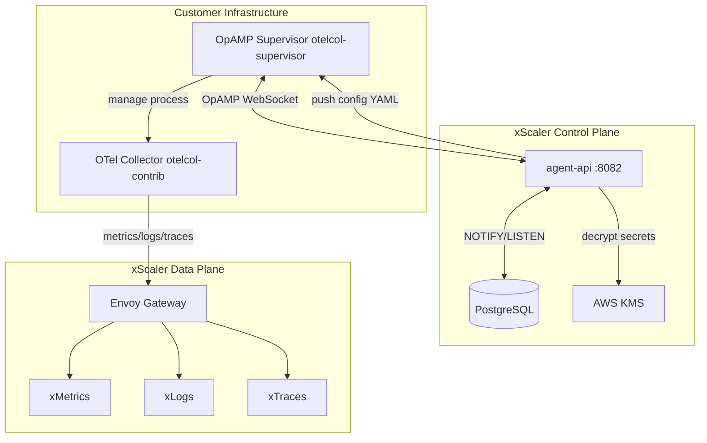
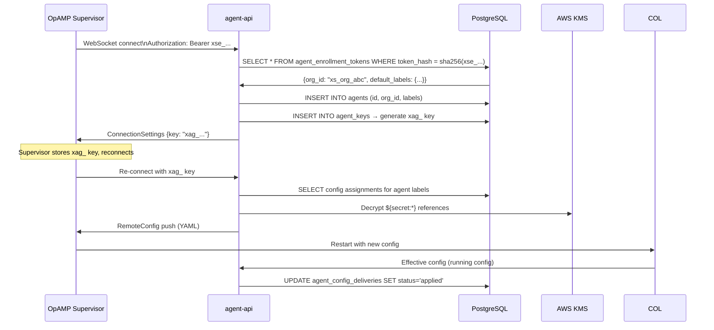
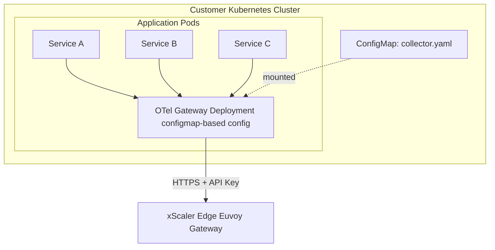

# Agent vs Gateway Mode

## Learning Objectives

- [ ] Explain the key differences between Agent Mode and Gateway Mode in xScaler context
- [ ] Describe how OpAMP manages agent configuration remotely
- [ ] Identify when each mode is appropriate for a production deployment
- [ ] Configure a collector in each mode

---

## Agent Mode in xScaler

In xScaler, "Agent Mode" has a specific meaning: an OTel Collector managed by an **OpAMP supervisor** and registered with `agent-api`.



### OpAMP — Open Agent Management Protocol

OpAMP is a WebSocket-based protocol for managing OTel agents remotely. The xScaler `agent-api` implements the OpAMP server.

**What OpAMP enables:**
- Push configuration to agents without SSH or file copy
- Receive health status from each agent
- Track which configuration version each agent is running
- Re-send configuration when an agent comes online or disconnects

**OpAMP Supervisor config** (``):

```yaml
server:
  endpoint: ws://agent-api:8082/v1/opamp   # WebSocket connection
  headers:
    Authorization: "Bearer xse_<enrollment-token>"

capabilities:
  accepts_remote_config: true        # Agent will accept pushed configs
  reports_effective_config: true     # Agent reports its running config
  reports_remote_config: true        # Agent can report remote config received
  reports_health: true               # Agent sends health status

agent:
  executable: /usr/local/bin/otelcol-contrib
  description:
    non_identifying_attributes:
      host.name: "${HOSTNAME}"

storage:
  directory: /var/lib/otelcol-supervisor
```

### Agent Enrollment Flow



### Two-Phase Token Exchange

xScaler agents go through two authentication phases:

| Phase | Token | Purpose |
|---|---|---|
| Enrollment | `xse_...` (enrollment token) | First connection — identify yourself to the org |
| Operational | `xag_...` (agent key) | All subsequent connections — per-agent identity |

The enrollment token is shared among a fleet. The agent key is unique to each agent and created during enrollment.

---

## Gateway Mode in xScaler

In Gateway Mode, the OTel Collector runs as a static Deployment (not managed by OpAMP). Configuration is managed via Kubernetes ConfigMaps or Helm values.



**Gateway Mode configuration** — no OpAMP, static ConfigMap:

```yaml
# ConfigMap: otel-gateway-config
apiVersion: v1
kind: ConfigMap
metadata:
  name: otel-gateway-config
  namespace: monitoring
data:
  config.yaml: |
    receivers:
      otlp:
        protocols:
          grpc:
            endpoint: 0.0.0.0:4317
          http:
            endpoint: 0.0.0.0:4318

    processors:
      memory_limiter:
        check_interval: 1s
        limit_mib: 512
        spike_limit_mib: 128
      batch:
        timeout: 5s
        send_batch_size: 2048

    exporters:
      prometheusremotewrite:
        endpoint: https://euw1-01.m.xscalerlabs.com/api/v1/push
        headers:
          Authorization: Bearer ${env:API_KEY}
          X-Scope-OrgID: ${env:TENANT_ID}
      otlphttp/traces:
        endpoint: https://euw1-01.t.xscalerlabs.com
        headers:
          Authorization: Bearer ${env:API_KEY}
          X-Scope-OrgID: ${env:TENANT_ID}

    service:
      pipelines:
        metrics:
          receivers: [otlp]
          processors: [memory_limiter, batch]
          exporters: [prometheusremotewrite]
        traces:
          receivers: [otlp]
          processors: [memory_limiter, batch]
          exporters: [otlphttp/traces]
```

---

## Comparison Table

| Feature | Agent Mode (OpAMP) | Gateway Mode (ConfigMap) |
|---|---|---|
| **Config management** | Remote push via OpAMP | ConfigMap + Helm |
| **Config update** | Push via portal/API, no restart | kubectl apply + pod restart |
| **Deployment type** | DaemonSet (one per node) | Deployment (N replicas) |
| **Secret management** | KMS envelope encryption | Kubernetes Secrets |
| **Health tracking** | Yes (portal dashboard) | Kubernetes liveness probe |
| **Config rollback** | Template revision history | Git revert + kubectl apply |
| **Label-based routing** | Yes (label selector assignments) | No (one config per deployment) |
| **Best for** | Managed fleets, dynamic infra | Static clusters, GitOps |

---

## Hands-On Exercise

### Exercise 2.5 — Verify the Local Dev OpAMP Agent

```bash
# 1. Check the agent supervisor config
cat 

# 2. Watch agent-1 connect to agent-api
docker compose logs agent-1 --tail=30 --follow

# 3. Check agent registration in database
docker compose exec postgres psql -U xscaler -d xscaler \
  -c "SELECT id, labels, last_seen_at FROM agents ORDER BY created_at DESC LIMIT 5;"

# 4. Check config delivery status
docker compose exec postgres psql -U xscaler -d xscaler \
  -c "SELECT a.id as agent_id, d.status, d.offered_at, d.applied_at
      FROM agent_config_deliveries d
      JOIN agents a ON d.agent_id = a.id
      ORDER BY d.offered_at DESC LIMIT 10;"
```

Expected output:
```
          agent_id          | status  |         offered_at          |         applied_at
----------------------------+---------+-----------------------------+-----------------------------
 01J1234567890ABCDEFGHIJKLMN | applied | 2026-06-18 10:00:00.123+00  | 2026-06-18 10:00:05.456+00
```

### Exercise 2.6 — Test Config Push

```bash
# Trigger a config update (simulates portal action)
docker compose exec postgres psql -U xscaler -d xscaler \
  -c "NOTIFY agent_config_changed, '{\"org_id\": \"your-org-id\"}';"

# Watch agent-api log to see push triggered
docker compose logs agent-api --tail=20
```

---

## Validation

- [ ] `docker compose logs agent-1` shows "Connected to OpAMP server"
- [ ] Agent appears in the database `agents` table
- [ ] `agent_config_deliveries` table shows status `applied`
- [ ] You can explain the enrollment token → agent key exchange

---

## Key Takeaways

:::tip[Session 2.4 Summary]

- **Agent Mode** in xScaler = OTel Collector managed by OpAMP supervisor + `agent-api`
- **Gateway Mode** = static OTel Deployment with ConfigMap-based configuration
- **OpAMP** enables remote config push, health monitoring, and delivery tracking without SSH
- Agent enrollment: `xse_` token (fleet) → `xag_` key (per-agent) via two-phase exchange
- Config delivery tracked in `agent_config_deliveries` table: `offered → applying → applied | failed`

:::

---

*← Previous: [Deployment Models](deployment-models.md)*  
*Next: [Session 3 Overview →](../session-3/overview.md)*
