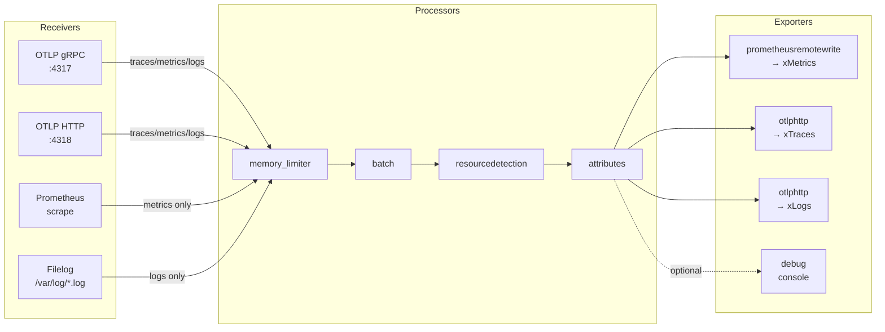

# OTel Collector Components

## Learning Objectives

- [ ] Describe the four component types in an OTel Collector pipeline
- [ ] Read and write a collector configuration with multiple pipelines
- [ ] Explain the role of `memory_limiter` and `batch` processors
- [ ] Configure receivers, processors, and exporters for xScaler

---

## Collector Pipeline Architecture



---

## Component Types

### Receivers

Receivers are **ingest endpoints** — they accept telemetry data from sources.

#### OTLP Receiver

Accepts all three signal types from OTel-instrumented applications:

```yaml
receivers:
  otlp:
    protocols:
      grpc:
        endpoint: 0.0.0.0:4317    # gRPC (protobuf)
      http:
        endpoint: 0.0.0.0:4318    # HTTP (protobuf or JSON)
        cors:
          allowed_origins: ["*"]  # For browser instrumentation
```

#### Prometheus Receiver

Scrapes Prometheus `/metrics` endpoints (pull model):

```yaml
receivers:
  prometheus:
    config:
      scrape_configs:
        - job_name: my-service
          scrape_interval: 15s
          static_configs:
            - targets: ['localhost:8080']
          relabel_configs:
            - source_labels: [__address__]
              target_label: instance
```

#### Filelog Receiver

Tails log files from the filesystem:

```yaml
receivers:
  filelog:
    include: [/var/log/app/*.log]
    start_at: end
    operators:
      - type: json_parser
        timestamp:
          parse_from: attributes.timestamp
          layout: '%Y-%m-%dT%H:%M:%S.%LZ'
      - type: severity_parser
        parse_from: attributes.level
```

#### Host Metrics Receiver

Collects CPU, memory, disk, network from the host:

```yaml
receivers:
  hostmetrics:
    collection_interval: 30s
    scrapers:
      cpu: {}
      disk: {}
      load: {}
      filesystem: {}
      memory: {}
      network: {}
      process:
        include:
          names: ['.*']
          match_type: regexp
```

---

### Processors

Processors **transform data** in the pipeline. They run after receivers and before exporters.

#### memory_limiter (Required)

Prevents OOM by dropping data when memory pressure is high:

```yaml
processors:
  memory_limiter:
    check_interval: 1s
    limit_mib: 256       # Absolute cap
    spike_limit_mib: 64  # Burst headroom
```

!!! warning "Always Include memory_limiter"
    Without `memory_limiter`, a telemetry spike will OOM-kill your collector, halting all data collection until it restarts. Place it **first** in every pipeline.

#### batch

Accumulates data and sends in batches — dramatically reduces network overhead:

```yaml
processors:
  batch:
    timeout: 5s              # Max wait before sending
    send_batch_size: 1024    # Target batch size
    send_batch_max_size: 2048
```

#### resourcedetection

Auto-detects resource attributes (cloud provider, host, k8s):

```yaml
processors:
  resourcedetection:
    detectors: [env, ec2, ecs, eks, gcp, azure, docker, system]
    timeout: 5s
    override: false
```

Adds labels like: `cloud.provider`, `cloud.region`, `host.id`, `k8s.cluster.name`

#### attributes

Adds, modifies, or removes attributes:

```yaml
processors:
  attributes:
    actions:
      - key: deployment.environment
        value: production
        action: upsert       # Add or overwrite
      - key: user_id
        action: delete       # Remove high-cardinality label
      - key: internal_token
        action: delete       # Remove sensitive data
```

#### filter

Includes or excludes spans/metrics/logs based on conditions:

```yaml
processors:
  filter/drop_health_checks:
    error_mode: ignore
    traces:
      span:
        - 'attributes["http.target"] == "/health"'
        - 'attributes["http.target"] == "/ready"'
```

---

### Exporters

Exporters **send data** to backends.

#### prometheusremotewrite (for xMetrics)

```yaml
exporters:
  prometheusremotewrite:
    endpoint: https://euw1-01.m.xscalerlabs.com/api/v1/push
    headers:
      Authorization: Bearer ${env:API_KEY}
      X-Scope-OrgID: ${env:TENANT_ID}
    retry_on_failure:
      enabled: true
      initial_interval: 5s
      max_interval: 30s
      max_elapsed_time: 300s
    queue:
      enabled: true
      num_consumers: 10
      queue_size: 5000
```

#### otlphttp (for xTraces / xLogs OTLP)

```yaml
exporters:
  otlphttp/traces:
    endpoint: https://euw1-01.t.xscalerlabs.com
    headers:
      Authorization: Bearer ${env:API_KEY}
      X-Scope-OrgID: ${env:TENANT_ID}

  otlphttp/logs:
    endpoint: https://euw1-01.l.xscalerlabs.com/otlp
    headers:
      Authorization: Bearer ${env:API_KEY}
      X-Scope-OrgID: ${env:TENANT_ID}
```

#### debug (for troubleshooting)

Prints telemetry to stdout — useful for verifying data:

```yaml
exporters:
  debug:
    verbosity: detailed
    sampling_initial: 5
    sampling_thereafter: 200
```

---

### Service Block — Connecting It All

The `service` block defines which components are active and how they connect:

```yaml
service:
  pipelines:
    # Metrics pipeline
    metrics:
      receivers: [otlp, prometheus, hostmetrics]
      processors: [memory_limiter, batch, resourcedetection, attributes]
      exporters: [prometheusremotewrite]

    # Traces pipeline
    traces:
      receivers: [otlp]
      processors: [memory_limiter, batch, resourcedetection, filter/drop_health_checks]
      exporters: [otlphttp/traces]

    # Logs pipeline
    logs:
      receivers: [otlp, filelog]
      processors: [memory_limiter, batch, resourcedetection]
      exporters: [otlphttp/logs]

  # Extensions (optional)
  extensions: [health_check, pprof, zpages]
```

!!! info "Multiple Exporters per Pipeline"
    One pipeline can have multiple exporters. Data is **fan-out** — a copy is sent to each exporter in parallel.

---

## Complete Example — xScaler Agent Mode Config

Based on `deploy/otel/otel-collector.yaml` from the repository:

```yaml
# otel-collector-agent.yaml
receivers:
  otlp:
    protocols:
      grpc:
        endpoint: 0.0.0.0:4317
      http:
        endpoint: 0.0.0.0:4318
  hostmetrics:
    collection_interval: 30s
    scrapers:
      cpu: {}
      memory: {}
      network: {}
      filesystem: {}

processors:
  memory_limiter:
    check_interval: 1s
    limit_mib: 256
    spike_limit_mib: 64
  batch:
    timeout: 5s
    send_batch_size: 1024
  resourcedetection:
    detectors: [env, system]
    override: false
  attributes:
    actions:
      - key: deployment.environment
        value: ${env:ENVIRONMENT}
        action: upsert

exporters:
  prometheusremotewrite:
    endpoint: https://euw1-01.m.xscalerlabs.com/api/v1/push
    headers:
      Authorization: Bearer ${env:API_KEY}
      X-Scope-OrgID: ${env:TENANT_ID}
  otlphttp/traces:
    endpoint: https://euw1-01.t.xscalerlabs.com
    headers:
      Authorization: Bearer ${env:API_KEY}
      X-Scope-OrgID: ${env:TENANT_ID}
  otlphttp/logs:
    endpoint: https://euw1-01.l.xscalerlabs.com/otlp
    headers:
      Authorization: Bearer ${env:API_KEY}
      X-Scope-OrgID: ${env:TENANT_ID}

service:
  pipelines:
    metrics:
      receivers: [otlp, hostmetrics]
      processors: [memory_limiter, batch, resourcedetection, attributes]
      exporters: [prometheusremotewrite]
    traces:
      receivers: [otlp]
      processors: [memory_limiter, batch, resourcedetection]
      exporters: [otlphttp/traces]
    logs:
      receivers: [otlp]
      processors: [memory_limiter, batch, resourcedetection]
      exporters: [otlphttp/logs]
```

---

## Hands-On Exercise

### Exercise 2.3 — Write a Collector Config

Create a collector config file that:
1. Receives OTLP metrics via HTTP on port 4318
2. Limits memory to 128 MiB
3. Batches every 5 seconds
4. Exports to your local xMetrics instance

```bash
cat > /tmp/my-collector.yaml << 'EOF'
receivers:
  otlp:
    protocols:
      http:
        endpoint: 0.0.0.0:4318

processors:
  memory_limiter:
    check_interval: 1s
    limit_mib: 128
    spike_limit_mib: 32
  batch:
    timeout: 5s
    send_batch_size: 512

exporters:
  prometheusremotewrite:
    endpoint: http://localhost:9009/api/v1/push
    headers:
      X-Scope-OrgID: ${env:TENANT_ID}

service:
  pipelines:
    metrics:
      receivers: [otlp]
      processors: [memory_limiter, batch]
      exporters: [prometheusremotewrite]
EOF
echo "Config written to /tmp/my-collector.yaml"
```

---

## Validation

- [ ] Config YAML has no syntax errors (validate with `otelcol-contrib validate --config=/tmp/my-collector.yaml`)
- [ ] All three pipeline types are present: metrics, traces, logs
- [ ] `memory_limiter` is the **first** processor in every pipeline
- [ ] `batch` comes immediately after `memory_limiter`

---

## Key Takeaways

!!! success "Session 2.2 Summary"
    - OTel Collector has four component types: **receivers**, **processors**, **exporters**, **extensions**
    - **Pipelines** connect them: `receivers → processors → exporters` per signal type
    - Always include **`memory_limiter`** first — it protects against OOM crashes
    - **`batch`** dramatically improves throughput by accumulating data before sending
    - Multiple exporters = fan-out: one pipeline can send data to multiple backends

---

*← Previous: [OTel Overview](otel-overview.md)*  
*Next: [Deployment Models →](deployment-models.md)*
