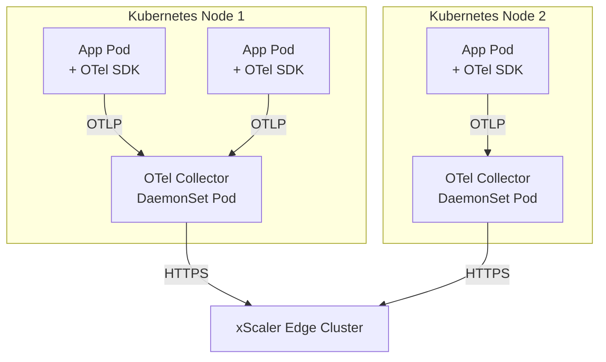
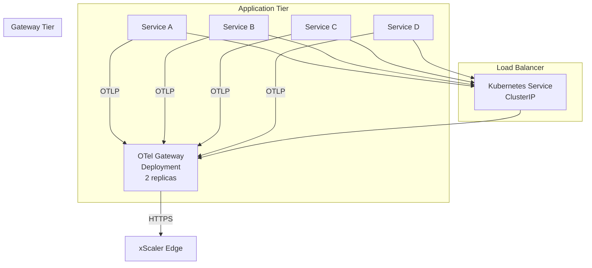
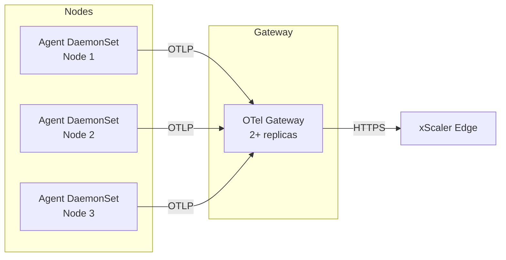

# Deployment Models

## Learning Objectives

- [ ] Describe the three OTel Collector deployment topologies
- [ ] Match each topology to appropriate use cases
- [ ] Explain the trade-offs between local and centralised collection
- [ ] Design a collection architecture for a given infrastructure

---

## Deployment Topology Options

```mermaid
graph TB
    subgraph "Option A: Direct SDK → Backend"
        APP_A[Application\n+ OTel SDK] -->|OTLP| XS_A[xScaler Edge]
    end

    subgraph "Option B: Agent Mode"
        APP_B[Application\n+ OTel SDK] -->|OTLP| COL_B[OTel Collector\n(co-located)]
        COL_B -->|OTLP / PRW| XS_B[xScaler Edge]
    end

    subgraph "Option C: Gateway Mode"
        APP_C1[App 1\n+ OTel SDK] -->|OTLP| GW[OTel Gateway\n(centralised)]
        APP_C2[App 2\n+ OTel SDK] -->|OTLP| GW
        APP_C3[App 3\n+ OTel SDK] -->|OTLP| GW
        GW -->|OTLP / PRW| XS_C[xScaler Edge]
    end
```

---

## Option A: Direct SDK → Backend

Applications send OTLP directly to xScaler without any intermediate collector.

**When to use:**
- Simple single-service deployments
- Serverless functions (Lambda, Cloud Functions)
- Environments where you cannot run a sidecar

**Configuration (application side):**
```bash
# Environment variables for OTel SDK auto-instrumentation
export OTEL_EXPORTER_OTLP_ENDPOINT="https://euw1-01.t.xscalerlabs.com"
export OTEL_EXPORTER_OTLP_HEADERS="Authorization=Bearer xag_...,X-Scope-OrgID=xs_..."
export OTEL_SERVICE_NAME="payment-api"
export OTEL_RESOURCE_ATTRIBUTES="deployment.environment=production"
```

**Limitations:**
- No buffering — if xScaler is unreachable, data is lost
- No pre-processing (filtering, enrichment)
- Each application manages its own retry logic

---

## Option B: Agent Mode (Recommended for Kubernetes)

One OTel Collector per node, deployed as a **DaemonSet**. Applications send OTLP to the local collector; the collector forwards to xScaler.



**Advantages:**
- Low network hop latency (local socket)
- Per-node batching and buffering
- Retry logic and queue in the collector
- Host metrics collection from the node

**Kubernetes DaemonSet configuration:**
```yaml
apiVersion: apps/v1
kind: DaemonSet
metadata:
  name: otel-collector
  namespace: monitoring
spec:
  selector:
    matchLabels:
      app: otel-collector
  template:
    metadata:
      labels:
        app: otel-collector
    spec:
      containers:
        - name: otel-collector
          image: otel/opentelemetry-collector-contrib:0.104.0
          args: ["--config=/etc/otelcol/config.yaml"]
          resources:
            limits:
              cpu: 500m
              memory: 256Mi
          env:
            - name: API_KEY
              valueFrom:
                secretKeyRef:
                  name: xscaler-credentials
                  key: api_key
            - name: TENANT_ID
              valueFrom:
                secretKeyRef:
                  name: xscaler-credentials
                  key: tenant_id
          volumeMounts:
            - name: config
              mountPath: /etc/otelcol
      volumes:
        - name: config
          configMap:
            name: otel-collector-config
```

---

## Option C: Gateway Mode

A small number of centralised collector instances (Deployment, not DaemonSet) receive from all applications and forward to xScaler.



**Advantages:**
- Centralised management — one config for all
- Better batching (more data = larger batches)
- Cross-service aggregation (combine signals from many services)
- Easier TLS certificate management

**Kubernetes Service for Gateway:**
```yaml
apiVersion: v1
kind: Service
metadata:
  name: otel-gateway
  namespace: monitoring
spec:
  selector:
    app: otel-gateway
  ports:
    - name: otlp-grpc
      port: 4317
      targetPort: 4317
    - name: otlp-http
      port: 4318
      targetPort: 4318
  type: ClusterIP
```

Application configuration (point to gateway service):
```bash
export OTEL_EXPORTER_OTLP_ENDPOINT="http://otel-gateway.monitoring.svc.cluster.local:4317"
```

---

## Combined: Agent + Gateway

For large-scale production, use both:



The **agent** handles:
- Host metrics (CPU, memory, disk)
- Node-level log collection
- Local buffering (short-term retry)

The **gateway** handles:
- Cross-service aggregation
- Centralized routing decisions (which tenant gets which data)
- Rate limiting and filtering
- TLS termination

---

## Topology Selection Guide

| Factor | Agent Mode | Gateway Mode | Direct SDK |
|---|---|---|---|
| **Host metrics needed?** | ✅ Native | ❌ Needs extra config | ❌ |
| **Log file collection?** | ✅ Native (filelog receiver) | ❌ | ❌ |
| **Centralised config?** | ❌ Per-node configs | ✅ One config | N/A |
| **Kubernetes DaemonSet?** | ✅ Natural fit | ❌ Deployment | N/A |
| **Lambda/Functions?** | ❌ No sidecar | ❌ Too heavy | ✅ |
| **Retry + buffering?** | ✅ Per node | ✅ Centralised | ❌ |
| **Large-scale (100+ nodes)?** | ✅ Scales linearly | ✅ Aggregates | ❌ |

---

## Hands-On Exercise

### Exercise 2.4 — Compare Deployment Models

Review the existing deployment configs in the repository:

```bash
# Agent mode (local dev agent)
cat deploy/agents/agent-1.supervisor.yaml

# Platform OTel collector (edge monitoring)
cat deploy/otel/otel-collector.yaml

# Edge cluster OTel collector (production)
cat charts/edge-xscaler/templates/otel-collector-configmap.yaml
```

Answer these questions:
1. Which component type is `deploy/otel/otel-collector.yaml`? (Agent/Gateway/Platform)
2. What targets does it scrape?
3. Where does it send data?

---

## Validation

- [ ] You can describe when to use Agent Mode vs Gateway Mode
- [ ] You understand that DaemonSet = Agent Mode, Deployment = Gateway Mode
- [ ] You can identify which config in the repository uses each topology

---

## Key Takeaways

!!! success "Session 2.3 Summary"
    - **Direct SDK** — simplest, no buffering, suits serverless
    - **Agent Mode** — DaemonSet per node, local buffering, host metrics, suits Kubernetes
    - **Gateway Mode** — centralised Deployment, cross-service aggregation, centralised routing
    - **Combined** — agents collect locally, gateway aggregates before export — best for 20+ nodes
    - xScaler's edge OTel collector is a **platform agent** (scrapes xMetrics, Envoy, proxy-auth)

---

*← Previous: [Collector Components](collector-components.md)*  
*Next: [Agent vs Gateway →](agent-vs-gateway.md)*
