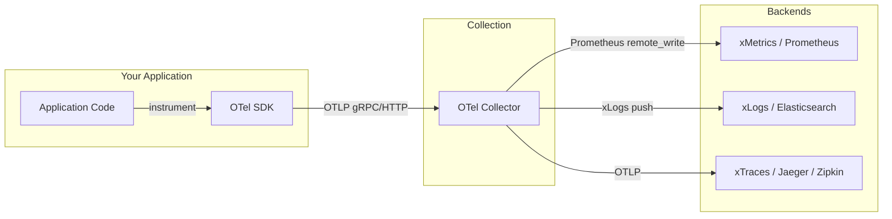
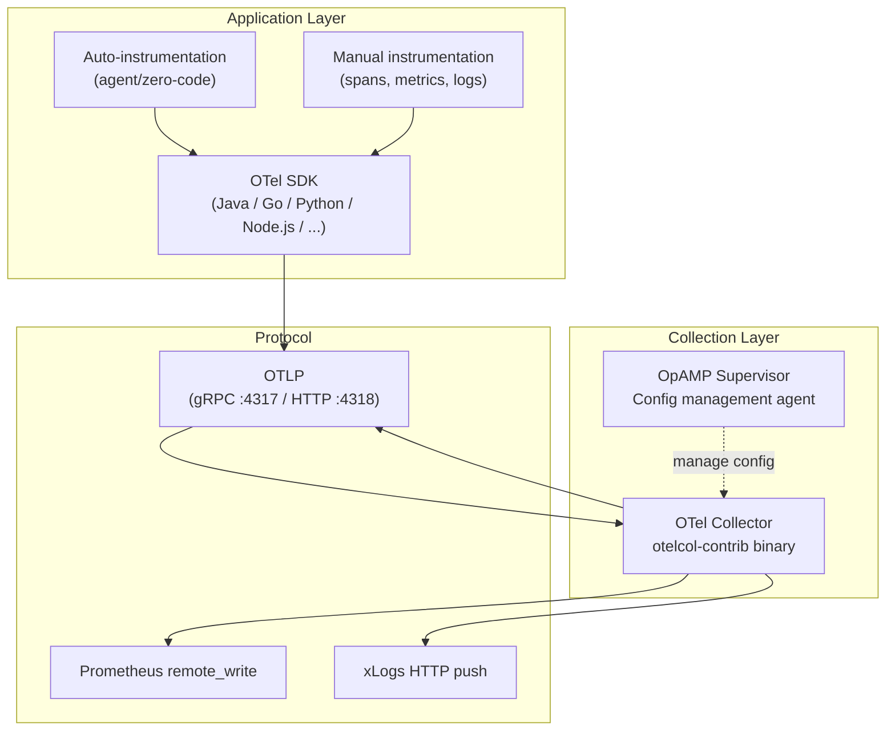

# OpenTelemetry Overview

## Learning Objectives

- [ ] Explain what OpenTelemetry is and why it was created
- [ ] Describe the relationship between OTel SDK, OTel Collector, and OTLP
- [ ] Identify the three signal types supported by OpenTelemetry
- [ ] Explain why xScaler uses OTel as its primary data collection mechanism

---

## What Is OpenTelemetry?

**OpenTelemetry (OTel)** is a CNCF graduated project that provides vendor-neutral APIs, SDKs, and tooling for instrumenting, generating, collecting, and exporting telemetry data (metrics, logs, and traces).



### Why OpenTelemetry?

**Before OTel:** Each observability vendor had proprietary SDKs. Switching vendors required re-instrumenting your entire codebase.

**After OTel:** Instrument once with OTel SDK → route to any backend by changing the collector configuration.

| Before OTel | After OTel |
|---|---|
| Datadog SDK in your code | OTel SDK in your code |
| Switch to Prometheus → rewrite | Switch backend → change config file |
| Multiple SDKs per language | Single SDK per language |
| Vendor lock-in | Vendor neutral |

---

## The OpenTelemetry Components



### OTel SDK

Library that you embed in your application. Provides APIs for:
- Creating spans (traces)
- Recording metrics
- Emitting structured logs

Available for: Java, Go, Python, JavaScript/Node.js, .NET, Rust, C++, PHP, Ruby, Swift

**Zero-code auto-instrumentation** is available for Java, Node.js, and Python — attach as a JVM agent or import a module without modifying application code.

### OTel Collector

A standalone binary (`otelcol-contrib`) that acts as a pipeline for telemetry data:
- Receives data from applications (OTLP) or scrapes from endpoints (Prometheus)
- Processes data (batch, filter, enrich, compress)
- Exports to one or more backends

The xScaler platform uses `otelcol-contrib` (the community distribution that includes all receivers, processors, and exporters).

### OTLP — OpenTelemetry Protocol

The wire format for transmitting telemetry. Available over:

| Transport | Port | Format | Use Case |
|---|---|---|---|
| gRPC | `:4317` | Protobuf | Best performance, default |
| HTTP | `:4318` | Protobuf or JSON | Firewall-friendly |

xScaler's Envoy gateway accepts both:
- gRPC OTLP on port `:4317`
- HTTP OTLP on port `:8282` (via `/otlp/v1/traces`)

---

## OTel Signal Types

### Traces

A distributed trace is a tree of **spans**. Each span represents a unit of work with:
- `trace_id` — unique per request
- `span_id` — unique per operation
- `parent_span_id` — links child to parent
- `name` — operation name
- `start_time` / `end_time`
- `attributes` — key-value metadata
- `status` — OK or ERROR

```json
{
  "traceId": "0102030405060708090a0b0c0d0e0f10",
  "spanId": "0102030405060708",
  "parentSpanId": "0807060504030201",
  "name": "POST /checkout",
  "kind": "SPAN_KIND_SERVER",
  "startTimeUnixNano": "1718800000000000000",
  "endTimeUnixNano": "1718800000150000000",
  "attributes": [
    {"key": "http.method", "value": {"stringValue": "POST"}},
    {"key": "http.status_code", "value": {"intValue": 200}}
  ],
  "status": {"code": "STATUS_CODE_OK"}
}
```

### Metrics

OTel defines five metric instrument types:

| Instrument | Description | Example |
|---|---|---|
| Counter | Monotonically increasing | `http_requests_total` |
| UpDownCounter | Increases and decreases | `active_connections` |
| Gauge | Current value snapshot | `memory_usage_bytes` |
| Histogram | Distribution with buckets | `request_duration_seconds` |
| ObservableGauge | Async gauge (polling) | `cpu_load_avg` |

### Logs

OTel logs map to the existing structured log model. Key fields:
- `timestamp`
- `severity` (TRACE, DEBUG, INFO, WARN, ERROR, FATAL)
- `body` — the log message
- `attributes` — structured key-value data
- `trace_id` / `span_id` — correlation with traces

---

## OTel in xScaler

xScaler uses OTel in two distinct ways:

### 1. Platform Self-Monitoring

The OTel Collector in the edge cluster scrapes platform component metrics and sends them to `system-mimir`:

```yaml
# deploy/otel/otel-collector.yaml (local dev)
receivers:
  prometheus:
    config:
      scrape_configs:
        - job_name: mimir
          static_configs:
            - targets: ['client-mimir:9009']
              labels: {xscaler_cluster: local}
        - job_name: envoy
          static_configs:
            - targets: ['envoy:9901']
              labels: {xscaler_cluster: local}
        - job_name: proxy-auth
          static_configs:
            - targets: ['proxy-auth:9002']
              labels: {xscaler_cluster: local}
        - job_name: loki
          static_configs:
            - targets: ['client-loki:3100']
              labels: {xscaler_cluster: local}
        - job_name: tempo
          static_configs:
            - targets: ['tempo:3200']
              labels: {xscaler_cluster: local}
exporters:
  prometheusremotewrite:
    endpoint: http://system-mimir:9009/api/v1/push
    headers:
      X-Scope-OrgID: system-monitoring
```

### 2. Tenant Data Collection

Customers deploy OTel Collectors that send telemetry to xScaler's Envoy gateway, authenticated with API keys:

```yaml
exporters:
  prometheusremotewrite:
    endpoint: https://euw1-01.m.xscalerlabs.com/api/v1/push
    headers:
      Authorization: Bearer xag_...
      X-Scope-OrgID: xs_payment_abc12345
```

---

## Hands-On Exercise

### Exercise 2.1 — Inspect the Local OTel Collector Config

```bash
# View the local dev OTel collector configuration
cat /path/to/xscaler/deploy/otel/otel-collector.yaml

# Watch the collector in action
docker compose logs otel-collector --follow --tail=20
```

### Exercise 2.2 — Verify Data Is Flowing

Open Grafana → **Explore**, select the platform metrics datasource, and run:

```promql
up
```

You should see `1` for each edge component that the collector is successfully scraping.

---

## Validation

- [ ] You can explain the difference between OTel SDK and OTel Collector
- [ ] The `up` metric returns results in Grafana Explore

---

## Key Takeaways

!!! success "Session 2.1 Summary"
    - OpenTelemetry is the **CNCF standard** for vendor-neutral telemetry instrumentation
    - Three signals: **traces** (request trees), **metrics** (numeric time series), **logs** (text events)
    - **OTLP** is the wire protocol — available over gRPC (:4317) or HTTP (:4318)
    - The **OTel Collector** is the central pipeline: receive → process → export
    - xScaler uses OTel both for **platform self-monitoring** and for **customer telemetry collection**

---

*← Previous: [Session 2 Overview](overview.md)*  
*Next: [Collector Components →](collector-components.md)*
