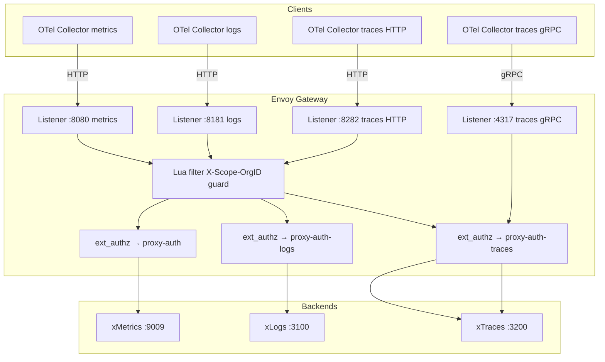
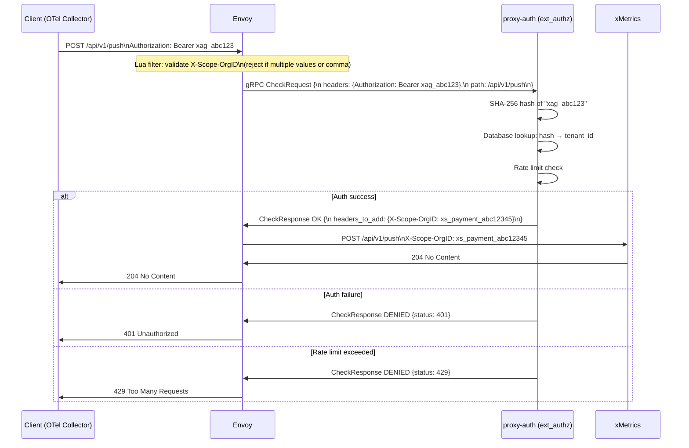
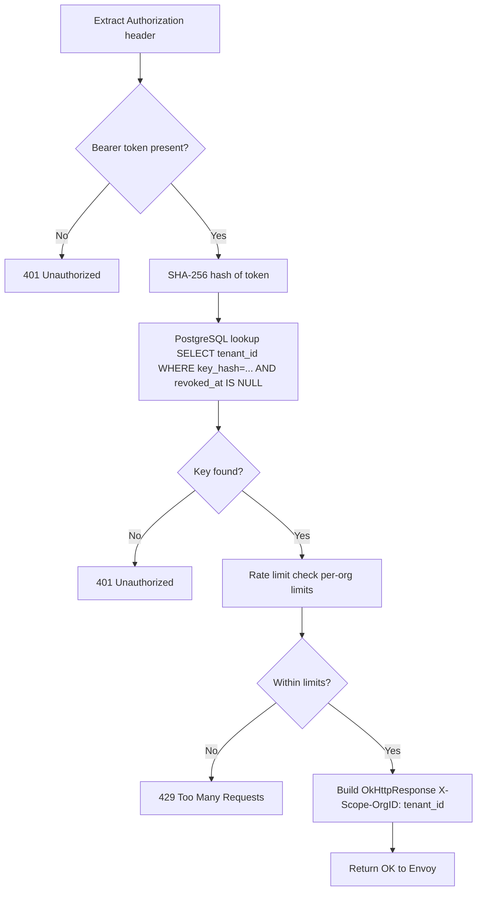

# Architecture Review — Envoy and proxy-auth Deep Dive

## Learning Objectives

- [ ] Describe the role of Envoy as the xScaler edge gateway
- [ ] Explain the ext_authz pattern and how proxy-auth integrates
- [ ] Trace a request through Envoy → proxy-auth → backend
- [ ] Identify the Envoy configuration patterns for each signal type

---

## Envoy Gateway Architecture

Envoy is the **front door** for all telemetry data in xScaler. It runs four TCP listeners, each handling a different signal protocol.



---

## The ext_authz Pattern

`ext_authz` is an Envoy filter that offloads authentication decisions to an external service. Every request must pass the ext_authz check before being forwarded to the backend.



### ext_authz Configuration

From `deploy/envoy/envoy.yaml` (metrics listener):

```yaml
http_filters:
  - name: envoy.filters.http.ext_authz
    typed_config:
      "@type": type.googleapis.com/envoy.extensions.filters.http.ext_authz.v3.ExtAuthz
      grpc_service:
        envoy_grpc:
          cluster_name: proxy_auth
      timeout: 250ms       # Must respond within 250ms
      failure_mode_allow: false  # FAIL CLOSED — deny on auth service error
      include_peer_certificate: false
```

:::warning[Fail-Closed Security]

`failure_mode_allow: false` means if `proxy-auth` is unavailable or times out, ALL requests are **denied**. This is intentional — availability of the auth service is critical to the security model.

:::

---

## Lua Filter — X-Scope-OrgID Guard

A Lua script runs before ext_authz on every listener. It enforces that only one tenant ID can be active per request:

```lua
-- Envoy Lua filter (from deploy/envoy/envoy.yaml)
function envoy_on_request(request_handle)
  local org_id = request_handle:headers():get("x-scope-orgid")
  if org_id then
    -- Reject if multiple values (comma-separated)
    if string.find(org_id, ",") then
      request_handle:respond(
        {[":status"] = "400"},
        "x-scope-orgid header must not contain commas"
      )
      return
    end
  else
    -- Default to "anonymous" if not set (proxy-auth will validate and override)
    request_handle:headers():add("x-scope-orgid", "anonymous")
  end
end
```

**Why this matters:** A malicious client could try to inject multiple org IDs to exfiltrate data from another tenant. The Lua filter and proxy-auth together prevent this.

---

## proxy-auth Deep Dive

proxy-auth is a Go service that implements the gRPC `envoy.service.auth.v3.Authorization` interface.

### Request Processing Pipeline



### Rate Limiting

proxy-auth enforces per-org rate limits configured in the `plans` table:

| Signal | Rate Limit Field | Unit |
|---|---|---|
| Metrics | `max_active_series` + scrape interval | Series count |
| Logs | `max_logs_bytes_per_sec` | Bytes per second |
| Traces | — | No hard rate limit currently |

### proxy-auth Metrics

proxy-auth exposes Prometheus metrics at `:9002/metrics`:

```
xscalor_ext_authz_requests_total{status="OK"} 15234
xscalor_ext_authz_requests_total{status="DENIED"} 42
xscalor_ext_authz_latency_seconds_bucket{le="0.001"} 14800
xscalor_proxy_auth_key_lookup_duration_seconds_bucket{le="0.005"} 15234
```

These are scraped by the edge OTel Collector and sent to `platform-metrics` for platform observability.

---

## Signal-Specific Routing

### Metrics (Listener :8080 → xMetrics)

Routes:
- `POST /api/v1/push` → xMetrics push (Prometheus remote_write)
- `GET /api/v1/query` → xMetrics query (PromQL instant)
- `GET /api/v1/query_range` → xMetrics range query
- `GET /api/v1/label` → Label names
- `GET /api/v1/series` → Series metadata
- `POST /alertmanager/*` → 503 (alertmanager routes not exposed in this version)

### Logs (Listener :8181 → xLogs)

Routes:
- `POST /loki/api/v1/push` → xLogs push
- `GET /loki/api/v1/query` → xLogs instant query (LogQL)
- `GET /loki/api/v1/query_range` → xLogs range query
- `GET /api/v1/*` → xLogs API passthrough

### Traces HTTP (Listener :8282 → xTraces)

Routes:
- `POST /otlp/v1/traces` → xTraces OTLP HTTP ingest
- `GET /api/traces/{traceID}` → xTraces trace lookup

### Traces gRPC (Listener :4317 → xTraces)

Routes:
- `opentelemetry.proto.collector.trace.v1.TraceService/Export` → xTraces OTLP gRPC ingest

---

## Hands-On Exercise

### Exercise 3.3 — Inspect Envoy Admin Interface

:::note[Platform Operator Exercise]

The Envoy admin interface is accessible only to platform operators via cluster access (kubectl port-forward or equivalent). Ask your instructor if a forwarded port has been set up for this exercise.

:::

```bash
# Envoy admin stats (requires cluster access)
curl -s http://<envoy-admin>/stats | grep "ext_authz" | head -20

# Envoy clusters health
curl -s http://<envoy-admin>/clusters | grep "health_flags" | head -10

# Active listener configuration
curl -s http://<envoy-admin>/listeners | jq .
```

### Exercise 3.4 — Test Auth Rejection

```bash
# Test with invalid API key
curl -v https://<edge>.m.xscalerlabs.com/api/v1/push \
  -H "Authorization: Bearer xag_invalidkeyhere" \
  -H "Content-Type: application/x-protobuf" \
  2>&1 | grep "< HTTP"
# Expected: 401

# Test with no auth header
curl -v https://<edge>.m.xscalerlabs.com/api/v1/push \
  -H "Content-Type: application/x-protobuf" \
  2>&1 | grep "< HTTP"
# Expected: 401

# Test with comma in X-Scope-OrgID
curl -v https://<edge>.m.xscalerlabs.com/api/v1/push \
  -H "Authorization: Bearer $API_KEY" \
  -H "X-Scope-OrgID: tenant1,tenant2" \
  2>&1 | grep "< HTTP"
# Expected: 400
```

---

## Validation

- [ ] You can describe the Envoy admin endpoints and what each exposes
- [ ] Invalid API key returns HTTP 401
- [ ] Comma in X-Scope-OrgID returns HTTP 400
- [ ] You can describe the ext_authz flow from memory

---

## Key Takeaways

:::tip[Session 3.2 Summary]

- Envoy runs **four listeners**: metrics (8080), logs (8181), traces HTTP (8282), traces gRPC (4317)
- Every request passes through **ext_authz** → `proxy-auth` before reaching any backend
- `failure_mode_allow: false` means auth service outage = total denial (fail-closed)
- **Lua filter** blocks multi-tenant injection attacks (comma in X-Scope-OrgID → 400)
- `proxy-auth` does SHA-256 hash lookup, rate limit check, then injects X-Scope-OrgID
- ext_authz timeout is **250ms** — keep key lookup fast

:::

---

*← Previous: [Metrics Collection](metrics-collection.md)*  
*Next: [Customer Workshop →](customer-workshop.md)*
