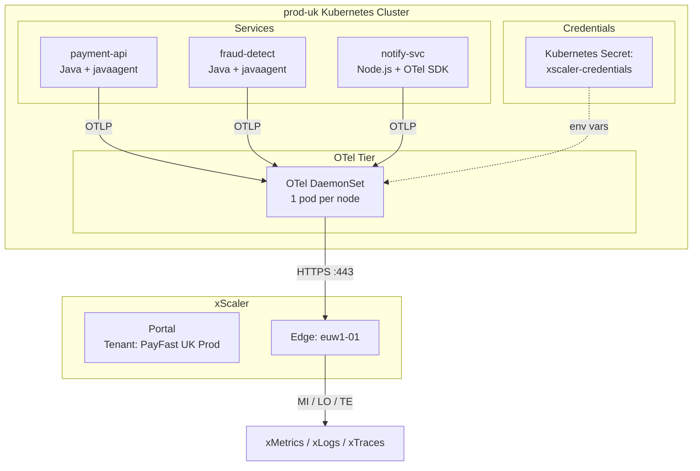

# Customer Architecture Workshop

## Learning Objectives

- [ ] Apply platform architecture knowledge to design a real customer scenario
- [ ] Choose appropriate OTel deployment topology for given constraints
- [ ] Identify potential cardinality risks in a customer's label set
- [ ] Present and defend architectural decisions

---

## Workshop Overview

This 30-minute group exercise asks you to design an observability architecture for a realistic customer scenario. Work in groups of 3-4 people.

---

## Scenario: FinTech Startup — PayFast

PayFast is a payment processing startup with the following infrastructure:

**Current State:**
- 12 microservices (Java and Node.js)
- 3 Kubernetes clusters: `prod-uk`, `prod-us`, `staging`
- Each cluster has 10–20 nodes
- 200–500 pods per cluster at peak
- Daily traffic: 2M transactions/day
- Currently: no observability tooling

**Requirements:**
- Collect metrics, logs, and traces from all services
- Strict tenant isolation between prod-uk and prod-us data
- Log retention: 30 days
- Metric retention: 90 days
- Budget: Start with the $19/month Scale plan

**Constraints:**
- No ability to modify application code in the first phase (Java services have `-javaagent` hooks only)
- Kubernetes teams manage their own clusters
- Security team requires all secrets managed via Kubernetes Secrets
- No direct internet access from pods (outbound only via egress proxy)

---

## Workshop Tasks

### Task 1 — Tenant Design (10 minutes)

Design the tenant structure for PayFast. Answer:

1. How many tenants should be created? Why?
2. What should the `display_name` and `environment` be for each?
3. How many API keys are needed?
4. Which xScaler plan fits the initial rollout?

**Discussion template:**
```
Tenants:
1. display_name: _____, environment: _____, cluster: _____
2. display_name: _____, environment: _____, cluster: _____
3. display_name: _____, environment: _____, cluster: _____

API Keys per tenant: _____
Reason for number of keys: _____

Initial plan: _____ because _____
```

### Task 2 — Collector Deployment (10 minutes)

Design the OTel Collector deployment for `prod-uk` Kubernetes cluster. Answer:

1. Agent Mode or Gateway Mode? Or both?
2. How many collector replicas/pods?
3. Which receivers are needed?
4. How are credentials managed?
5. How does traffic reach xScaler (via egress proxy)?

**Discussion template:**
```
Deployment type: DaemonSet / Deployment / Both
Replicas: _____
Receivers: _____
Credential management: _____
Egress proxy configuration: _____
```

### Task 3 — Cardinality Risk Review (10 minutes)

PayFast's Java services emit these Prometheus metrics:

```
# HELP payment_request_total Total payment requests
# TYPE payment_request_total counter
payment_request_total{
  merchant_id="merchant_12345",    # 50,000 merchants
  currency="GBP",                  # 30 currencies
  payment_method="card",           # 5 methods
  user_id="user_abc",              # 2M users
  request_id="req_xyz",            # unique per request
  status="success"                 # 3 statuses
} 1
```

Calculate:
1. Current cardinality (worst case): ______ series
2. Which labels should be removed from this metric?
3. Which labels should be kept?
4. After cleanup, what is the estimated series count?

---

## Reference Architecture



---

## Sample Solution

??? success "Click to reveal suggested answer"

    **Task 1 — Tenant Design:**
    - 3 tenants: `PayFast UK Production`, `PayFast US Production`, `PayFast Staging`
    - 2 API keys per tenant (active + backup)
    - Start with Scale plan ($19/mo) — 20k active series included
    - Upgrade to Enterprise if series count exceeds 20k

    **Task 2 — Collector Deployment:**
    - Agent Mode (DaemonSet) — 1 collector per node
    - Receivers: `otlp` (receives from Java javaagent), `hostmetrics` (node metrics)
    - Credentials: Kubernetes Secret → mounted as environment variables
    - Egress proxy: set `HTTPS_PROXY` env var in DaemonSet pod spec

    **Task 3 — Cardinality:**
    - Current worst case: 50,000 × 30 × 5 × 2,000,000 × unique × 3 = **astronomically high**
    - Remove: `merchant_id` (50k), `user_id` (2M), `request_id` (unique)
    - Keep: `currency`, `payment_method`, `status`
    - After cleanup: 30 × 5 × 3 = **450 series per metric** ✅

---

## Key Takeaways

!!! success "Session 3.3 Summary"
    - Tenant design: **one tenant per environment per region** for isolation
    - For Kubernetes: **DaemonSet (Agent Mode)** is almost always the right choice
    - Cardinality review is essential before onboarding — one bad label can blow up storage
    - Always remove: `user_id`, `request_id`, `trace_id`, `session_id` from metrics
    - Keep: `environment`, `region`, `service`, `http_method`, `status_code` (bounded values)

---

*← Previous: [Architecture Review](architecture-review.md)*  
*Next: [Session 4 Overview →](../session-4/overview.md)*
