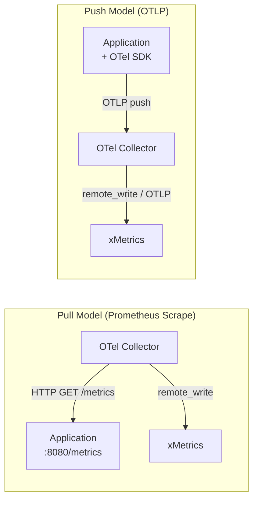
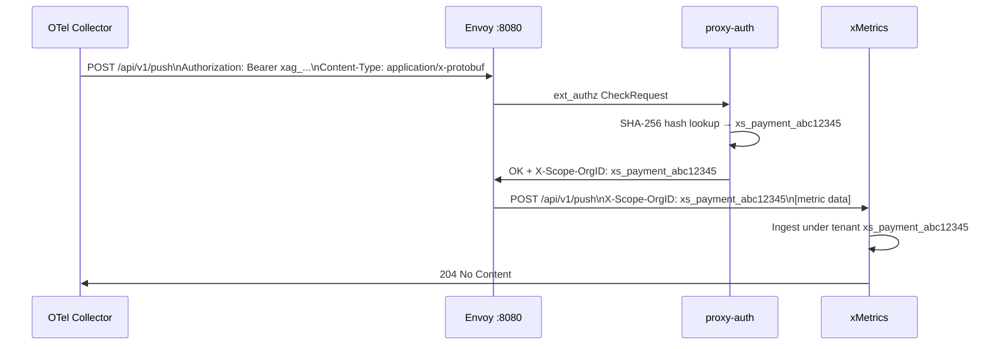

# Metrics Collection

## Learning Objectives

- [ ] Explain the Prometheus pull model vs OTLP push model
- [ ] Configure the OTel Collector Prometheus receiver for scraping
- [ ] Configure the OTel Collector prometheusremotewrite exporter for pushing to xMetrics
- [ ] Understand xMetrics's multi-tenant ingestion model

---

## Two Models of Metrics Collection



| Attribute | Pull (Prometheus scrape) | Push (OTLP) |
|---|---|---|
| **Direction** | Collector polls application | Application sends to collector |
| **Format** | Prometheus text exposition | OTLP protobuf |
| **Protocol** | HTTP GET `/metrics` | gRPC :4317 or HTTP :4318 |
| **Discovery** | Static config or SD | N/A — app knows where to send |
| **Cardinality control** | `relabel_configs` | `attributes` processor |
| **Short-lived pods** | Problematic — pod may be gone | Fine — push before termination |
| **xScaler use case** | Platform self-monitoring | Customer application data |

---

## Pull Model — Prometheus Scrape

xScaler's edge OTel Collector scrapes platform component metrics using the Prometheus receiver:

```yaml
# From deploy/otel/otel-collector.yaml (actual repository config)
receivers:
  prometheus:
    config:
      scrape_configs:
        - job_name: mimir
          scrape_interval: 15s
          static_configs:
            - targets: ['client-mimir:9009']
              labels:
                xscaler_cluster: local

        - job_name: envoy
          scrape_interval: 15s
          static_configs:
            - targets: ['envoy:9901']
              labels:
                xscaler_cluster: local

        - job_name: proxy-auth
          scrape_interval: 15s
          static_configs:
            - targets: ['proxy-auth:9002']
              labels:
                xscaler_cluster: local

        - job_name: loki
          scrape_interval: 15s
          static_configs:
            - targets: ['client-loki:3100']
              labels:
                xscaler_cluster: local

        - job_name: tempo
          scrape_interval: 15s
          static_configs:
            - targets: ['tempo:3200']
              labels:
                xscaler_cluster: local
```

**Production edge OTel collector** uses DNS-based service discovery (from `charts/edge-xscaler/templates/otel-collector-configmap.yaml`):

```yaml
scrape_configs:
  - job_name: mimir-distributor
    dns_sd_configs:
      - names:
          - "AAAA+mimir-distributor.xscaler-edge.svc.cluster.local"
        type: AAAA
        port: 8080
    metric_relabel_configs:
      # Only keep xscaler-specific proxy-auth metrics
      - source_labels: [__name__]
        action: keep
        regex: "xscalor_ext_authz_.*|xscalor_proxy_auth_.*"
```

---

## Push Model — OTLP Metrics

Applications using the OTel SDK push metrics via OTLP to a collector, which then remote-writes to xMetrics:

```yaml
# Customer collector config
exporters:
  prometheusremotewrite:
    endpoint: https://euw1-01.m.xscalerlabs.com/api/v1/push
    headers:
      Authorization: Bearer ${env:API_KEY}
      X-Scope-OrgID: ${env:TENANT_ID}
    tls:
      insecure_skip_verify: false
    retry_on_failure:
      enabled: true
      initial_interval: 5s
      max_interval: 30s
      max_elapsed_time: 300s
    queue:
      enabled: true
      num_consumers: 10
      queue_size: 5000
```

---

## xMetrics Multi-Tenant Ingestion

xMetrics receives metrics via the Prometheus remote_write protocol at `/api/v1/push`. Each request must include `X-Scope-OrgID` to route to the correct tenant:



**xMetrics configuration** (`deploy/mimir/mimir.yaml`):
```yaml
multitenancy_enabled: true

ingester:
  ring:
    replication_factor: 1  # local dev; production uses 3

limits:
  ingestion_rate: 100000    # samples/sec per tenant
  ingestion_burst_size: 200000
  max_global_series_per_user: 10000000  # 10M series limit
```

---

## Cardinality — The Most Important Metric Concept

**Active series** drive your xMetrics storage and billing costs. A single high-cardinality label can turn 100 series into 1,000,000.

**High-cardinality labels to AVOID in metrics:**

```yaml
# ❌ NEVER add these to metrics
processors:
  # user_id: 10M unique users → 10M series per metric
  # request_id: unique per request → unbounded
  # trace_id: unique per request → unbounded
  # session_id: unique per session → high cardinality
```

**Remove them in the attributes processor:**

```yaml
processors:
  attributes/remove-hc:
    actions:
      - key: user_id
        action: delete
      - key: request_id
        action: delete
      - key: trace_id
        action: delete
```

**Good low-cardinality labels for metrics:**
```
service (10-50 values)
environment (prod/staging/dev = 3 values)
region (us-east-1/eu-west-1 = ~10 values)
http_method (GET/POST/PUT/DELETE = 4 values)
http_status_code (200/400/500 = ~10 grouped values)
```

---

## Hands-On Exercise

### Exercise 3.1 — Verify Metrics Are Flowing

```bash
# 1. Check the Prometheus endpoint of xMetrics
curl -s http://localhost:9009/metrics | head -20

# 2. Query active series count via PromQL
curl -s "http://localhost:9009/prometheus/api/v1/query" \
  -H "X-Scope-OrgID: system-monitoring" \
  --data-urlencode 'query=count({__name__=~".+"})' | jq '.data.result'

# 3. Check scrape targets
curl -s "http://localhost:9009/prometheus/api/v1/targets" \
  -H "X-Scope-OrgID: system-monitoring" | jq '.data.activeTargets | length'
```

### Exercise 3.2 — Push a Test Metric

```bash
# Send a metric via Prometheus remote_write to the local xMetrics
# (requires snappy-encoded protobuf in production, but xMetrics accepts JSON for dev)
curl -s -X POST "http://localhost:8080/api/v1/push" \
  -H "Authorization: Bearer $API_KEY" \
  -H "Content-Type: application/x-protobuf" \
  -H "X-Prometheus-Remote-Write-Version: 0.1.0"
# Note: use otelcol-contrib or Prometheus for actual remote_write in practice
```

---

## Validation

- [ ] Prometheus receiver scrape targets are visible in `docker compose logs otel-collector`
- [ ] PromQL `up` returns values in the system-mimir Grafana datasource
- [ ] You can explain the difference between pull and push collection

---

## Key Takeaways

!!! success "Session 3.1 Summary"
    - **Pull model** (Prometheus scrape): Collector polls `/metrics` → good for infrastructure components
    - **Push model** (OTLP): Apps send to collector → good for application-level telemetry
    - **xMetrics** ingests via Prometheus remote_write; tenant isolation via `X-Scope-OrgID`
    - **Cardinality** is the primary cost driver — never add user_id, request_id, or trace_id to metrics
    - `max_global_series_per_user: 10,000,000` is the xMetrics limit per tenant (local dev config)

---

*← Previous: [Session 3 Overview](overview.md)*  
*Next: [Architecture Review →](architecture-review.md)*
