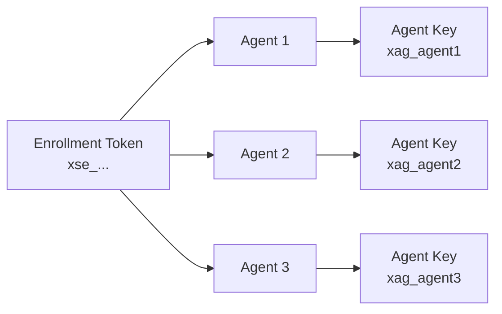

# Agent Deployment

## Learning Objectives

- [ ] Install the OTel Collector binary (`otelcol-contrib`)
- [ ] Install and configure the OpAMP supervisor
- [ ] Create an enrollment token in the portal
- [ ] Deploy the supervisor and verify agent enrollment

---

## Components Required

| Component | Binary | Role |
|---|---|---|
| `otelcol-contrib` | OTel Collector | Runs the actual pipeline |
| `otelcol-supervisor` | OpAMP Supervisor | Manages the collector process remotely |

The supervisor and the collector are **two separate processes**. The supervisor manages the collector's lifecycle and configuration.

---

## Enrollment Token

An enrollment token is an `xse_` prefixed key that allows a new agent to register with xScaler. It is a shared secret for a fleet — not unique per agent.



### Create an Enrollment Token (Portal API)

```bash
# Create enrollment token for a Kubernetes fleet
curl -s -X POST $PORTAL_BASE/agent-enrollment-tokens \
  -H "Authorization: Bearer $JWT_TOKEN" \
  -H "Content-Type: application/json" \
  -d '{
    "display_name": "k8s-prod-fleet",
    "default_labels": {
      "environment": "production",
      "deployment": "kubernetes",
      "team": "platform"
    }
  }' | jq .
```

Expected response:
```json
{
  "id": "token_abc123",
  "token": "xse_a1b2c3d4e5f6g7h8i9j0k1l2m3n4o5p6",
  "display_name": "k8s-prod-fleet",
  "default_labels": {
    "environment": "production",
    "deployment": "kubernetes",
    "team": "platform"
  }
}
```

!!! warning "Save the Token"
    Like API keys, the enrollment token value is shown once. Save it to your secret manager immediately.

For local dev, the seed data pre-creates a token:
```
xse_localdev0000000000000000000000
```

---

## Installing the OTel Collector

=== "Linux (binary)"

    ```bash
    # Download otelcol-contrib (check releases.opentelemetry.io for latest)
    OTEL_VERSION="0.104.0"
    curl -Lo /tmp/otelcol-contrib.tar.gz \
      "https://github.com/open-telemetry/opentelemetry-collector-releases/releases/download/v${OTEL_VERSION}/otelcol-contrib_${OTEL_VERSION}_linux_amd64.tar.gz"

    tar -xzf /tmp/otelcol-contrib.tar.gz -C /tmp/
    sudo mv /tmp/otelcol-contrib /usr/local/bin/
    sudo chmod +x /usr/local/bin/otelcol-contrib

    # Verify
    otelcol-contrib --version
    ```

=== "Docker"

    ```bash
    # Pull the OTel Collector Contrib image
    docker pull otel/opentelemetry-collector-contrib:0.104.0

    # Run with a config file
    docker run --rm \
      -v /path/to/config.yaml:/etc/otelcol/config.yaml \
      otel/opentelemetry-collector-contrib:0.104.0 \
      --config /etc/otelcol/config.yaml
    ```

=== "Kubernetes"

    ```yaml
    # Defined in the DaemonSet manifest
    # See Appendix: Kubernetes DaemonSet manifest
    containers:
      - name: otel-collector
        image: otel/opentelemetry-collector-contrib:0.104.0
        args: ["--config=/etc/otelcol/config.yaml"]
    ```

---

## Configuring the OpAMP Supervisor

Create the supervisor config file:

```yaml
# /etc/otelcol-supervisor/supervisor.yaml

server:
  # Production endpoint
  endpoint: wss://agents.xscalerlabs.com/v1/opamp
  # Local dev endpoint
  # endpoint: ws://agent-api:8082/v1/opamp
  headers:
    Authorization: "Bearer ${env:XSCALER_ENROLLMENT_TOKEN}"

capabilities:
  accepts_remote_config: true        # Receive config from portal
  reports_effective_config: true     # Report running config back
  reports_remote_config: true        # Report received config
  reports_health: true               # Report health status

agent:
  executable: /usr/local/bin/otelcol-contrib
  description:
    non_identifying_attributes:
      # These labels are used to match config assignments
      environment: "${env:ENVIRONMENT}"
      deployment: "${env:DEPLOYMENT}"
      team: "${env:TEAM}"

storage:
  directory: /var/lib/otelcol-supervisor
```

---

## Running the Supervisor

### systemd Service (Recommended for VMs)

```ini
# /etc/systemd/system/otelcol-supervisor.service
[Unit]
Description=OpenTelemetry Collector Supervisor
After=network.target

[Service]
Type=simple
User=otelcol
Group=otelcol
Environment=XSCALER_ENROLLMENT_TOKEN=xse_...
Environment=ENVIRONMENT=production
Environment=DEPLOYMENT=kubernetes
Environment=TEAM=platform
ExecStart=/usr/local/bin/otelcol-supervisor --config /etc/otelcol-supervisor/supervisor.yaml
Restart=always
RestartSec=5

[Install]
WantedBy=multi-user.target
```

```bash
sudo systemctl daemon-reload
sudo systemctl enable otelcol-supervisor
sudo systemctl start otelcol-supervisor
sudo systemctl status otelcol-supervisor
```

### Kubernetes DaemonSet

```yaml
apiVersion: apps/v1
kind: DaemonSet
metadata:
  name: otelcol-supervisor
  namespace: monitoring
spec:
  selector:
    matchLabels:
      app: otelcol-supervisor
  template:
    metadata:
      labels:
        app: otelcol-supervisor
    spec:
      containers:
        - name: supervisor
          image: otel/opentelemetry-collector-contrib:0.104.0
          command: ["otelcol-contrib", "--config=/etc/supervisor/supervisor.yaml"]
          env:
            - name: XSCALER_ENROLLMENT_TOKEN
              valueFrom:
                secretKeyRef:
                  name: xscaler-enrollment
                  key: token
            - name: ENVIRONMENT
              value: "production"
            - name: DEPLOYMENT
              value: "kubernetes"
            - name: TEAM
              value: "platform"
            - name: HOSTNAME
              valueFrom:
                fieldRef:
                  fieldPath: spec.nodeName
          volumeMounts:
            - name: supervisor-config
              mountPath: /etc/supervisor
            - name: supervisor-storage
              mountPath: /var/lib/otelcol-supervisor
      volumes:
        - name: supervisor-config
          configMap:
            name: otelcol-supervisor-config
        - name: supervisor-storage
          emptyDir: {}
```

---

## Local Dev — Verify Agent Is Running

The local dev stack includes a pre-configured agent:

```bash
# Check agent-1 status
docker compose ps agent-1

# Watch agent enrollment and config delivery
docker compose logs agent-1 --follow --tail=50
```

Expected log output:
```
2026/06/18 10:00:00 INFO Connected to OpAMP server endpoint=ws://agent-api:8082/v1/opamp
2026/06/18 10:00:00 INFO Enrollment successful agent_id=01J1234567890ABCDEFGHIJKLMN
2026/06/18 10:00:01 INFO Received remote config from server
2026/06/18 10:00:01 INFO Agent started with new config
2026/06/18 10:00:01 INFO Reported effective config to server
```

---

## Hands-On Exercise

### Exercise 4.2 — Inspect the Local Dev Agent

```bash
# 1. View supervisor config
cat /path/to/xscaler/deploy/agents/agent-1.supervisor.yaml

# 2. Check agent registration
docker compose exec postgres psql -U xscaler -d xscaler \
  -c "SELECT id, labels, last_seen_at FROM agents;"

# 3. Check enrollment token
docker compose exec postgres psql -U xscaler -d xscaler \
  -c "SELECT id, display_name, use_count FROM agent_enrollment_tokens;"

# 4. Check agent keys
docker compose exec postgres psql -U xscaler -d xscaler \
  -c "SELECT agent_id, created_at FROM agent_keys;"
```

---

## Validation

- [ ] `docker compose ps agent-1` shows `Up`
- [ ] `docker compose logs agent-1` shows "Connected to OpAMP server"
- [ ] Agent appears in the `agents` table in PostgreSQL
- [ ] `agent_keys` table has an entry for the agent
- [ ] Enrollment token `use_count` has incremented

---

## Key Takeaways

!!! success "Session 4.2 Summary"
    - Two components: `otelcol-contrib` (pipeline) + `otelcol-supervisor` (OpAMP manager)
    - Enrollment tokens (`xse_`) are **fleet credentials** — shared among all agents in a group
    - Per-agent keys (`xag_`) are created during enrollment — unique to each agent instance
    - Supervisor labels (from `non_identifying_attributes`) are used for config template matching
    - Agent storage directory persists across restarts — supervisor remembers its agent key

---

*← Previous: [Tenant Administration](tenant-administration.md)*  
*Next: [Agent Registration →](agent-registration.md)*
