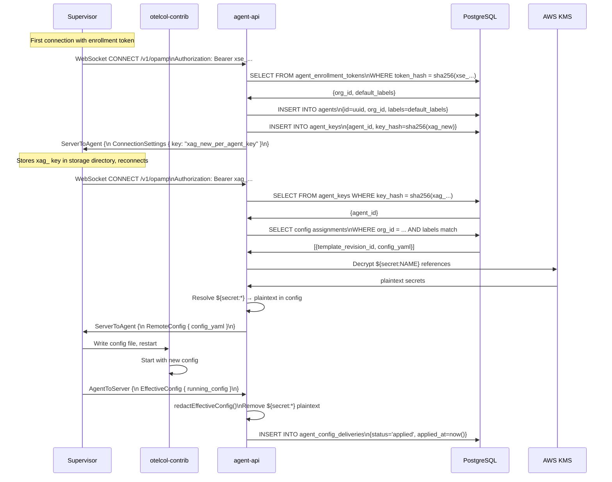
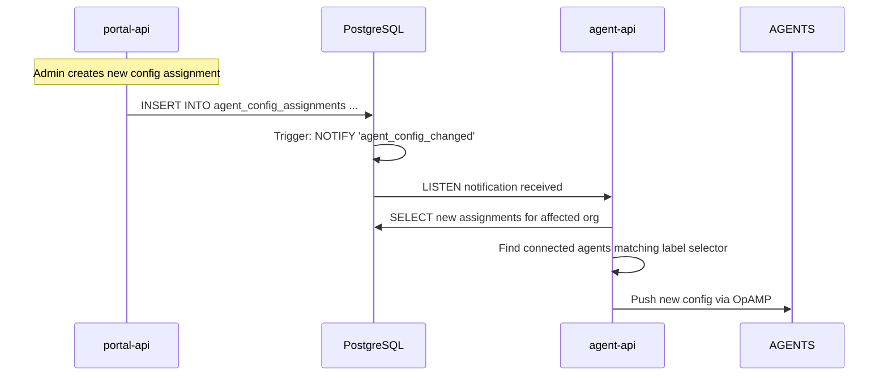

# Agent Registration

## Learning Objectives

- [ ] Trace the full OpAMP enrollment and config push sequence
- [ ] Explain the two-phase token exchange in detail
- [ ] Read agent status from the portal API and database
- [ ] Identify stale agents and understand the stale sweep

---

## OpAMP Protocol Overview

OpAMP (Open Agent Management Protocol) is a WebSocket-based protocol defined by the OpenTelemetry community. The xScaler `agent-api` is the OpAMP server.

The protocol uses bidirectional WebSocket messages:

| Direction | Message Type | Purpose |
|---|---|---|
| Agent → Server | `AgentToServer` | Status report, health, effective config |
| Server → Agent | `ServerToAgent` | Config push, connection settings |

---

## Full Registration Sequence



---

## server Capabilities

From `agent-api/internal/opampserver/server.go`, the server advertises:

```go
serverCapabilities =
    protobufs.ServerCapabilities_ServerCapabilities_AcceptsStatus |
    protobufs.ServerCapabilities_ServerCapabilities_OffersRemoteConfig |
    protobufs.ServerCapabilities_ServerCapabilities_AcceptsEffectiveConfig |
    protobufs.ServerCapabilities_ServerCapabilities_OffersConnectionSettings
```

| Capability | Meaning |
|---|---|
| `AcceptsStatus` | Server processes agent health and status reports |
| `OffersRemoteConfig` | Server can push config to agents |
| `AcceptsEffectiveConfig` | Server receives the config the agent is actually running |
| `OffersConnectionSettings` | Server can send new credentials to agents (used for enrollment) |

---

## Config Delivery Lifecycle

Every config push is tracked in the `agent_config_deliveries` table:

```
offered → applying → applied
                  ↘ failed
```

| Status | Meaning |
|---|---|
| `offered` | Config was sent to the agent via OpAMP |
| `applying` | Agent acknowledged and is restarting the collector |
| `applied` | Agent reported effective config matching the revision |
| `failed` | Agent reported error (invalid YAML, collector crash, etc.) |

Query delivery status:
```bash
docker compose exec postgres psql -U xscaler -d xscaler -c "
  SELECT
    a.id AS agent_id,
    r.revision,
    d.status,
    d.offered_at,
    d.applied_at,
    d.error
  FROM agent_config_deliveries d
  JOIN agents a ON d.agent_id = a.id
  JOIN agent_config_template_revisions r ON d.revision_id = r.id
  ORDER BY d.offered_at DESC
  LIMIT 10;
"
```

---

## Stale Agent Sweep

The agent-api runs a background sweep every **30 seconds** to detect stale agents:

- If an agent hasn't sent a heartbeat in `staleAfter: 90s` (from Helm values), it is marked as disconnected
- Stale agents do not receive new config pushes until they reconnect
- On reconnect, the latest config is immediately re-delivered

```yaml
# charts/portal-xscaler/values.yaml
agentApi:
  staleAfter: 90s     # Mark agent stale after this period without heartbeat
```

---

## PostgreSQL NOTIFY/LISTEN

Config changes propagate to agents in near-real-time via PostgreSQL's NOTIFY/LISTEN mechanism:



The channel name is `agent_config_changed` (from `agent-api/cmd/agent-api/main.go`).

---

## Hands-On Exercise

### Exercise 4.3 — Monitor Agent Registration

```bash
# 1. Watch OpAMP messages in real time
docker compose logs agent-api --follow --tail=20

# 2. Check all agents and their last heartbeat
docker compose exec postgres psql -U xscaler -d xscaler -c "
  SELECT
    id,
    labels,
    last_seen_at,
    EXTRACT(EPOCH FROM (now() - last_seen_at)) AS seconds_ago
  FROM agents
  ORDER BY last_seen_at DESC;
"

# 3. Check config delivery history
docker compose exec postgres psql -U xscaler -d xscaler -c "
  SELECT d.status, COUNT(*) FROM agent_config_deliveries d GROUP BY d.status;
"

# 4. Trigger a config change notification
docker compose exec postgres psql -U xscaler -d xscaler -c "
  SELECT pg_notify('agent_config_changed', '{\"org_id\": \"test\"}');
"

# 5. Watch agent-api log for the notification handling
docker compose logs agent-api --follow --tail=5
```

---

## Validation

- [ ] Agent appears in `agents` table with recent `last_seen_at`
- [ ] `agent_config_deliveries` shows `status='applied'`
- [ ] Triggering `pg_notify` causes agent-api to log "Config change notification received"
- [ ] You can explain the enrollment token vs agent key distinction

---

## Key Takeaways

!!! success "Session 4.3 Summary"
    - OpAMP is bidirectional WebSocket — both agent and server can send messages at any time
    - Config delivery is tracked: `offered → applying → applied | failed`
    - Stale sweep runs every **30s** — agents must heartbeat within **90s** to stay active
    - PostgreSQL **NOTIFY/LISTEN** on `agent_config_changed` triggers near-real-time config push
    - Effective configs are redacted by `redactEffectiveConfig()` before storing — secrets never stored in DB

---

*← Previous: [Agent Deployment](agent-deployment.md)*  
*Next: [Configuration Management →](configuration-management.md)*
