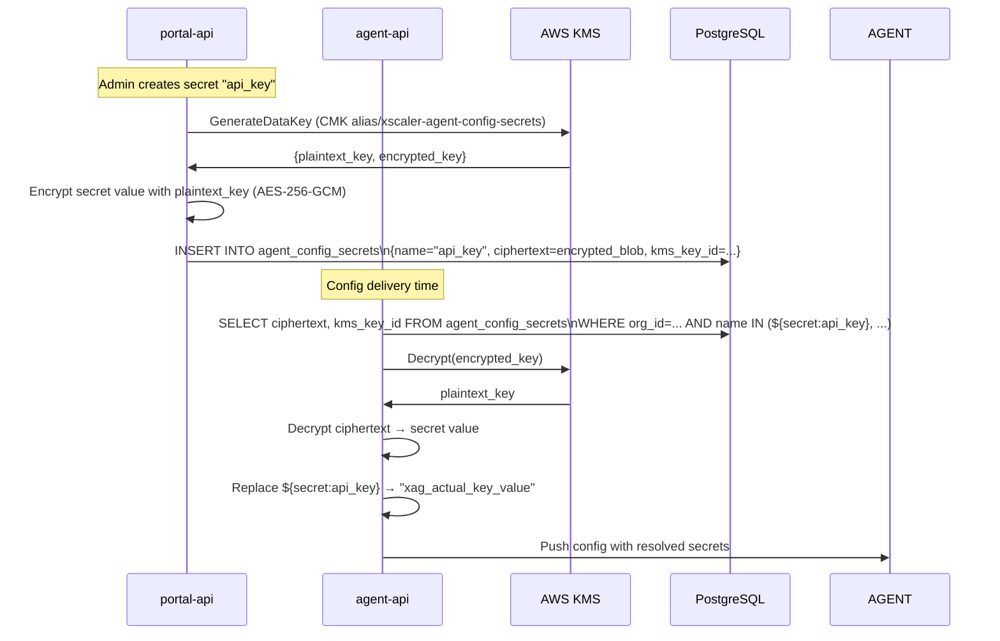
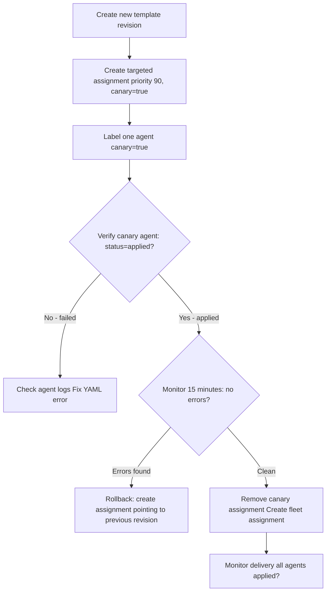

# Configuration Management

## Learning Objectives

- [ ] Create a config template with `${secret:NAME}` references
- [ ] Store secrets using KMS envelope encryption
- [ ] Create label-selector based assignments
- [ ] Roll out a config change and monitor delivery
- [ ] Roll back to a previous config revision

---

## Config Template System

```mermaid
graph TB
    subgraph "Portal (Admin)"
        CT[Config Template]
        CR1[Revision 1 base config]
        CR2[Revision 2 added receivers]
        CA1[Assignment 1 priority 0 label: {}]
        CA2[Assignment 2 priority 50 label: {team: backend}]
        CS[Secrets ${secret:api_key}]
    end

    subgraph "Delivery"
        AA[agent-api]
        KMS[AWS KMS decrypt secrets]
    end

    subgraph "Agents"
        AG1[Agent A team: backend]
        AG2[Agent B team: frontend]
        AG3[Agent C no team label]
    end

    CT --> CR1 & CR2
    CR2 --> CA1 & CA2
    CS -.->|${secret:api_key}| CR2
    CA1 -->|matches all| AA
    CA2 -->|matches team=backend| AA
    AA -->|decrypt| KMS
    KMS --> AA
    AA -->|resolved config| AG1 & AG2 & AG3
    CA2 -.->|higher priority\nfor team=backend| AG1
```

---

## Config Templates

A **config template** is the OTel Collector YAML with secret placeholders. Multiple revisions can be created — agents always receive the latest revision assigned to them.

### Template YAML Format

```yaml
# Config template stored in agent_config_template_revisions.config_yaml
# ${secret:NAME} placeholders are resolved at delivery time

receivers:
  otlp:
    protocols:
      grpc:
        endpoint: 0.0.0.0:4317
      http:
        endpoint: 0.0.0.0:4318

  hostmetrics:
    collection_interval: 30s
    scrapers:
      cpu: {}
      memory: {}
      network: {}

processors:
  memory_limiter:
    check_interval: 1s
    limit_mib: 256
    spike_limit_mib: 64

  batch:
    timeout: 5s
    send_batch_size: 1024

exporters:
  prometheusremotewrite:
    endpoint: ${secret:metrics_endpoint}
    headers:
      Authorization: Bearer ${secret:api_key}
      X-Scope-OrgID: ${secret:tenant_id}

  otlphttp/traces:
    endpoint: ${secret:traces_endpoint}
    headers:
      Authorization: Bearer ${secret:api_key}
      X-Scope-OrgID: ${secret:tenant_id}

service:
  pipelines:
    metrics:
      receivers: [otlp, hostmetrics]
      processors: [memory_limiter, batch]
      exporters: [prometheusremotewrite]
    traces:
      receivers: [otlp]
      processors: [memory_limiter, batch]
      exporters: [otlphttp/traces]
```

### Secret Reference Syntax

```
${secret:NAME}
```

Where `NAME` is the key in the `agent_config_secrets` table for the organisation.

---

## Secrets Management

Secrets are stored using **AWS KMS envelope encryption**:

1. Secret value is encrypted with a data key
2. Data key is encrypted with the KMS CMK (Customer Master Key)
3. Only the ciphertext is stored in the database (`agent_config_secrets.ciphertext`)
4. At delivery time, `agent-api` decrypts via KMS and injects the plaintext into the YAML



---

## Label Selector Assignments

Assignments determine which config template revision goes to which agents.

### Selector Examples

```json
{}                                    // Matches ALL agents in the org
{"environment": "production"}        // Only production agents
{"team": "backend"}                  // Only agents labeled team=backend
{"environment": "production", "team": "backend"}  // Both labels must match
```

### Priority

When multiple assignments match the same agent, **highest priority wins**:

| Priority | Selector | Config |
|---|---|---|
| 0 (lowest) | `{}` | Base config — all agents |
| 50 | `{"environment": "production"}` | Production-specific config |
| 100 (highest) | `{"team": "database"}` | DB team specific config |

An agent with labels `{environment: "production", team: "database"}` receives priority-100 config.

---

## Config Rollout Procedure



### Create Assignment via SQL (for local dev)

```sql
-- From scripts/agents/
INSERT INTO agent_config_assignments (
  id,
  organization_id,
  revision_id,
  label_selector,
  priority
) VALUES (
  'assign_001',
  'your-org-id',
  'revision-id-here',
  '{}',        -- matches all agents
  0
);
```

---

## Rollback

To roll back, create a new assignment pointing to a previous revision:

```sql
-- Rollback: assign the previous revision at higher priority
INSERT INTO agent_config_assignments (
  id,
  organization_id,
  revision_id,
  label_selector,
  priority
) VALUES (
  'rollback_001',
  'your-org-id',
  'PREVIOUS_REVISION_ID',
  '{}',
  200   -- Higher priority overrides the current assignment
);
```

This triggers a `NOTIFY agent_config_changed` → agent-api pushes the previous revision → all agents roll back.

---

## Hands-On Exercise

### Exercise 4.4 — Explore Config in the Database

```bash
# 1. View config templates
docker compose exec postgres psql -U xscaler -d xscaler -c "
  SELECT id, display_name, created_at FROM agent_config_templates;
"

# 2. View config revisions
docker compose exec postgres psql -U xscaler -d xscaler -c "
  SELECT t.display_name, r.revision, substring(r.config_yaml, 1, 100) AS config_preview
  FROM agent_config_template_revisions r
  JOIN agent_config_templates t ON r.template_id = t.id
  ORDER BY r.created_at;
"

# 3. View assignments
docker compose exec postgres psql -U xscaler -d xscaler -c "
  SELECT a.label_selector, a.priority, r.revision
  FROM agent_config_assignments a
  JOIN agent_config_template_revisions r ON a.revision_id = r.id
  ORDER BY a.priority DESC;
"

# 4. See the full config from seed (local dev)
docker compose exec postgres psql -U xscaler -d xscaler -c "
  SELECT config_yaml FROM agent_config_template_revisions LIMIT 1;
"
```

---

## Validation

- [ ] Config templates are present in the database
- [ ] Assignments exist with appropriate label selectors
- [ ] `agent_config_deliveries` shows `applied` for the local agent
- [ ] You can describe the `${secret:NAME}` resolution flow

---

## Key Takeaways

:::tip[Session 4.4 Summary]

- Config templates contain `${secret:NAME}` placeholders resolved at delivery time via AWS KMS
- Secrets are stored as KMS envelope-encrypted ciphertext — never as plaintext in the DB
- **Label selectors** determine which agents receive which template — `{}` matches all
- **Priority** resolves conflicts when multiple assignments match the same agent
- Rollback = create a new assignment at higher priority pointing to the previous revision
- Config pushes are triggered within seconds via PostgreSQL **NOTIFY/LISTEN**

:::

---

*← Previous: [Agent Registration](agent-registration.md)*  
*Next: [Session 5 Overview →](../session-5/overview.md)*
