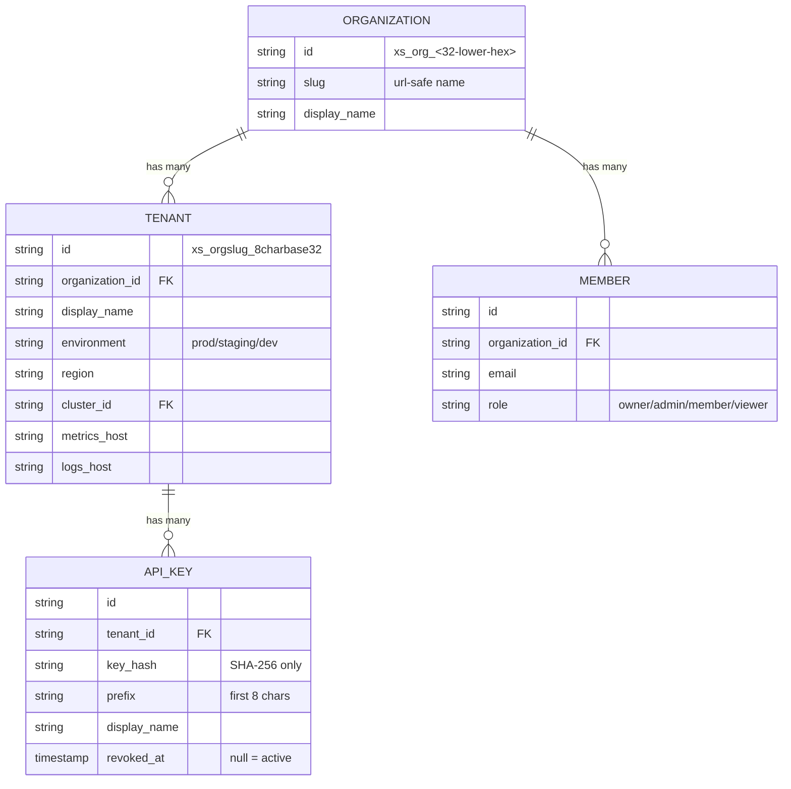

import Tabs from '@theme/Tabs';
import TabItem from '@theme/TabItem';

# Tenant Administration

## Learning Objectives

- [ ] Create, update, and delete tenants via the portal API
- [ ] Understand the tenant ID format and what each part means
- [ ] Manage API keys for a tenant (create, list, revoke)
- [ ] Monitor tenant usage via the dashboard API

---

## Tenant Data Model



### Tenant ID Format

```
xs_payment_ab3cd4ef
│  │        │
│  │        └── 8-char lower-case base32 (random)
│  └── Organisation slug (from display_name)
└── xScaler tenant prefix
```

---

## Tenant Lifecycle

### Create a Tenant

<Tabs>
  <TabItem value="portal-ui" label="Portal UI">


1. Navigate to `https://portal.xscalerlabs.com` → **Tenants** → **New Tenant**
2. Enter `Display Name` and select `Environment`
3. Click **Create**

<div class="screenshot-placeholder">
[Screenshot: New Tenant modal with Display Name field and Environment dropdown]
</div>

  </TabItem>
</Tabs>

<Tabs>
  <TabItem value="api" label="API">


```bash
# Create a tenant
curl -s -X POST $PORTAL_BASE/tenants \
  -H "Authorization: Bearer $JWT_TOKEN" \
  -H "Content-Type: application/json" \
  -d '{
    "display_name": "Payment Service Production",
    "environment": "prod"
  }' | jq .
```

Expected response:
```json
{
  "id": "xs_payment_ab3cd4ef",
  "display_name": "Payment Service Production",
  "environment": "prod",
  "region": "eu-west-1",
  "metrics_host": "euw1-01.m.xscalerlabs.com",
  "logs_host": "euw1-01.l.xscalerlabs.com",
  "traces_host": "euw1-01.t.xscalerlabs.com",
  "created_at": "2026-06-18T10:00:00Z"
}
```

  </TabItem>
</Tabs>

### List Tenants

```bash
curl -s $PORTAL_BASE/tenants \
  -H "Authorization: Bearer $JWT_TOKEN" | jq '.[].id'
```

### Get Tenant Details

```bash
export TENANT_ID="xs_payment_ab3cd4ef"

curl -s $PORTAL_BASE/tenants/$TENANT_ID \
  -H "Authorization: Bearer $JWT_TOKEN" | jq .
```

### Update a Tenant

```bash
curl -s -X PATCH $PORTAL_BASE/tenants/$TENANT_ID \
  -H "Authorization: Bearer $JWT_TOKEN" \
  -H "Content-Type: application/json" \
  -d '{"display_name": "Payment Service EU Production"}' | jq .
```

---

## API Key Management

### Create an API Key

```bash
KEY_RESPONSE=$(curl -s -X POST $PORTAL_BASE/tenants/$TENANT_ID/keys \
  -H "Authorization: Bearer $JWT_TOKEN" \
  -H "Content-Type: application/json" \
  -d '{"display_name": "k8s-prod-collector-1"}')

echo $KEY_RESPONSE | jq .

# Save the key immediately — it is only shown once
export API_KEY=$(echo $KEY_RESPONSE | jq -r '.key')
echo "API Key: $API_KEY"
```

:::warning[One-Time Display]

The full API key value is shown **once** at creation. Only the first 8 characters (prefix) are stored for display. Always save the key to your secret management system immediately.

:::

### List API Keys

```bash
curl -s $PORTAL_BASE/tenants/$TENANT_ID/keys \
  -H "Authorization: Bearer $JWT_TOKEN" | jq '.[] | {id, display_name, prefix, created_at}'
```

Output shows prefix only:
```json
{
  "id": "key_abc123",
  "display_name": "k8s-prod-collector-1",
  "prefix": "xag_a1b2",
  "created_at": "2026-06-18T10:00:00Z"
}
```

### Revoke an API Key

```bash
# Get key ID first
KEY_ID=$(curl -s $PORTAL_BASE/tenants/$TENANT_ID/keys \
  -H "Authorization: Bearer $JWT_TOKEN" | jq -r '.[0].id')

# Revoke
curl -s -X DELETE $PORTAL_BASE/tenants/$TENANT_ID/keys/$KEY_ID \
  -H "Authorization: Bearer $JWT_TOKEN"
```

:::info[Revocation Delay]

proxy-auth caches key lookups for up to 15 seconds. After revocation, the key may still work for up to 15 seconds before the cache expires.

:::

---

## Usage Monitoring

### Dashboard Summary

```bash
curl -s $PORTAL_BASE/dashboard/org/summary \
  -H "Authorization: Bearer $JWT_TOKEN" | jq '{
    billing_plan: .billing_plan,
    active_series: .org_active_series,
    plan_max_series: .plan_max_active_series,
    logs_gb_this_month: .org_logs_gb_ingested_this_month,
    pct_used: (.org_active_series / .plan_max_active_series * 100 | floor)
  }'
```

Expected response:
```json
{
  "billing_plan": "scale",
  "active_series": 1243,
  "plan_max_series": 20000,
  "logs_gb_this_month": 0.42,
  "pct_used": 6
}
```

### Per-Tenant Usage

```bash
curl -s $PORTAL_BASE/dashboard/tenants/$TENANT_ID/usage \
  -H "Authorization: Bearer $JWT_TOKEN" | jq .
```

---

## Hands-On Exercise

### Exercise 4.1 — Tenant Lifecycle

```bash
# Set up environment
export PORTAL_BASE="https://portal.xscalerlabs.com"
export JWT_TOKEN=$(curl -s -X POST $PORTAL_BASE/auth/login \
  -H "Content-Type: application/json" \
  -d '{"email":"training@example.com","password":"Training123!"}' | jq -r '.token')

# Create three tenants (simulate multi-environment setup)
for ENV in prod staging dev; do
  curl -s -X POST $PORTAL_BASE/tenants \
    -H "Authorization: Bearer $JWT_TOKEN" \
    -H "Content-Type: application/json" \
    -d "{\"display_name\": \"Workshop Service $ENV\", \"environment\": \"$ENV\"}" | jq '.id'
done

# List all tenants
curl -s $PORTAL_BASE/tenants \
  -H "Authorization: Bearer $JWT_TOKEN" | jq '.[].display_name'

# Create API keys for the prod tenant
PROD_TENANT=$(curl -s $PORTAL_BASE/tenants \
  -H "Authorization: Bearer $JWT_TOKEN" | jq -r '.[] | select(.environment=="prod") | .id' | head -1)

# Create active key
ACTIVE_KEY=$(curl -s -X POST $PORTAL_BASE/tenants/$PROD_TENANT/keys \
  -H "Authorization: Bearer $JWT_TOKEN" \
  -H "Content-Type: application/json" \
  -d '{"display_name": "active-collector-key"}' | jq -r '.key')

# Create backup key
BACKUP_KEY=$(curl -s -X POST $PORTAL_BASE/tenants/$PROD_TENANT/keys \
  -H "Authorization: Bearer $JWT_TOKEN" \
  -H "Content-Type: application/json" \
  -d '{"display_name": "backup-key"}' | jq -r '.key')

echo "Active: $ACTIVE_KEY"
echo "Backup: $BACKUP_KEY"
```

---

## Validation

- [ ] Three tenants created (prod, staging, dev)
- [ ] Two API keys created for prod tenant
- [ ] `curl $PORTAL_BASE/tenants` lists all three tenants
- [ ] Usage dashboard shows 0 active series initially
- [ ] Portal UI shows tenants in the dashboard

---

## Troubleshooting

<details>
<summary><strong>Cannot create more than 3 tenants on Free plan</strong></summary>

Free plan limits tenant count. In training, use the provided Scale plan Stripe key.
Check current plan:
```bash
curl -s $PORTAL_BASE/dashboard/org/summary \
  -H "Authorization: Bearer $JWT_TOKEN" | jq .billing_plan
```

</details>

<details>
<summary><strong>Tenant ID not matching expected format</strong></summary>

The format `xs_<slug>_<base32>` is auto-generated. You cannot specify the ID at creation time.

</details>

---

## Key Takeaways

:::tip[Session 4.1 Summary]

- Tenant ID format: `xs_<orgslug>_<8-char-lower-base32>` — auto-generated, not configurable
- Always create **two API keys per tenant**: active + backup
- API key value is shown **once** — save immediately to secret manager
- Revocation has up to **15 second propagation delay** (proxy-auth cache)
- `usage-sync` runs every **60 seconds** to update usage metrics in PostgreSQL

:::

---

*← Previous: [Session 4 Overview](overview.md)*  
*Next: [Agent Deployment →](agent-deployment.mdx)*
