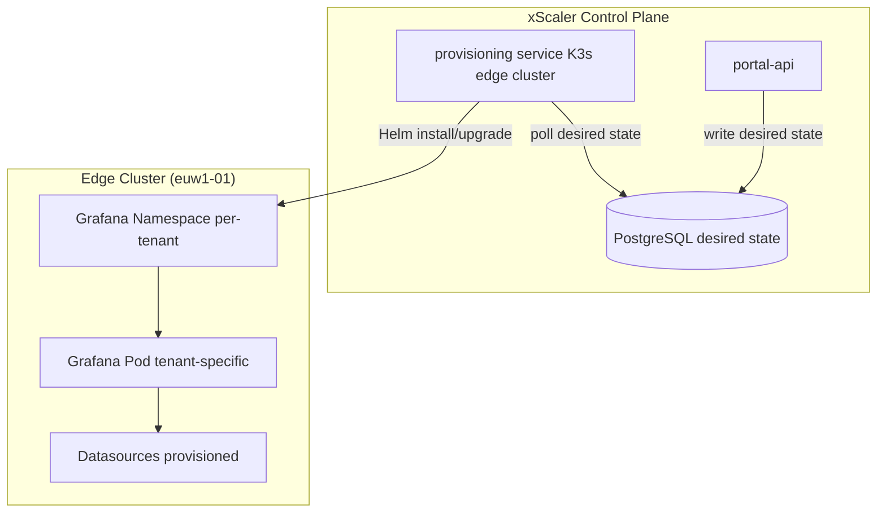

# Grafana Deployment Options

## Learning Objectives

- [ ] Compare self-managed Grafana vs xScaler Managed Grafana
- [ ] Explain the `provisioning service` managed Grafana provisioner
- [ ] Describe the managed Grafana billing model
- [ ] Choose the appropriate deployment option for a use case

---

## Option 1: Self-Managed Grafana

You deploy and manage Grafana yourself. xScaler provides the datasource connection details (URLs and API keys); you configure them in your own Grafana instance.

**Pros:**
- Full control over Grafana version, plugins, and settings
- Integrate with existing SSO/SAML
- No additional cost from xScaler

**Cons:**
- You manage upgrades, backups, and HA
- You manage user access separately from the xScaler portal

### Setup Steps

1. Deploy Grafana (Docker, Helm, Grafana Cloud, etc.)
2. Get datasource connection details from xScaler portal
3. Configure datasources (see [Datasource Configuration](datasource-configuration.mdx))
4. Configure user access within your Grafana instance

---

## Option 2: xScaler Managed Grafana

xScaler provisions and manages a Grafana instance per tenant, deployed in the edge cluster. The portal's **Managed Grafana** feature handles provisioning.



### provisioning service

`provisioning service` is the managed Grafana provisioner. It runs in the edge cluster and:
1. Polls `portal-api` for the desired Grafana state per tenant
2. Installs/upgrades Grafana using Helm
3. Provisions datasources, API keys, and SMTP settings

### Managed Grafana Billing

From `docs/grafana-usage-billing-setup.md`:

| Parameter | Value |
|---|---|
| Price | $0.04/pod-hour |
| Minimum replicas | 2 |
| Meter | `grafana_active_hours` |
| Meter formula | `sum` |
| Billing cadence | Hourly (reported every 15 minutes) |

The `grafana-usage-reporter` CronJob runs every 15 minutes:

```yaml
# charts/portal-xscaler/values.yaml
cronJobs:
  grafanaUsageReporter:
    schedule: "*/15 * * * *"
```

Deduplication identifier format:
```
org_<orgID>_grafana_<grafanaID>_<YYYYMMDDHH>
```

This prevents double-billing when the CronJob runs within the same UTC hour.

**48-hour backfill window:** The reporter looks back 48 hours to catch any missed hours due to CronJob failures.

---

## Comparison Table

| Feature | Self-Managed | Managed Grafana |
|---|---|---|
| **Setup effort** | You configure | Portal handles it |
| **Upgrades** | Manual | Automatic |
| **HA** | You configure | xScaler manages |
| **SSO/SAML** | Your IdP | Configurable via portal |
| **Cost** | Grafana OSS/Cloud pricing | $0.04/pod-hour (min 2 pods) |
| **Datasources** | You configure | Auto-provisioned |
| **Plugins** | Any | Standard set |
| **Isolation** | Depends on your setup | Per-tenant namespace |

---

## Key Takeaways

:::tip[Session 5.2 Summary]

- **Self-managed**: bring your own Grafana, configure datasources manually
- **Managed Grafana**: xScaler provisions per-tenant Grafana in the edge cluster
- `provisioning service` polls portal-api for desired state and applies Helm changes
- Managed billing: **$0.04/pod-hour**, minimum 2 replicas, reported every 15 minutes
- The `grafana-usage-reporter` CronJob deduplicates by using `YYYYMMDDHH` identifiers

:::

---

*← Previous: [Grafana Overview](grafana-overview.md)*  
*Next: [Datasource Configuration →](datasource-configuration.mdx)*
