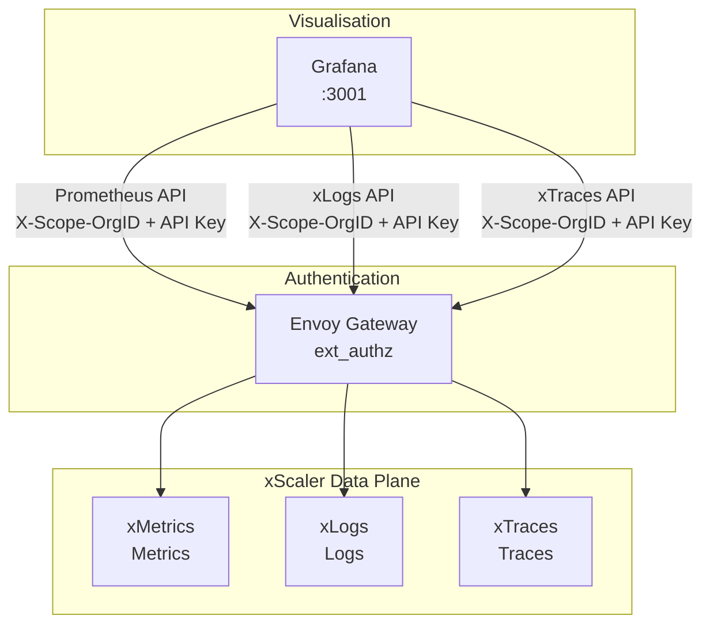
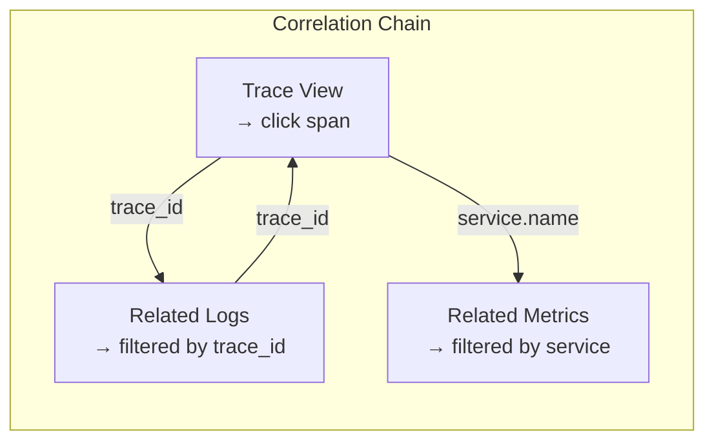

# Grafana Overview

## Learning Objectives

- [ ] Explain Grafana's role as a pure visualisation layer in xScaler
- [ ] Describe how Grafana datasources connect to xScaler backends
- [ ] Understand the difference between system-mimir and client-mimir datasources
- [ ] Read the pre-provisioned datasource YAML from the repository

---

## Grafana in the xScaler Architecture

Grafana is a **visualisation and alerting layer** — it does not store data. It queries the xScaler backends via datasource plugins and renders dashboards.



**Grafana's role:**
- Dashboard creation and display
- Alert rule evaluation and routing
- Cross-signal correlation (trace → log → metric)
- User access control (RBAC)

**Grafana does NOT do:**
- Store any metrics, logs, or traces
- Ingest or collect telemetry
- Manage tenants or API keys (use portal-api for this)

---

## Datasource Model

Each xScaler signal requires its own Grafana datasource:

| Signal | Datasource Type | URL | Auth Headers |
|---|---|---|---|
| Metrics | Prometheus | `https://euw1-01.m.xscalerlabs.com/prometheus` | `Authorization: Bearer xag_...` + `X-Scope-OrgID` |
| Logs | xLogs | `https://euw1-01.l.xscalerlabs.com` | `Authorization: Bearer xag_...` + `X-Scope-OrgID` |
| Traces | xTraces | `https://euw1-01.t.xscalerlabs.com` | `Authorization: Bearer xag_...` + `X-Scope-OrgID` |

---

## System vs Client Datasources

The local dev Grafana has four pre-provisioned datasources:

```yaml
# deploy/observability/grafana/provisioning/datasources/datasource.yml
datasources:
  - name: system-mimir
    type: prometheus
    url: http://system-mimir:9010/prometheus
    jsonData:
      httpHeaderName1: X-Scope-OrgID
    secureJsonData:
      httpHeaderValue1: system-monitoring
    # Used by: xScaler platform operators
    # Shows: xMetrics internals, Envoy stats, proxy-auth metrics

  - name: client-mimir
    type: prometheus
    url: http://client-mimir:9009/prometheus
    jsonData:
      httpHeaderName1: X-Scope-OrgID
    secureJsonData:
      httpHeaderValue1: ${LOADGEN_GRAFANA_TENANT}
    # Used by: tenant users
    # Shows: their own application metrics

  - name: client-loki
    type: loki
    url: http://client-loki:3100
    jsonData:
      httpHeaderName1: X-Scope-OrgID
    secureJsonData:
      httpHeaderValue1: ${LOADGEN_GRAFANA_TENANT}

  - name: tempo
    type: tempo
    url: http://tempo:3200
    jsonData:
      httpHeaderName1: X-Scope-OrgID
    secureJsonData:
      httpHeaderValue1: ${LOADGEN_GRAFANA_TENANT}
```

!!! info "No API Key in Local Dev"
    In the local dev stack, Envoy is not in the path for Grafana queries — Grafana connects directly to xMetrics/xLogs/xTraces. In production, Grafana queries go through Envoy and require `Authorization: Bearer xag_...`.

---

## Cross-Signal Correlation

One of Grafana's most powerful features is correlating the three signals:



### Trace-to-Logs Configuration

```yaml
# xTraces datasource
jsonData:
  tracesToLogs:
    datasourceUid: xscaler-logs
    filterByTraceID: true
    filterBySpanID: false
    tags: ["service.name", "deployment.environment"]
```

### Trace-to-Metrics Configuration

```yaml
# xTraces datasource
jsonData:
  tracesToMetrics:
    datasourceUid: xscaler-metrics
    tags: [{key: "service.name", value: "service"}]
    queries:
      - name: Error rate
        query: sum(rate(http_errors_total{$__tags}[5m]))
```

---

## Hands-On Exercise

### Exercise 5.1 — Explore Pre-Provisioned Datasources

1. Open Grafana at `https://<slug>.g.xscalerlabs.com`
2. Navigate to **Connections → Data Sources**

<div class="screenshot-placeholder">
[Screenshot: Grafana datasources list showing system-mimir, client-mimir, client-loki, and tempo with green status indicators]
</div>

3. Click on `client-mimir` → **Save & Test**

Expected result: `"Data source connected and labels found."`

4. Click on `tempo` → **Save & Test**

Expected result: `"Data source successfully connected."`

### Exercise 5.2 — Run Cross-Signal Query

1. Open **Explore**
2. Select `tempo` datasource
3. Search for recent traces: click **Search** tab → Run Query
4. Click on a trace to open the trace view
5. Click **Logs for this span** to see related logs

<div class="screenshot-placeholder">
[Screenshot: xTraces trace view with spans expanded, showing "Logs for this span" button]
</div>

---

## Validation

- [ ] All four datasources show green status
- [ ] PromQL `up` returns results in `client-mimir`
- [ ] LogQL `{service=~".+"}` returns log streams in `client-loki`
- [ ] xTraces search returns at least one trace
- [ ] Clicking a trace span shows the "Logs" button

---

## Key Takeaways

!!! success "Session 5.1 Summary"
    - Grafana is a **pure visualisation layer** — no data storage, no ingestion
    - Each signal (metrics, logs, traces) requires its own datasource configuration
    - `system-mimir` = platform observability (for xScaler operators)
    - `client-mimir/loki/tempo` = tenant data (for tenant users)
    - Cross-signal correlation links traces → logs → metrics via `trace_id` and `service.name`

---

*← Previous: [Session 5 Overview](overview.md)*  
*Next: [Deployment Options →](deployment-options.md)*
