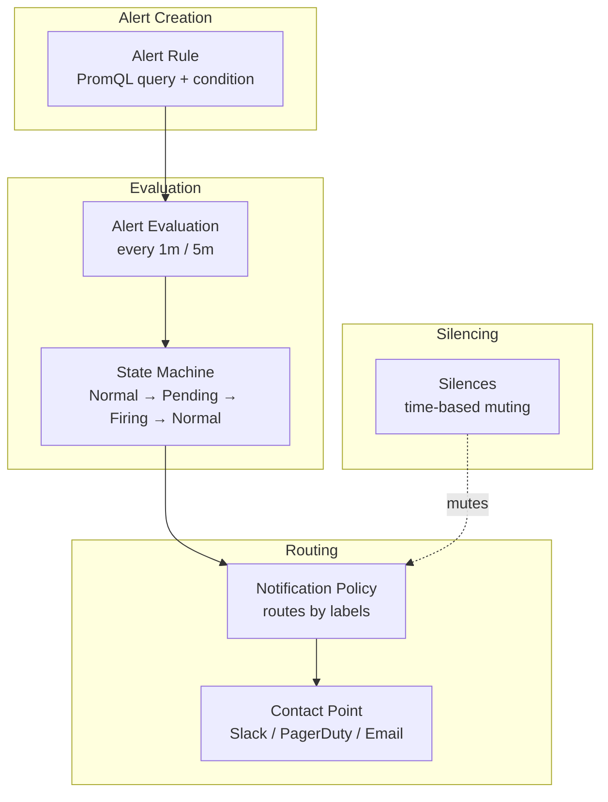
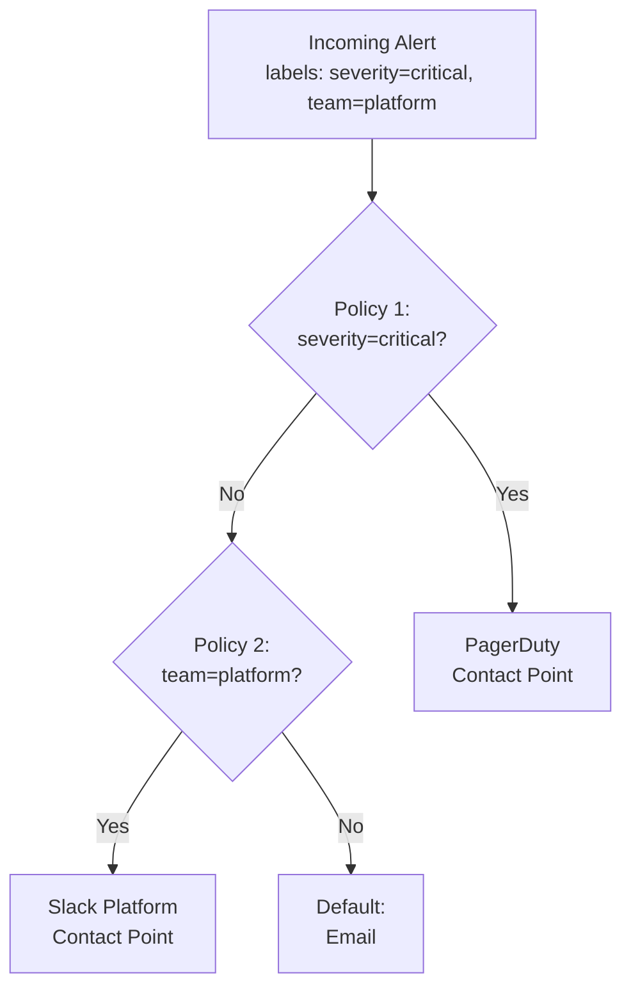

# Alerting

## Learning Objectives

- [ ] Create an alert rule using PromQL in Grafana
- [ ] Configure a notification channel (contact point)
- [ ] Set up an alert routing policy
- [ ] Test alert firing and resolution
- [ ] Design an alerting strategy around the four golden signals

---

## Grafana Alerting Architecture



---

## Alert States

| State | Meaning |
|---|---|
| **Normal** | Query returns no data, or value is within threshold |
| **Pending** | Threshold exceeded but `For` duration not yet elapsed |
| **Firing** | Threshold exceeded for the full `For` duration |
| **NoData** | Query returns no results (separate alert) |
| **Error** | Alert evaluation failed (datasource error) |

The `For` duration prevents alert flapping — the condition must be true continuously for this period before the alert fires.

---

## Creating Alert Rules

### Four Golden Signal Alert Rules

#### 1. High Error Rate

```
Name: High error rate
Datasource: xScaler Metrics
Query:
  sum(rate(http_requests_total{status=~"5.."}[5m]))
  / sum(rate(http_requests_total[5m])) * 100
Condition: IS ABOVE 1
For: 2m
Labels: severity=warning, team=platform
```

#### 2. High Latency

```
Name: High p99 latency
Query:
  histogram_quantile(0.99, sum by (le) (
    rate(http_request_duration_seconds_bucket[5m])
  )) * 1000
Condition: IS ABOVE 500
For: 2m
Labels: severity=warning
```

#### 3. Low Traffic (Traffic Drop)

```
Name: Request rate too low
Query:
  sum(rate(http_requests_total[5m]))
Condition: IS BELOW 0.1
For: 5m
Labels: severity=warning
Annotation: May indicate upstream issues or deployment
```

#### 4. High CPU Saturation

```
Name: High CPU saturation
Query:
  1 - avg(rate(node_cpu_seconds_total{mode="idle"}[5m]))
Condition: IS ABOVE 0.85
For: 5m
Labels: severity=warning
```

---

## Creating an Alert Rule in Grafana UI

=== "Step by Step"

    1. Navigate to **Alerting → Alert rules → New alert rule**

    <div class="screenshot-placeholder">
    [Screenshot: Grafana new alert rule page with query editor, condition section, and labels fields]
    </div>

    2. **Section 1 — Set an alert rule name**
       - Name: `Workshop: High Error Rate`
       - Folder: Create a new folder `Workshop Alerts`
       - Group: `golden-signals`

    3. **Section 2 — Set a query and alert condition**
       - Datasource: `xScaler Metrics` (or `client-mimir`)
       - Query A:
       ```promql
       sum(rate(http_requests_total{status=~"5.."}[5m]))
       / sum(rate(http_requests_total[5m])) * 100
       ```
       - Reduce: **Last** (pick the most recent value)
       - Threshold: **IS ABOVE** `1`

    4. **Section 3 — Alert evaluation behavior**
       - Evaluate every: `1m`
       - For: `2m`

    5. **Section 4 — Configure labels and notifications**
       - Add label: `severity=warning`
       - Add label: `team=platform`

    6. Click **Save rule and exit**

=== "Alert Rule YAML"

    For GitOps-managed alerting, use Grafana's provisioning format:

    ```yaml
    # grafana/provisioning/alerting/workshop-alerts.yaml
    apiVersion: 1
    groups:
      - orgId: 1
        name: golden-signals
        folder: Workshop Alerts
        interval: 1m
        rules:
          - uid: workshop-error-rate
            title: "Workshop: High Error Rate"
            condition: C
            data:
              - refId: A
                datasourceUid: xscaler-metrics
                model:
                  expr: |
                    sum(rate(http_requests_total{status=~"5.."}[5m]))
                    / sum(rate(http_requests_total[5m])) * 100
                  instant: false
                  range: true
              - refId: B
                datasourceUid: "-100"
                model:
                  conditions:
                    - evaluator: {params: [0], type: gt}
                      operator: {type: and}
                      query: {params: [A]}
                      reducer: {type: last}
                      type: query
                  type: classic_conditions
            for: 2m
            labels:
              severity: warning
              team: platform
            annotations:
              description: "Error rate is {{ $value | humanize }}%"
              summary: "High error rate detected"
    ```

---

## Notification Channels (Contact Points)

### Create a Slack Contact Point

1. **Alerting → Contact points → New contact point**
2. Name: `Workshop Slack`
3. Type: **Slack**
4. Webhook URL: `https://hooks.slack.com/services/...`
5. Message: `{{ template "slack.default.message" . }}`

<div class="screenshot-placeholder">
[Screenshot: Grafana contact point configuration for Slack showing Webhook URL and message template fields]
</div>

### Create an Email Contact Point

```yaml
# Email contact point via provisioning
contactPoints:
  - orgId: 1
    name: Workshop Email
    receivers:
      - uid: email-receiver
        type: email
        settings:
          addresses: oncall@example.com
          singleEmail: false
          subject: "[Alert] {{ .CommonLabels.alertname }}"
```

---

## Notification Policies

Notification policies route alerts to the correct contact point based on labels:



---

## Hands-On Exercise

### Exercise 6.5 — Create and Test an Alert Rule

```bash
# 1. First, create a Grafana alert rule via API
curl -s -X POST "https://<slug>.g.xscalerlabs.com/api/v1/provisioning/alert-rules" \
  -u "admin:admin" \
  -H "Content-Type: application/json" \
  -d '{
    "title": "Workshop: Test Alert",
    "ruleGroup": "workshop",
    "folderUID": "workshop",
    "for": "30s",
    "orgID": 1,
    "condition": "C",
    "data": [
      {
        "refId": "A",
        "datasourceUid": "__expr__",
        "model": {
          "expr": "1",
          "type": "math"
        }
      },
      {
        "refId": "C",
        "datasourceUid": "__expr__",
        "model": {
          "conditions": [{
            "evaluator": {"params": [0], "type": "gt"},
            "operator": {"type": "and"},
            "query": {"params": ["A"]},
            "reducer": {"type": "last"},
            "type": "query"
          }],
          "type": "classic_conditions"
        }
      }
    ],
    "labels": {"severity": "warning"},
    "annotations": {"description": "Test alert - always fires"}
  }' | jq .
```

2. Navigate to **Alerting → Alert rules → Workshop: Test Alert**
3. Watch it transition from **Normal → Pending → Firing** (after 30 seconds)

<div class="screenshot-placeholder">
[Screenshot: Grafana alert rules list showing the test alert in Firing state with red indicator]
</div>

4. Click the alert → **Silence** → silence for 5 minutes
5. Observe the state change to **Silenced**

---

## Validation

- [ ] Alert rule appears in Alerting → Alert rules
- [ ] Rule transitions through Normal → Pending → Firing
- [ ] Contact point test sends a test notification
- [ ] Silence mutes the alert

---

## Key Takeaways

!!! success "Session 6.3 Summary"
    - Alert states: **Normal → Pending → Firing** — the `For` period prevents flapping
    - Four golden signal alerts: error rate > 1%, p99 > 500ms, traffic too low, CPU > 85%
    - **Contact points** define WHERE to send (Slack, email, PagerDuty)
    - **Notification policies** define WHICH alerts go WHERE based on labels
    - **Silences** temporarily mute alerts during maintenance windows
    - Use `severity` labels to distinguish `warning` (page someone) from `info` (log only)

---

*← Previous: [APM](apm.md)*  
*Next: [Session 7 Overview →](../session-7/overview.md)*
