# APM — Application Performance Monitoring

## Learning Objectives

- [ ] Navigate and interpret distributed traces in xTraces
- [ ] Use the service map to understand inter-service dependencies
- [ ] Identify slow spans and trace errors using TraceQL
- [ ] Correlate a slow trace to related logs and metrics

---

## Distributed Tracing Concepts

A **trace** represents the complete journey of a single request through your distributed system. Each unit of work within a trace is a **span**.

```mermaid
gantt
    title Trace: POST /api/checkout (trace_id=abc123)
    dateFormat  x
    axisFormat  +%Lms

    section api-gateway
    Route Request      :0, 5

    section checkout-api
    HTTP Handler       :5, 15
    Validate Cart      :15, 25
    Lock Inventory     :25, 95

    section inventory-svc
    CheckStock         :28, 90

    section payment-api
    ChargeCard         :95, 225

    section card-processor
    ProcessPayment     :100, 220

    section checkout-api
    SendConfirmation   :225, 240
    HTTP Response      :240, 245
```



**Span attributes** (key metadata on each span):
- `service.name` — which service emitted this span
- `http.method`, `http.target`, `http.status_code` — HTTP details
- `db.system`, `db.statement` — database queries
- `span.kind` — SERVER, CLIENT, PRODUCER, CONSUMER, INTERNAL
- `otel.status_code` — OK or ERROR

---

## Finding Slow Requests with TraceQL

TraceQL is xTraces's query language for searching traces:

```traceql
# All traces taking more than 500ms
{duration > 500ms}

# Errors in the payment-api service
{resource.service.name = "payment-api" && status = error}

# Slow database spans
{span.db.system = "postgresql" && duration > 200ms}

# Find a specific trace by ID
{traceID = "abc123def456"}

# All traces involving the checkout-api and payment-api
{resource.service.name = "checkout-api" && resource.service.name = "payment-api"}
```

---

## xTraces Views

### Trace Search

1. Open **Explore → xTraces**
2. Select **Search** tab
3. Filter by service name, span name, duration

<div class="screenshot-placeholder">
[Screenshot: xTraces search view showing a list of traces with duration, service name, and timestamp columns]
</div>

### Trace Detail View

Click any trace to see the full waterfall:

<div class="screenshot-placeholder">
[Screenshot: xTraces trace waterfall view showing nested spans with durations, service names highlighted in different colours]
</div>

**Reading the waterfall:**
- **Wide spans** = slow operations (investigate these first)
- **Red spans** = errors
- **Gaps** between spans = network latency or serialisation overhead
- **Deep nesting** = many service hops (N+1 query pattern or excessive fan-out)

### Service Map

The service map visualises inter-service call relationships, built from trace data:

<div class="screenshot-placeholder">
[Screenshot: xTraces service map showing nodes for each service with edges representing call paths, request rates, and error rates labelled on edges]
</div>

Enable via xTraces datasource configuration:
```yaml
jsonData:
  serviceMap:
    datasourceUid: xscaler-metrics
```

---

## RED Metrics from Traces

**RED** = Rate, Errors, Duration — the three metrics derived from traces:

```promql
# R — Request Rate (traces per second)
sum(rate(traces_spanmetrics_calls_total{service="payment-api"}[5m]))

# E — Error Rate
sum(rate(traces_spanmetrics_calls_total{service="payment-api", status_code="STATUS_CODE_ERROR"}[5m]))
/ sum(rate(traces_spanmetrics_calls_total{service="payment-api"}[5m]))

# D — Duration (p99)
histogram_quantile(0.99,
  sum by (le) (
    rate(traces_spanmetrics_duration_milliseconds_bucket{service="payment-api"}[5m])
  )
)
```

These span metrics are available if you enable the **spanmetrics connector** in your OTel Collector.

---

## Hands-On Exercise

### Exercise 6.3 — Explore a Distributed Trace

1. Open Grafana → **Explore** → Select `tempo` datasource
2. Click **Search** tab → Run Query (no filters)

<div class="screenshot-placeholder">
[Screenshot: xTraces search results showing 10-20 recent traces from the loadgen service]
</div>

3. Sort by **Duration** (descending) — find the slowest trace
4. Click the trace to open the waterfall view
5. Find the slowest span — note:
   - Which service emitted it?
   - What operation was it?
   - How long did it take?

6. Click the span → click **Logs for this span**

<div class="screenshot-placeholder">
[Screenshot: Trace detail with a selected span showing the "Logs" side panel with xLogs log lines filtered by trace_id]
</div>

### Exercise 6.4 — Find Errors with TraceQL

1. In xTraces Explore, select the **TraceQL** tab
2. Enter:
```traceql
{status = error}
```
3. How many error traces were found in the last hour?
4. Click one — identify which service and span produced the error

---

## Validation

- [ ] xTraces search returns traces
- [ ] You can click a trace and read the waterfall
- [ ] Clicking a span shows "Logs for this span" from xLogs
- [ ] TraceQL `{status = error}` returns error traces
- [ ] You can identify the slowest span in a trace

---

## Key Takeaways

!!! success "Session 6.2 Summary"
    - A **trace** = a tree of spans representing one request's journey through all services
    - **Wide spans** = slow; **red spans** = errors — these are investigation starting points
    - **TraceQL** queries xTraces: `{resource.service.name = "x" && duration > 500ms}`
    - The **service map** visualises call graphs built from trace data
    - **Trace → Logs** correlation: clicking a span reveals xLogs logs filtered by `trace_id`
    - **RED metrics** (Rate, Errors, Duration) from traces provide service-level SLO visibility

---

*← Previous: [Dashboard Creation](dashboard-creation.md)*  
*Next: [Alerting →](alerting.md)*
