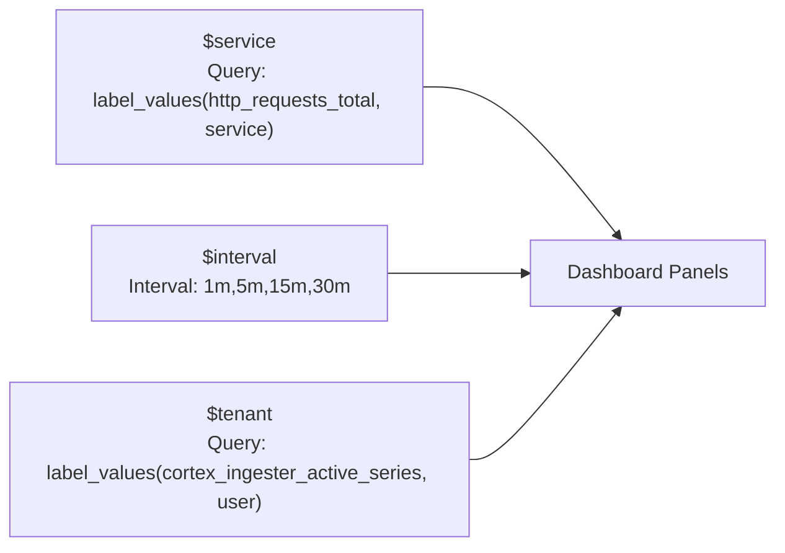

# Dashboard Creation

## Learning Objectives

- [ ] Structure a dashboard around the four golden signals
- [ ] Create Grafana variables for dynamic service and tenant filtering
- [ ] Build time series, stat, and gauge panels with meaningful PromQL queries
- [ ] Import and use the pre-built xScaler dashboard templates

---

## Dashboard Structure

A well-structured service dashboard follows a top-down hierarchy:

```
Dashboard: Payment Service
│
├── Row: SLO Status                  ← "Are we meeting our commitments?"
│   ├── Availability SLO (99.9%)   [Stat panel]
│   ├── Latency SLO p99 < 500ms    [Gauge panel]
│   └── Error rate < 1%            [Stat panel]
│
├── Row: Traffic                     ← "How much load?"
│   ├── Request rate by endpoint   [Time series]
│   └── Active connections         [Time series]
│
├── Row: Errors                      ← "What's failing?"
│   ├── Error rate by endpoint     [Time series + threshold]
│   └── Error count by type        [Bar chart]
│
├── Row: Latency                     ← "How fast?"
│   ├── p50 / p90 / p99 latency   [Time series]
│   └── Latency heatmap            [Heatmap panel]
│
└── Row: Saturation                  ← "Are we running out of resources?"
    ├── CPU utilisation             [Time series + threshold]
    └── Memory utilisation         [Gauge]
```

---

## Dashboard Variables

Variables make dashboards reusable across services and tenants:



### Create a Service Variable

1. Dashboard Settings → Variables → New variable
2. Type: **Query**
3. Query: `label_values(http_requests_total, service)`
4. Datasource: `xScaler Metrics`
5. Name: `service`

Now panels can use `{service="$service"}` to filter by the selected service.

---

## The Four Golden Signals — PromQL Queries

### 1. Latency

```promql
# p99 request latency
histogram_quantile(0.99,
  sum by (le) (
    rate(http_request_duration_seconds_bucket{service="$service"}[$interval])
  )
)

# Multiple percentiles in one panel
histogram_quantile(0.50, sum by (le) (rate(http_request_duration_seconds_bucket{service="$service"}[$interval])))
histogram_quantile(0.90, sum by (le) (rate(http_request_duration_seconds_bucket{service="$service"}[$interval])))
histogram_quantile(0.99, sum by (le) (rate(http_request_duration_seconds_bucket{service="$service"}[$interval])))
```

**Recommended panel type:** Time series  
**Unit:** `seconds`  
**Alert threshold:** p99 > 500ms

### 2. Traffic

```promql
# Request rate
sum(rate(http_requests_total{service="$service"}[$interval]))

# Request rate by endpoint
sum by (endpoint) (rate(http_requests_total{service="$service"}[$interval]))
```

**Recommended panel type:** Time series  
**Unit:** `requests/sec`

### 3. Errors

```promql
# Error rate (percentage)
sum(rate(http_requests_total{service="$service", status=~"5.."}[$interval]))
/
sum(rate(http_requests_total{service="$service"}[$interval]))
* 100

# Error count by type
sum by (error_type) (
  rate(http_requests_total{service="$service", status=~"5.."}[$interval])
)
```

**Recommended panel type:** Time series with threshold at 1%  
**Unit:** `percent (0-100)`

### 4. Saturation

```promql
# CPU utilisation
1 - avg by (instance) (
  rate(node_cpu_seconds_total{mode="idle"}[$interval])
)

# Memory utilisation
1 - avg by (instance) (
  node_memory_MemAvailable_bytes / node_memory_MemTotal_bytes
)

# Go service goroutines (saturation indicator for Go services)
go_goroutines{service="$service"}
```

**Recommended panel type:** Gauge or Time series  
**Unit:** `percent (0.0-1.0)` with threshold at 0.85

---

## Log Volume Panel (LogQL)

Add a log volume panel to understand log ingestion:

```logql
# Log line rate by level
sum by (level) (
  rate({service="$service"}[$interval])
)

# Error log rate
sum(rate({service="$service"} |= "error" [$interval]))
```

**Panel type:** Time series or Bar chart

---

## Hands-On Exercise

### Exercise 6.1 — Build a Service Dashboard

1. In Grafana, click **Dashboards → New → New Dashboard**
2. Click **Add panel**
3. Select `client-mimir` datasource
4. Add the request rate query:

```promql
sum by (service) (rate(http_requests_total[$__rate_interval]))
```

<div class="screenshot-placeholder">
[Screenshot: Grafana panel editor with PromQL query entered and time series chart showing request rate]
</div>

5. Set panel title: `Request Rate`
6. Set unit: `requests/sec`
7. Click **Apply**

8. Add a second panel with error rate:
```promql
sum(rate(http_requests_total{status=~"5.."}[$__rate_interval]))
/ sum(rate(http_requests_total[$__rate_interval])) * 100
```

9. Set threshold: Red at 1%, Yellow at 0.5%

10. **Save dashboard** as `Workshop: Service Overview`

### Exercise 6.2 — Add Dashboard Variables

1. Click Dashboard Settings → Variables → **+ New variable**
2. Configure:
   - Type: **Query**
   - Name: `service`
   - Datasource: `client-mimir`
   - Query: `label_values(up, job)`
   - Refresh: **On time range change**
3. Save variable

4. Update your panels to use `$service` in the label selector

---

## Validation

- [ ] Dashboard has at least 4 panels (one per golden signal)
- [ ] Panels display data from `client-mimir`
- [ ] `$service` variable filters panels correctly
- [ ] Error rate panel has threshold colour applied

---

## Key Takeaways

!!! success "Session 6.1 Summary"
    - Structure dashboards around the **four golden signals**: latency, traffic, errors, saturation
    - Use **variables** to make dashboards reusable across services (`$service`, `$interval`)
    - `histogram_quantile()` requires a `rate()` inside — always use `$__rate_interval` for dynamic intervals
    - Combine PromQL and LogQL in the same dashboard for a complete service view
    - Keep dashboards **organised by rows** — SLO status → Traffic → Errors → Latency → Saturation

---

*← Previous: [Session 6 Overview](overview.md)*  
*Next: [APM →](apm.md)*
