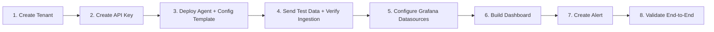

# Session 7 — Hands-On Lab and Q&A

## Session Overview

**Duration:** 2 hours  
**Format:** Self-paced lab + group Q&A  
**Level:** All levels

---

## Session Agenda

| Time | Topic | Format |
|---|---|---|
| 0:00 – 0:15 | Lab briefing and environment verification | Presentation |
| 0:15 – 1:30 | Self-paced hands-on lab | Individual/Pairs |
| 1:30 – 2:00 | Group debrief + open Q&A | Discussion |

---

## Learning Objectives

- [ ] Complete an end-to-end platform workflow: tenant → agent → data → dashboard → alert
- [ ] Troubleshoot common issues independently
- [ ] Ask questions based on your specific environment or use case
- [ ] Identify next steps for your production deployment

---

## Session Pages

1. [Lab Guide](lab-guide.md) — complete end-to-end lab exercise
2. [Wrap-Up](wrap-up.md) — training summary, next steps, resources

---

## Lab Overview

The Session 7 lab is a **complete end-to-end exercise** that combines all previous sessions:

---

*← Previous: [Alerting](../session-6/alerting.mdx)*  
*Next: [Lab Guide →](lab-guide.md)*
